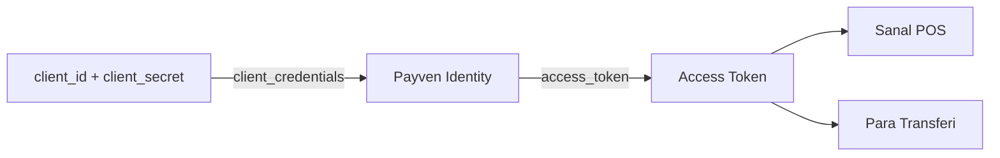

Payven'i doğru kullanmak için **organizasyon**, **merchant** ve **API anahtarı** arasındaki farkı anlamak gerekir.

## Kavramlar

<Tabs>
  <Tab title="Organizasyon (Tenant)">
    Payven'in birincil müşterisidir. Lisanslı ödeme kuruluşu, banka veya büyük e-ticaret platformu. Bir organizasyonun:

    - Birden fazla **merchant**'ı,
    - Birden fazla **API anahtarı** (`client_id` / `client_secret` çifti),
    - Birden fazla **banka konfigürasyonu**,
    - Bir **plan**'ı (kullanım kotaları) olur.

    Tüm idari işlemler — kullanıcı yönetimi, plan, banka credential'ları, akıllı yönlendirme kuralları — organizasyon seviyesindedir.
  </Tab>
  <Tab title="Merchant">
    Organizasyona bağlı bayi veya alt müşteridir. Her ödeme bir merchant adına gerçekleştirilir. Bir merchant'ın:

    - **Kimliği** (`merchantId` — UUID),
    - **Dış kimliği** (`externalId` — sizin sisteminizdeki kimlik),
    - **Vergi bilgileri**, iletişim bilgileri,
    - Bağlı olduğu **banka profilleri** olur.

    API çağrılarında merchant'ı `X-Merchant-Id` veya `X-External-Merchant-Id` header'ı ile belirtirsiniz.
  </Tab>
  <Tab title="Alt Merchant">
    İhtiyaç halinde merchant'ın altında ek seviye. Marketplace ortamlarında satıcıları temsil eder.

    Alt merchant kullanımı **opsiyoneldir**. İhtiyacınız yoksa merchant seviyesinde kalabilirsiniz.
  </Tab>
  <Tab title="API Anahtarı">
    API'ye erişim için OAuth 2.0 Client Credentials çifti kullanılır:

    - `client_id`: Public tanımlayıcı (`pvk_live_…` veya `pvk_test_…` ile başlar).
    - `client_secret`: Gizli secret — yalnızca oluşturma anında gösterilir, güvenli bir vault'ta saklayın.

    Bu çift ile [Payven Identity'den](/documentation/concepts/authentication) bir **access token** alır, sonraki tüm istekleri `Authorization: Bearer <access_token>` header'ı ile yaparsınız.

    API anahtarı **organizasyon seviyesindedir** — aynı çiftle organizasyona bağlı tüm merchant'lar adına işlem yapabilirsiniz. Hangi merchant adına işlem yaptığınızı her istekte ilgili merchant header'ı ile belirtirsiniz.
  </Tab>
</Tabs>

## Bir bakışta hiyerarşi

```
Organizasyon (Tenant)
├── Plan ve kotalar
├── Kullanıcılar (konsol erişimi)
├── API anahtarları (client_id + client_secret çiftleri)
├── Banka konfigürasyonları
├── Akıllı yönlendirme kuralları
└── Merchant'lar
    ├── Merchant 1
    │   ├── Vergi / iletişim bilgileri
    │   ├── Banka profilleri
    │   └── Alt Merchant'lar (opsiyonel)
    ├── Merchant 2
    └── ...
```

## Merchant kimliği — iki form

Her API isteğinde merchant'ı **iki şekilde** belirtebilirsiniz. Hangisini kullanacağınızı sisteminize en uygun olana göre seçersiniz.

| Header | Değer | Ne zaman kullanılır? |
|---|---|---|
| `X-Merchant-Id` | UUID (örn. `3fa85f64-5717-4562-b3fc-2c963f66afa6`) | Payven'in atadığı dahili kimlik. Konsol üzerinden alınır. |
| `X-External-Merchant-Id` | Serbest metin (örn. `M-IST-001`) | Sizin sisteminizdeki merchant kimliği. Onboarding sırasında belirlenir. |

İki header'dan **biri** zorunludur. İkisini birden gönderirseniz öncelik `X-Merchant-Id`'dedir.

## Çoklu ürün senaryosu

Aynı `client_id` / `client_secret` çiftiyle alınan tek bir access token, planınızdaki tüm ürünlerde geçerlidir:



Her ürün için ayrı API anahtarı oluşturmanıza gerek yoktur. **Plan**, hangi ürünlerin etkin olduğunu belirler.

## Sınırlar ve kotalar

Plan seviyenize bağlı olarak:

- Saniyede istek sayısı (rate limit),
- Aylık işlem hacmi,
- Eşzamanlı webhook hedefi,
- Aktif merchant sayısı

gibi limitler uygulanır. Mevcut planınızı ve kullanımınızı [Konsol → Plan ve Kullanım](https://dashboard.payven.com.tr/my-plan) ekranından izleyebilirsiniz.

Rate limit davranışı, `429` yanıtı ve `Retry-After` header'ı için: [Rate Limiting](/documentation/concepts/rate-limiting).
