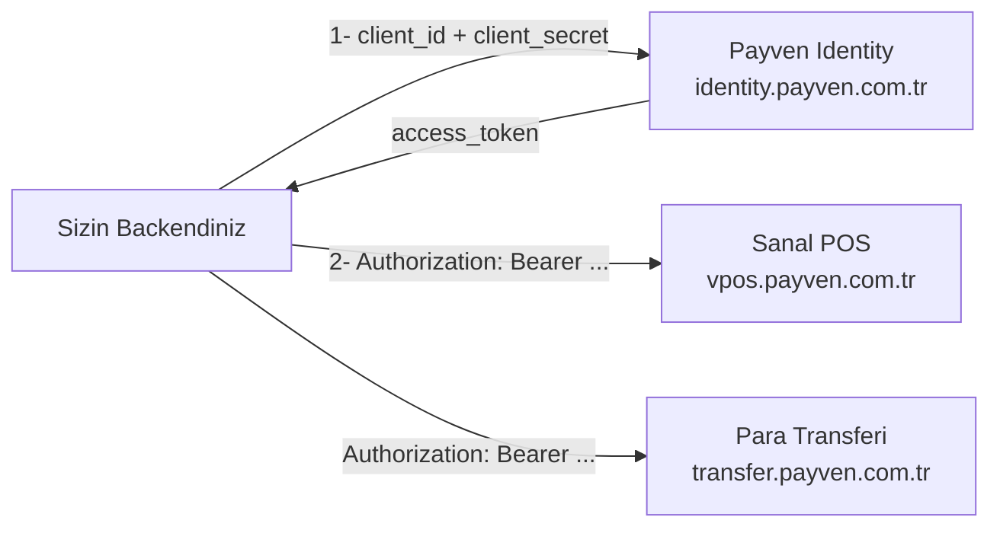
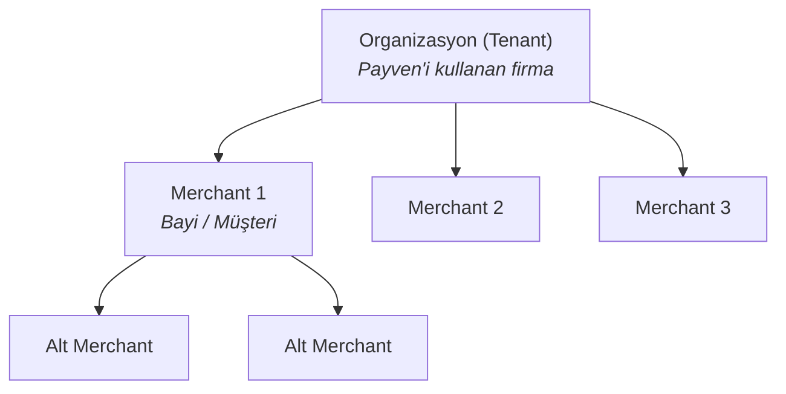
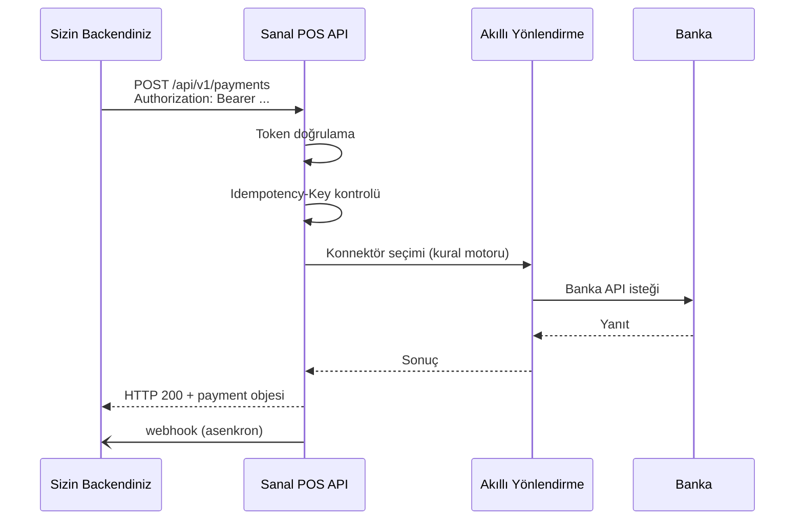

Payven, ortak bir kimlik servisi etrafında düzenlenmiş bağımsız ürün servislerinden oluşur. **Tek bir access token ile** planınızdaki tüm ürünleri çağırırsınız.

## Servis topolojisi

İlk adımda Identity'den `client_credentials` akışıyla bir access token alırsınız; sonraki tüm istekleri ürün servislerine `Authorization: Bearer <access_token>` header'ı ile yaparsınız. Aynı token Sanal POS ve Para Transferi servislerinin ikisinde de geçerlidir.

| Servis | Sorumluluk |
|---|---|
| **Identity** | Organizasyon ve kullanıcı yönetimi, API anahtarı yaşam döngüsü, OAuth 2.0 token üretimi |
| **Sanal POS** | Kart ödemeleri, 3D Secure, akıllı yönlendirme, mutabakat, webhook teslimi |
| **Para Transferi** | Çoklu banka üzerinden FAST, EFT ve havale yönlendirme |
| **Fraud** | Sanal POS akışlarının içinde otomatik çalışan risk motoru — kural yönetimi, blacklist/whitelist, manuel inceleme kuyruğu |

Tüm ürün servisleri aynı **Bearer access token**'ı kabul eder; servis başına ayrı kimlik akışı yoktur. Fraud servisinin endpoint'leri (kural CRUD, manuel inceleme) Sanal POS API'siyle birlikte sunulur.

<Note>
**Yol haritasında:** Fatura Ödeme ve Açık Bankacılık modülleri geliştirme aşamasındadır. Bu servisler henüz canlı API'ye dahil değildir. [Yol haritası](/#yol-haritasi).
</Note>

## Organizasyon ve merchant modeli

Payven üç katmanlı bir hesap yapısı kullanır:

- **Organizasyon (Tenant):** Payven'i kullanan firma. Tipik olarak ödeme kuruluşu, banka veya büyük platform olur — lisans zorunluluğu yoktur. Tüm API anahtarları ve banka konfigürasyonları bu seviyede yönetilir.
- **Merchant:** Organizasyona bağlı bayi veya alt müşteri. Her ödeme bir merchant adına gerçekleştirilir.
- **Alt Merchant:** İsteğe bağlı olarak merchant ağacında ek seviye (örneğin marketplace satıcıları).

Detay: [Hesap Yapısı](/documentation/account-model).

## İstek yaşam döngüsü

Aşağıda kart ödeme isteğinin Sanal POS servisinden geçişi gösterilmiştir; Para Transferi ve Fraud için de mantık aynıdır.

## Ortam URL'leri

Her servis kendi alt-domain'i üzerinden hizmet verir. Tüm path'ler `/api/v1` ile başlar.

| Servis | Sandbox | Production |
|---|---|---|
| **Identity** | `https://identity-sandbox.payven.com.tr` | `https://identity.payven.com.tr` |
| **Sanal POS** | `https://vpos-sandbox.payven.com.tr` | `https://vpos.payven.com.tr` |
| **Para Transferi** | `https://transfer-sandbox.payven.com.tr` | `https://transfer.payven.com.tr` |

Fraud kontrolü Sanal POS akışlarının içinde **otomatik** çalışır — sizin tarafınızdan ayrı bir API çağrısı gerekmez. Kural yönetimi [konsoldan](https://dashboard.payven.com.tr) yapılır.

Sandbox ortamı, organizasyonunuzun konnektör konfigürasyonuna göre ya simülasyonla yanıt üretir ya da bankanın test ortamına gerçek çağrı atar — bkz. [Sandbox Ortamı](/sanal-pos/test/sandbox#banka-cagri-modu). Production geçişi öncesinde [Go-live kontrol listesini](/documentation/security/go-live-checklist) tamamlayın.
