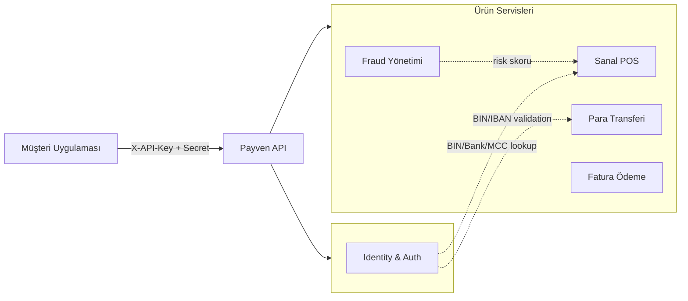
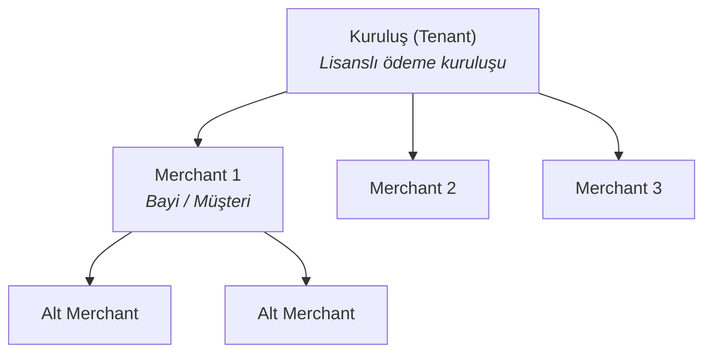
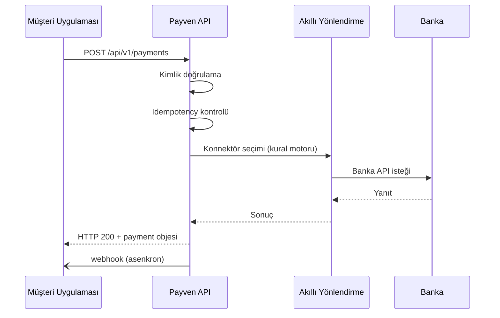

Payven, ortak bir kimlik servisi etrafında düzenlenmiş bağımsız ürün servislerinden oluşur. Tek bir API anahtarı çiftiyle birden fazla ürünü tüketebilirsiniz.

## Servis topolojisi

| Servis | Sorumluluk | Auth |
|---|---|---|
| **Identity & Auth** | Kullanıcı ve kuruluş yönetimi, API anahtarı yaşam döngüsü, ortak referans veriler (banka, BIN, MCC, şehir) | OAuth 2.0 / OIDC tabanlı, Bearer token |
| **Sanal POS** | Ödeme işlemleri, akıllı yönlendirme, mutabakat, webhook | API Key + Secret |
| **Para Transferi** | Çoklu banka üzerinden FAST, EFT, havale yönlendirme | API Key + Secret |
| **Fraud Yönetimi** | Kural motoru, kara/beyaz liste, risk skorlama | API Key + Secret |
| **Fatura Ödeme** | Fatura oluşturma, sorgulama, tahsilat | API Key + Secret |

## Kuruluş ve merchant modeli

Payven üç katmanlı bir hesap yapısı kullanır:

- **Kuruluş (Tenant):** Payven'in birincil müşterisi. Lisanslı ödeme kuruluşu, banka veya büyük platform. Tüm API anahtarları ve banka konfigürasyonları bu seviyede yönetilir.
- **Merchant:** Kuruluşa bağlı bayi veya alt müşteri. Her ödeme bir merchant adına gerçekleştirilir.
- **Alt Merchant:** İsteğe bağlı olarak merchant ağacında ek seviye (örneğin marketplace satıcıları).

Detay: [Hesap Modeli](/documentation/account-model).

## İstek yaşam döngüsü

## Ortam URL'leri

| Ortam | API Base URL | Konsol |
|---|---|---|
| **Sandbox** | `https://vpos-sandbox.payven.com.tr` | `https://dashboard-sandbox.payven.com.tr` |
| **Production** | `https://vpos.payven.com.tr` | `https://dashboard.payven.com.tr` |

Sandbox ortamı gerçek bankaya istek göndermeden, banka yanıtlarını simüle eder. Production geçişi öncesinde [kontrol listesini](/documentation/security/go-live-checklist) tamamlayın.
