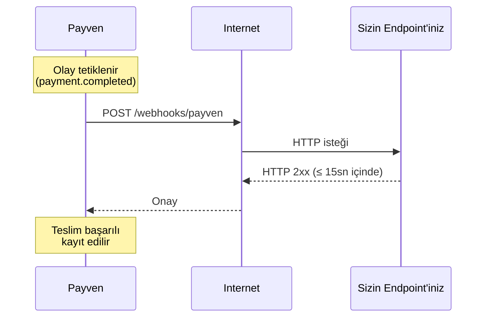

Webhook'lar, sunucunuza **HTTP POST** isteği göndererek ödeme, iade, mutabakat gibi olayları gerçek zamanlı bildirir. Polling yerine event-driven çalışmanın yoludur.

<Note>
Bu sayfa **genel** webhook prensiplerini açıklar. Sanal POS özelinde olay listesi ve örnek payload'lar için: [Sanal POS Webhook Olayları](/sanal-pos/webhooks/events).
</Note>

## Neden webhook?

| Polling (sorgulama) | Webhook |
|---|---|
| Sürekli `GET` istekleriyle durum sorgulanır | Olay gerçekleşince Payven sizin endpoint'inize bildirir |
| Gecikme: sorgulama aralığı kadar | Gecikme: saniyenin altı |
| Rate limit kotanızı tüketir | Limitten muaf |
| Sunucu kaynağını boşa kullanır | Sadece olay olduğunda çalışır |

## Akış



## Endpoint kuralları

Webhook endpoint'iniz aşağıdaki kurallara uymalıdır:

<Check>**HTTPS zorunlu** — HTTP URL'leri reddedilir.</Check>
<Check>**Public erişilebilir** — özel ağ veya VPN arkasında olamaz.</Check>
<Check>**15 saniye içinde HTTP 2xx döner** — Payven delivery timeout'u 15 saniyedir; performans için handler'ınızı 5 saniyenin altında tamamlamayı hedefleyin, uzun süren işler için iş kuyruğa atılmalıdır.</Check>
<Check>**Idempotent çalışır** — aynı olay birden fazla kez gelebilir.</Check>
<Check>**İmzayı doğrular** — sahte istekleri reddeder.</Check>

## Genel istek formatı

```http
POST /webhooks/payven HTTP/1.1
Host: example.com
Content-Type: application/json
X-Payven-Event: payment.completed
X-Payven-Event-Id: evt_8e3f5c129a7b4c8dbc4e2c963f66afa6
X-Payven-Delivery-Id: 9f1c8e76-2a3b-4f12-9c8d-12cb24a8a8a8
X-Payven-Signature: sha256=4f1d8c92ab7e3...
X-Payven-Timestamp: 1714742400

{
  "id": "evt_8e3f5c129a7b4c8dbc4e2c963f66afa6",
  "type": "payment.completed",
  "created_at": "2026-05-03T12:34:56.789+00:00",
  "data": { ... }
}
```

| Header | Açıklama |
|---|---|
| `X-Payven-Event` | Olay tipi (örn. `payment.completed`). |
| `X-Payven-Event-Id` | **Olay kimliği** — aynı olay birden fazla teslim edilse bile aynı kalır. Idempotent handler'ınızda bu değeri kullanın. |
| `X-Payven-Delivery-Id` | **Teslim kimliği** — her teslim denemesinde farklıdır. Debug ve teslim kaydı eşleştirmesi için kullanılır. |
| `X-Payven-Signature` | İstek gövdesinin HMAC-SHA256 imzası — `sha256=<hex>` formatında. |
| `X-Payven-Timestamp` | İmzalanan Unix zaman damgası (saniye). Replay saldırılarına karşı 5 dakika tolerans dışındaki istekleri reddedin. |

## İmza doğrulama (kısa)

İstek gövdesi ile timestamp'i `subscription.secret` ile HMAC-SHA256 hashlenir. Detay ve kod örnekleri: [İmza Doğrulama](/sanal-pos/webhooks/signature).

```
hmac = HMAC_SHA256(secret, timestamp + "." + body)
signature_header = "sha256=" + hex(hmac)
```

## Yeniden deneme

İlk denemede `2xx` dönmezse Payven otomatik olarak yeniden dener:

| Deneme | Bekleme süresi |
|---|---|
| 1 | Hemen |
| 2 | 1 dakika |
| 3 | 5 dakika |
| 4 | 30 dakika |
| 5 | 2 saat |
| 6 | 24 saat |

Tüm bekleme süreleri ±%20 jitter ile uygulanır. 6. denemeden sonra hâlâ başarılı olunmamışsa teslim "kalıcı başarısız" olarak işaretlenir; konsoldan manuel olarak yeniden tetiklenebilir.

Detay: [Yeniden Deneme Politikası](/sanal-pos/webhooks/retry-policy).

## Abone olmak

Webhook abonelikleri her ürün için ayrı tanımlanır. Sanal POS örneği:

```bash
curl -X POST https://vpos.payven.com.tr/api/v1/webhooks \
  -H "Authorization: Bearer $PAYVEN_TOKEN" \
  -H "Content-Type: application/json" \
  -d '{
    "url":    "https://example.com/webhooks/payven",
    "events": ["payment.completed", "payment.failed", "refund.completed"]
  }'
```

Yanıttaki `secret` değerini saklayın — imza doğrulamasında kullanacaksınız.

## Test ve debug

Konsol → **Webhook Teslim Kayıtları** ekranından her teslim denemesinin:

- HTTP yanıt kodunu,
- Yanıt gövdesini,
- Süresini,
- Yeniden deneme sayısını,
- Tam request/response payload'unu

görebilirsiniz. Lokal geliştirmede [ngrok](https://ngrok.com) veya [Cloudflare Tunnel](https://www.cloudflare.com/products/tunnel/) gibi araçlarla local endpoint'inizi internete açabilirsiniz.
