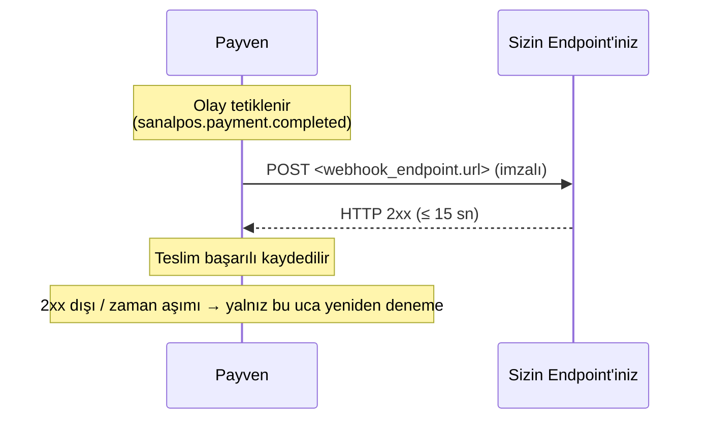

Webhook'lar, sunucunuza **HTTP POST** isteği göndererek ödeme, iade, transfer, fatura, bakiye ve
e-Fatura gibi olayları gerçek zamanlı bildirir. Polling yerine olay güdümlü çalışmanın yoludur.

**Tek uç tüm ürünlerin olaylarını alır.** Bir webhook ucu (**endpoint**) tanımlarsınız; Sanal POS,
Para Transferi, Fatura Ödeme, Cüzdan, e-Fatura ... olaylarının hepsi aynı adrese gelir. Ürün başına
ayrı abonelik yoktur ve uçlar ürün API'lerinde değil **İşyeri API'sinde** yönetilir.

<Note>
Olay kodlarının tam listesi: [Webhook Olay Referansı](/documentation/concepts/webhook-events).
Ürün bazında gövde alanları ve örnek payload'lar: [Sanal POS](/sanal-pos/webhooks/events) ·
[Para Transferi](/para-transferi/webhooks/events).
</Note>

## Garantiler

- **En az bir kez teslim (at-least-once)** — aynı olay birden fazla gelebilir; `id` ile tekilleştirin.
- **Sıra garantisi yok** — olayın zamanı için `created` alanına bakın.
- **HMAC-SHA256 imzalı** — isteğin Payven'den geldiğini doğrularsınız.
- **~2,5 gün boyunca 10 deneme** — ucunuz kapalıysa olay kaybolmaz.
- **Olaylar saklanır** — webhook kaçırılsa bile `GET /events` ile geri çekilir.
- **Test ve canlı ayrıdır** — her olay `livemode` taşır.

## Akış


```mermaid
sequenceDiagram
    participant Payven
    participant You as Sizin Endpoint'iniz

    Note over Payven: Olay tetiklenir<br/>(sanalpos.payment.completed)
    Payven->>You: POST <webhook_endpoint.url> (imzalı)
    You-->>Payven: HTTP 2xx (≤ 15 sn)
    Note over Payven: Teslim başarılı kaydedilir
    Note over Payven: 2xx dışı / zaman aşımı → yalnız bu uca yeniden deneme
```

## Webhook ucu oluşturmak

Uçlar **İşyeri API'sinde** (`https://merchant.payven.com.tr/api/v1/webhook-endpoints`) yönetilir.
Panelden de açabilirsiniz: İşyeri paneli › **Geliştirici › Webhook'lar**.

<Warning>
API anahtarınızla uç yönetecekseniz anahtarın **İşyeri API'si (`merchant`)** kapsamı seçili olmalıdır;
aksi halde istek `401 audience_invalid` döner. Uç açmak/değiştirmek `CanManageWebhooks` yetkisi ister.
</Warning>

```bash
curl -X POST https://merchant.payven.com.tr/api/v1/webhook-endpoints \
  -H "Authorization: Bearer $PAYVEN_TOKEN" \
  -H "Content-Type: application/json" \
  -d '{
    "url":            "https://example.com/webhooks/payven",
    "enabled_events": ["sanalpos.payment.completed", "sanalpos.payment.failed", "sanalpos.refund.completed"],
    "description":    "Canlı sipariş akışı",
    "payload_format": "event"
  }'
```

| Alan | Açıklama |
|---|---|
| `url` | Public HTTPS adresi |
| `enabled_events` | Abone olunan olay kodları. Boş liste ya da `["*"]` = **tüm olaylar** |
| `description` | Serbest açıklama |
| `metadata` | Serbest anahtar-değer (en fazla 50 anahtar; anahtar 40, değer 500 karakter) |
| `payload_format` | `event` (olay zarfı — varsayılan, önerilen) ya da `flat` (zarfsız gövde — hazır e-ticaret eklentileri) |

Yanıt (`201`):

```json
{
  "id":             "5d1c0e8a-7b2f-4c11-9a3e-2f6d8c4b1a90",
  "object":         "webhook_endpoint",
  "url":            "https://example.com/webhooks/payven",
  "enabled_events": ["sanalpos.payment.completed", "sanalpos.payment.failed", "sanalpos.refund.completed"],
  "description":    "Canlı sipariş akışı",
  "metadata":       {},
  "payload_format": "event",
  "status":         "enabled",
  "created":        "2026-09-24T14:05:12.451+03:00",
  "secret":         "whsec_3f9a..."
}
```

<Warning>
**`secret` yalnız oluştururken (ve `rotate-secret` yanıtında) bir kez döner** — güvenli bir yere
kaydedin. Kaybederseniz `POST /webhook-endpoints/{id}/rotate-secret` ile yenileyin.
</Warning>

Katalogda olmayan bir olay koduyla uç açmak **`422 webhook_event_type_unknown`** döner. Geçerli
kodlar: `GET /webhook-endpoints/event-types`.

**Kapsam:** bayi kullanıcısının (ya da bayiye bağlı API anahtarının) açtığı uç yalnız o bayinin
olaylarını alır. Tenant yöneticisinin bayi seçmeden açtığı uç **tüm bayilerin** olaylarını alır.

### Uç yönetimi

| Uç | İş |
|----|----|
| `GET /webhook-endpoints` · `GET /webhook-endpoints/{id}` | Liste (sayfalı) / tekil — sır dönmez |
| `PUT /webhook-endpoints/{id}` | Güncelle (tam değiştirme; `metadata` birleştirilir) |
| `DELETE /webhook-endpoints/{id}` | Sil |
| `POST /webhook-endpoints/{id}/enable` · `/disable` | Aç / kapat |
| `POST /webhook-endpoints/{id}/rotate-secret` | Yeni sır — bkz. [İmza Doğrulama](/sanal-pos/webhooks/signature#secret-rotasyonu) |
| `POST /webhook-endpoints/{id}/test` | İmzalı `merchant.webhook_endpoint.test` olayı gönderir, alıcının cevabını döner |
| `GET /webhook-endpoints/{id}/deliveries` | Teslim listesi (`state`, `event_id` filtreli) |
| `GET /webhook-endpoints/deliveries/{delivery_id}/attempts` | Denemeler (HTTP kodu, süre, yanıt) |
| `POST /webhook-endpoints/deliveries/{delivery_id}/retry` | Teslimi hemen yeniden dene |
| `GET /webhook-endpoints/event-types` | Abone olunabilecek olay kodları (Türkçe ad + açıklama) |

<Note>
Ürün API'lerindeki eski `/api/v1/webhook-subscriptions` uçları kaldırıldı: yazma istekleri
**`410 webhook_subscriptions_moved`** döner ve bu kayıtlar teslim almaz.
</Note>

## İstek formatı

```http
POST /webhooks/payven HTTP/1.1
Host: example.com
Content-Type: application/json
X-Payven-Event: sanalpos.payment.completed
X-Payven-Event-Id: evt_8e3f5c129a7b4c8dbc4e2c963f66afa6
X-Payven-Delivery-Id: 9f1c8e76-2a3b-4f12-9c8d-12cb24a8a8a8
X-Payven-Signature: sha256=4f1d8c92ab7e3...
X-Payven-Timestamp: 1790000000

{
  "id":          "evt_8e3f5c129a7b4c8dbc4e2c963f66afa6",
  "object":      "event",
  "type":        "sanalpos.payment.completed",
  "created":     "2026-09-24T14:05:12.451+03:00",
  "livemode":    true,
  "api_version": "2026-09-24",
  "resource_id": "8c3a1f0e-...",
  "data": {
    "object": {
      "event_type":     "sanalpos.payment.completed",
      "transaction_id": "8c3a1f0e-...",
      "status":         "completed",
      "amount":         150000,
      "currency":       "TRY",
      "external_id":    "ORDER-1001"
    }
  }
}
```

- `data.object` ürünün olay gövdesidir (snake_case). Aynı nesne `GET /events/{id}`'de de döner.
- **Tutarlar kuruş** (`150000` = 1.500,00 TL), **tarihler Türkiye saati** (`+03:00`).
- `api_version` zarfın sözleşme sürümüdür; kırıcı bir değişiklik yeni bir tarih alır.
- `payload_format: flat` seçilen uçta gövde **yalnız `data.object`**'tir (zarfsız); başlıklar aynıdır.

| Header | Açıklama |
|---|---|
| `X-Payven-Event` | Olay kodu (örn. `sanalpos.payment.completed`) |
| `X-Payven-Event-Id` | `evt_...` — **tekilleştirme anahtarı**, denemeler arasında değişmez (= zarftaki `id`) |
| `X-Payven-Delivery-Id` | Teslim kimliği — destek kaydında bunu verin |
| `X-Payven-Signature` | `sha256=<hex>`; sır yenileme geçişinde virgülle iki değer |
| `X-Payven-Timestamp` | İmzanın üretildiği an (Unix saniye) — ±5 dakika dışını reddedin |

## İmza doğrulama (kısa)

```
input     = "{X-Payven-Timestamp}.{ham istek gövdesi}"
signature = "sha256=" + lowercase_hex(HMAC_SHA256(secret, input))
```

Başlığı virgülden bölün; **herhangi bir** imza eşleşiyorsa kabul edin. Gövdeyi parse etmeden,
ham haliyle imzalayın. Kod örnekleri: [İmza Doğrulama](/sanal-pos/webhooks/signature).

## Endpoint kuralları

<Check>**HTTPS zorunlu**, **public erişilebilir** (özel ağ / VPN arkasında olamaz).</Check>
<Check>**15 saniye içinde HTTP 2xx döner** — işi kuyruğa atıp hemen cevap verin.</Check>
<Check>**Idempotent çalışır** — `id` (= `X-Payven-Event-Id`) ile tekilleştirin; `X-Payven-Delivery-Id` her teslimde farklı olabilir.</Check>
<Check>**İmzayı doğrular** — sahte istekleri reddeder.</Check>

## Yeniden deneme ve otomatik kapatma

2xx dışındaki her cevap, zaman aşımı ve bağlantı hatası başarısız sayılır ve **yalnız o uca**
yeniden denenir. Yönlendirmeler (`3xx`) izlenmez. Toplam **10 deneme / ~2,5 gün**, her beklemeye
±%20 sapma eklenir. Tükenen teslim panelden ya da
`POST /webhook-endpoints/deliveries/{id}/retry` ile yeniden gönderilir. Program:
[Yeniden Deneme Politikası](/sanal-pos/webhooks/retry-policy).

Bir uç **3 gün** boyunca hiç başarılı teslim yapamazsa kapatılır (`status: disabled`,
`disabled_reason: consecutive_failures`) ve `merchant.webhook_endpoint.disabled` olayı yayınlanır.

## Kaçırılan olayları çekmek — `GET /events`

```http
GET https://merchant.payven.com.tr/api/v1/events?type=sanalpos.payment.*&created_gte=2026-09-20T00:00:00%2B03:00&page=1&page_size=50
```

Her öğe webhook zarfıyla **aynı nesnedir**. Filtreler: `type` (tam ad ya da `sanalpos.payment.*`),
`resource_id`, `created_gte`, `created_lte`. `GET /events/{evt_id}` tek olayı döner.

## Test ve debug

- `POST /webhook-endpoints/{id}/test` — imzalı deneme olayı gönderir ve ucunuzun HTTP kodunu,
  süresini ve cevabını döner.
- `GET /webhook-endpoints/{id}/deliveries` ve `.../attempts` — her teslimin durumu, HTTP kodu,
  süresi ve yanıt gövdesi.
- Lokal geliştirmede [ngrok](https://ngrok.com) veya [Cloudflare Tunnel](https://www.cloudflare.com/products/tunnel/)
  ile local endpoint'inizi internete açabilirsiniz. Test modundaki olaylar da gerçek imzayla gelir
  (`livemode: false`).
