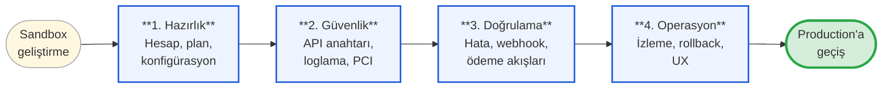
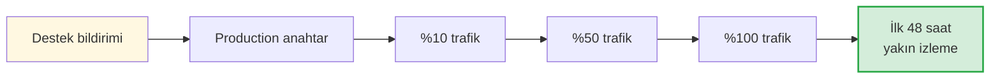

Bu sayfa, **canlıya geçmeden önce** entegrasyonunuzda kontrol etmeniz gereken her şeyi tek bir yerde toplar. Tüm maddeleri ✅ işaretledikten sonra production geçişi için [destek ekibine](/resources/support) bildirin.

## Geçiş yolculuğu

Her faz aşağıda ayrı bir bölümde detaylandırılır.

<CardGroup cols={4}>
  <Card title="1. Hazırlık" icon="folder-gear">
    Hesap, plan, merchant ve banka konfigürasyonları
  </Card>
  <Card title="2. Güvenlik" icon="shield-keyhole">
    API anahtarı yönetimi, loglama, PCI-DSS uyumu
  </Card>
  <Card title="3. Doğrulama" icon="circle-check">
    Hata yönetimi, webhook, ödeme akışları, mutabakat
  </Card>
  <Card title="4. Operasyon" icon="chart-line">
    24/7 izleme, rollback planı, müşteri deneyimi
  </Card>
</CardGroup>

---

## Faz 1 — Hazırlık

### 🏢 Hesap ve yapılandırma

<Checkbox> Production konsoluna giriş yapabilen en az **iki yetkili kullanıcı** vardır. </Checkbox>
<Checkbox> Kuruluşunuzun **plan ve kotaları** beklenen işlem hacmini karşılıyor. </Checkbox>
<Checkbox> Production merchant tanımları (vergi bilgileri, iletişim, banka profilleri) eksiksiz girilmiştir. </Checkbox>
<Checkbox> Banka konfigürasyonları (credential, endpoint, store key) production değerleriyle güncellenmiştir. </Checkbox>
<Checkbox> Akıllı yönlendirme kurallarınız production'da test edilmiştir. </Checkbox>

---

## Faz 2 — Güvenlik ve uyumluluk

### 🔑 API anahtarı güvenliği

<Checkbox> Production API anahtarı **secret manager'da** saklanır, kaynak kodda **yoktur**. </Checkbox>
<Checkbox> **IP whitelist** tanımlanmıştır — yalnızca production sunucularınızdan istek atılabilir. </Checkbox>
<Checkbox> Geliştiriciler production anahtarına **doğrudan erişemez** — sadece servis hesabı kullanılır. </Checkbox>
<Checkbox> Sandbox ve production anahtarları **ayrı secret store'larda** saklanır. </Checkbox>
<Checkbox> Anahtar rotasyon prosedürü dokümante edilmiş, sorumlular belirlenmiştir. </Checkbox>

### 📋 Loglama ve gözlem

<Checkbox> İstek/yanıt loglarında **kart numarası, CVV, API secret görünmüyor**. </Checkbox>
<Checkbox> Tüm Payven çağrıları için **correlation ID** ile izleme yapılabiliyor. </Checkbox>
<Checkbox> Hata oranı ve latency için **alarm** kurulmuştur (örn. 5xx oranı %1'i geçerse uyarı). </Checkbox>
<Checkbox> Log saklama süresi yasal gereksinimlerinizi karşılıyor (genelde minimum 1 yıl). </Checkbox>

### 🛡️ PCI-DSS ve uyumluluk

<Checkbox> Kart bilgileri sunucularınızda **saklanmıyor**. </Checkbox>
<Checkbox> Hangi PCI-DSS SAQ formuna tabi olduğunuzu biliyorsunuz. </Checkbox>
<Checkbox> Loglarda kart numarası veya CVV görünmediği **otomatik test ile** doğrulanmıştır. </Checkbox>
<Checkbox> KVKK yükümlülükleriniz değerlendirilmiştir. </Checkbox>

---

## Faz 3 — Doğrulama ve test

### ⚠️ Hata yönetimi

<Checkbox> İstemci tarafı kodu **HTTP 4xx ve 5xx**'i farklı yönetiyor. </Checkbox>
<Checkbox> `5xx` ve timeout durumlarında **idempotency-key ile retry** uygulanıyor. </Checkbox>
<Checkbox> `429 Rate Limit` durumunda `Retry-After` başlığına uyuluyor. </Checkbox>
<Checkbox> Bilinmeyen hata kodları **default fallback** ile yönetiliyor (uygulama crash etmiyor). </Checkbox>
<Checkbox> Müşteriye gösterilen hata mesajları **anlaşılır** ve teknik detay sızdırmıyor. </Checkbox>

### 🔔 Webhook

<Checkbox> Webhook endpoint'iniz **HTTPS** üzerinde çalışıyor. </Checkbox>
<Checkbox> İmza doğrulaması (`X-Payven-Signature`) uygulanıyor. </Checkbox>
<Checkbox> Endpoint **15 saniyelik delivery timeout'undan çok önce** (hedef: 5sn altı) yanıt veriyor; ağır iş kuyruğa atılıyor. </Checkbox>
<Checkbox> Aynı `X-Payven-Event-Id` ile gelen olaylar **idempotent** işleniyor (aynı olay tekrar teslim edilebilir). </Checkbox>
<Checkbox> Webhook teslim hataları izleniyor; production konsoldaki **Webhook Teslim Kayıtları** düzenli kontrol ediliyor. </Checkbox>
<Checkbox> Payven webhook IP havuzları kendi güvenlik duvarınızda whitelist'lenmiştir. </Checkbox>

### 💳 Ödeme akışları

<Checkbox> **Non-3D ödeme** akışı production benzeri kart ile sandbox'ta test edilmiştir. </Checkbox>
<Checkbox> **3D Secure** akışında callback ve hata senaryoları test edilmiştir. </Checkbox>
<Checkbox> **İade** ve **iptal** akışları test edilmiştir. </Checkbox>
<Checkbox> **Taksit** seçenekleri için BIN bazlı doğrulama yapılmaktadır. </Checkbox>
<Checkbox> **Hosted Checkout** kullanıyorsanız, `return_url` ve `callback_url` HTTPS'tir. </Checkbox>
<Checkbox> Ödeme **timeout** durumunda kullanıcıya doğru mesaj gösteriliyor. </Checkbox>

### 📊 Mutabakat ve raporlama

<Checkbox> **Mutabakat** akışı sandbox'ta test edilmiş, sonuçlar muhasebe sürecine entegre edilmiştir. </Checkbox>
<Checkbox> Gün sonu / dönem sonu raporları otomatik üretiliyor. </Checkbox>
<Checkbox> Eksik/hatalı kayıt durumlarında **uyarı mekanizması** vardır. </Checkbox>

---

## Faz 4 — Operasyon hazırlığı

### 🚨 Operasyonel kontrol

<Checkbox> **24/7 izleme** ve **on-call** süreciniz tanımlıdır. </Checkbox>
<Checkbox> Sorun durumunda Payven destek ekibine ulaşılacak iletişim kanalları biliniyor. </Checkbox>
<Checkbox> **Rollback planı** yazılıdır — production'da sorun çıkarsa nasıl geri dönüleceği bellidir. </Checkbox>
<Checkbox> İlk gün için **gradual rollout** stratejisi vardır (örn. trafiğin %10'u, sonra %50, sonra %100). </Checkbox>

### 👤 Müşteri deneyimi

<Checkbox> Ödeme formu mobilde test edilmiştir. </Checkbox>
<Checkbox> Kart numarası alanında **inline format** (4'lü gruplama, BIN bazlı kart birliği logosu) vardır. </Checkbox>
<Checkbox> 3D Secure yönlendirmesi sonrası **dönüş URL'si** doğru çalışıyor. </Checkbox>
<Checkbox> Hata durumunda kullanıcı **bir sonraki adıma yönlendiriliyor** (sepete dönüş, başka kart deneme). </Checkbox>

---

## Production'a geçiş

Tüm maddeler tamamlandıysa, aşağıdaki adımları sırayla uygulayın:

<Steps>
  <Step title="Destek ekibine bildirim yapın">
    "Production'a geçişe hazırız" konusu ile [destek talebi](/resources/support) açın. Test sonuçlarınızı, üye işyeri listesini ve beklenen ilk gün hacmi paylaşın.
  </Step>
  <Step title="Production anahtarı oluşturun">
    Onay alındığında konsoldan production anahtarı üretin ve secret manager'a yazın.
  </Step>
  <Step title="Gradual rollout başlatın">
    İlk birkaç saat trafiğin küçük bir bölümünü (örn. %10) production'a yönlendirin; metrik ve hata oranlarını izleyin.
  </Step>
  <Step title="Trafiği artırın">
    Hata oranı kabul edilebilir seviyedeyse %50, sonra %100'e çıkın.
  </Step>
  <Step title="İlk 48 saat yakın izleme">
    Dashboard'da hata oranı, başarı oranı, latency ve webhook teslim metriklerini sürekli takip edin. Bir anomali görürseniz rollback planınızı uygulayın.
  </Step>
</Steps>

<Tip>
İlk production işleminizi gerçek bir kart ile düşük tutarlı (örn. 1,00 ₺) bir test ödemesi olarak yapın ve hemen iade edin. End-to-end akışın çalıştığını teyit eder.
</Tip>
