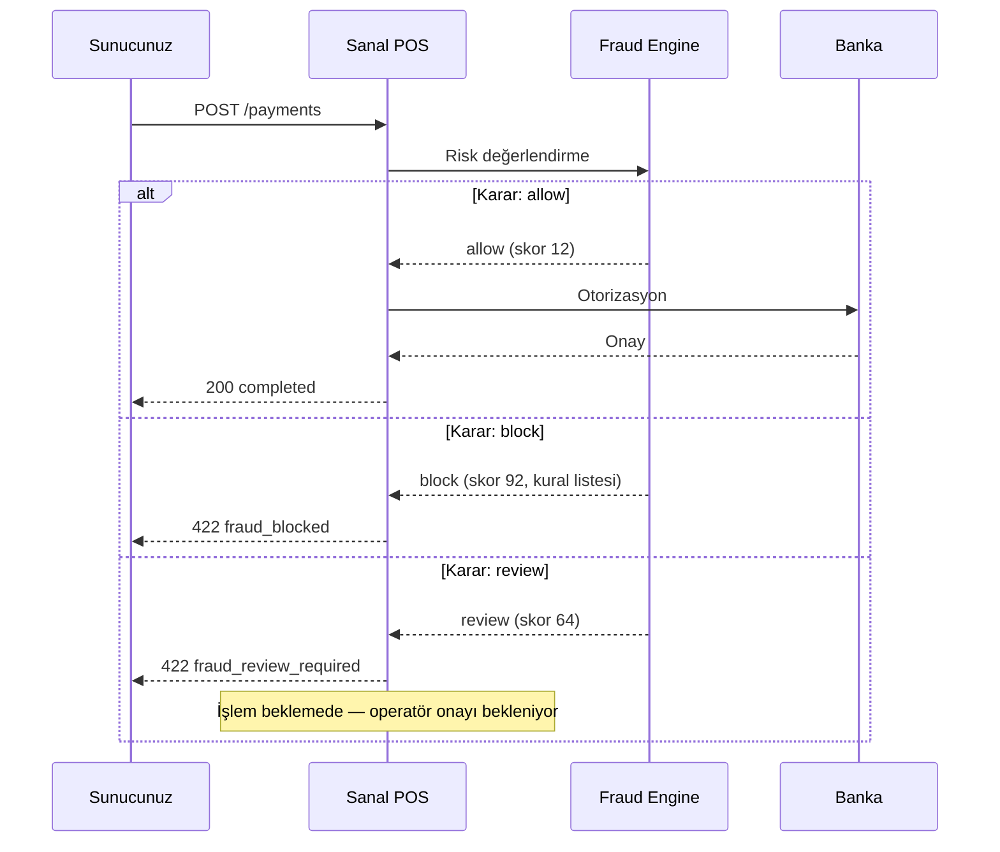

Payven Fraud modülü; ödeme akışlarına gerçek zamanlı risk skorlama ve kural tabanlı kontrol katmanı ekler. Sanal POS'a entegre olarak çalışır — her `POST /payments` ve `POST /payments/3d/init` çağrısı otomatik olarak fraud servisinden geçer ve `allow / review / block` kararı alınır.

<Note>
Fraud, Sanal POS müşterilerine **ek modül** olarak veya Sanal POS planının
parçası olarak sunulur. Standalone fraud servisi olarak da kullanılabilir
(merchant'ınızın kendi ödeme yönlendirme sistemini riske karşı denetlemek için).
</Note>

## Temel özellikler

<CardGroup cols={2}>
  <Card title="Hız Kontrolü (Velocity)" icon="gauge-high">
    Aynı kart, IP, e-posta veya merchant'tan birim zamanda gelen istek sayısı limitleri.
  </Card>
  <Card title="Kara/Beyaz Liste" icon="user-slash">
    BIN, kart numarası, IP, e-posta, müşteri kimliği bazlı block/allow listeleri.
  </Card>
  <Card title="Tutar & BIN Kuralları" icon="filter">
    "Yurt dışı BIN'lere 10.000 TL üstü reddet", "Prepaid kartlara taksit reddet" gibi kompozit kurallar.
  </Card>
  <Card title="Manual Review Queue" icon="user-check">
    `review` kararı alan işlemler operatöre düşer; karar verilene kadar otorizasyon beklemeye alınır.
  </Card>
  <Card title="Tenant + Merchant Politikaları" icon="layer-group">
    Tenant geneli varsayılan kurallar + merchant bazlı override. Plan-bazlı kapasite.
  </Card>
  <Card title="Olay Logları & Alerts" icon="bell">
    Her fraud kararı log'lanır; eşik aşımlarında alert tetiklenir.
  </Card>
</CardGroup>

## Base URL

| Ortam | URL |
|---|---|
| Sandbox | `https://fraud-sandbox.payven.com.tr` |
| Production | `https://fraud.payven.com.tr` |

## Fraud kararı

Sanal POS her ödeme isteğinde fraud servisini otomatik çağırır — sizin tarafınızdan ek bir API çağrısı gerekmez. Sonuç üç karardan biri olur:



| Karar | Anlam | Sonuç |
|---|---|---|
| `allow` | Risk düşük, işleme devam | Sanal POS bankaya otorizasyon gönderir |
| `block` | Risk yüksek — kesin reddet | `422 fraud_blocked` döner; işlem oluşmaz |
| `review` | Risk orta — manuel onay gerekli | İşlem `review` durumunda bekler; operatör allow/block'a çevirir |

## Kural tipleri

| Tip | Örnek konfigürasyon |
|---|---|
| **Velocity** | "Aynı karttan dakikada 5'ten fazla istek → block" |
| **Amount limit** | "Tek işlem üst sınırı 50.000 TL → review" |
| **BIN whitelist/blacklist** | "Yurt dışı BIN'lerini blokla", "Sadece şu 10 BIN'e izin ver" |
| **3DS zorunluluk** | "Belirli BIN'ler veya tutarlar için 3DS olmadan reddet" |
| **Geo-IP** | "TR dışı IP'lerden gelen istekleri review'e al" |
| **E-posta domain** | "Tek-kullanımlık e-posta domain'lerini blokla" |
| **Risk skoru kompoziti** | Velocity + amount + BIN sinyallerinden 0-100 skor üret |

Kural konfigürasyonu konsoldan yapılır veya API üzerinden:

```bash
curl -X POST https://fraud-sandbox.payven.com.tr/api/v1/fraud/rules \
  -H "Authorization: Bearer $PAYVEN_TOKEN" \
  -H "Content-Type: application/json" \
  -d '{
    "name":      "Yuksek tutar review",
    "type":      "amount_limit",
    "condition": { "operator": "gt", "value": 5000000 },
    "action":    "review",
    "priority":  10
  }'
```

## Endpoint kategorileri

Aşağıdaki endpoint'ler kuruluşunuzun fraud politikasını yönetmek içindir:

| Kategori | Açıklama |
|---|---|
| `/fraud/rules` | Kuruluş kurallarının CRUD'u |
| `/fraud/blacklist`, `/fraud/whitelist` | Kara/beyaz liste yönetimi (kart, BIN, IP, e-posta) |
| `/fraud/alerts` | Eşik aşımlarında üretilen uyarıların listesi |
| `/fraud/logs` | Fraud kararlarının audit kaydı |
| `/fraud/merchant-policies` | Merchant başına kural override'ları |
| `/fraud/reviews` | `review` durumundaki işlemlerin manuel onay/red'i |

## Webhook olayları

| Olay | Tetikleyici |
|---|---|
| `fraud.alert.created` | Yeni alert tetiklendi (eşik aşıldı) |
| `fraud.review_required` | İşlem manuel review'e düştü |
| `fraud.review_resolved` | Operatör review kararı verdi |
| `fraud.rule_triggered` | Bir kural tetiklendi (audit logging için) |

## Yol haritası

- **Machine learning skoring** — kural motoru üzerine ML tabanlı skor eklemesi
- **3rd party adapter** — Riskified, Sift, Forter gibi sistemler ile bridge
- **Chargeback feedback loop** — gelen chargeback'ler skoring modeline geri besler
- **Velocity dashboards** — gerçek zamanlı eşik görselleştirmesi

API referansı: [Fraud OpenAPI](/api-reference/fraud).
