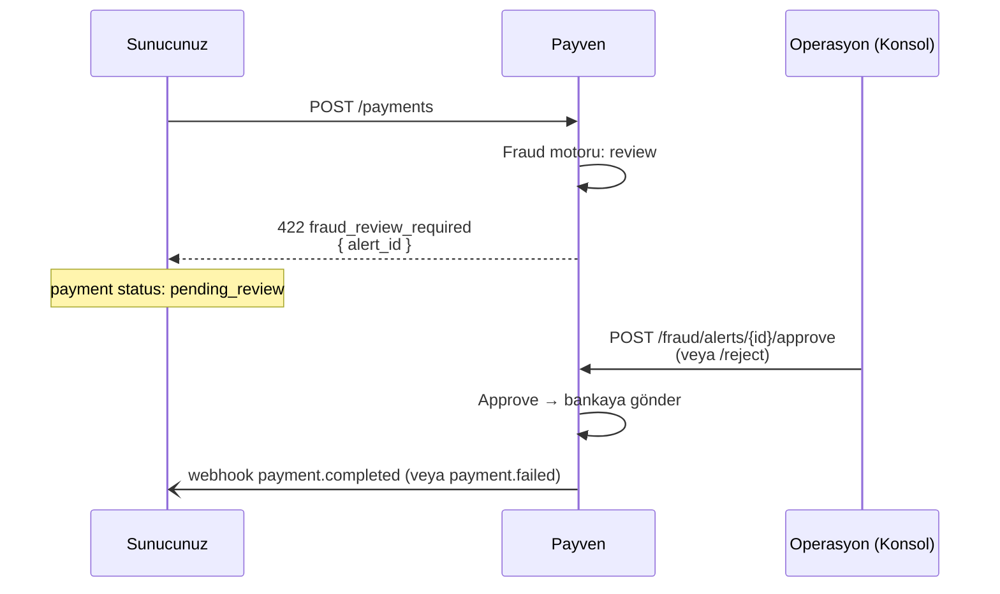

Payven Fraud modülü, Sanal POS akışlarına gömülü olarak çalışan **gerçek zamanlı bir kural motorudur**. Her ödeme isteği banka çağrısından önce kural setinden geçer; bir kural tetiklenirse işlem `fraud_blocked` veya `fraud_review_required` ile yanıtlanır.

<Note>
Fraud modülü Sanal POS akışı içinde **otomatik** çalışır — ayrı bir API çağrısı yapmanıza gerek yoktur. Ödeme isteği sırasında karar verilir, hata yanıtında neden döndürülür.
</Note>

## Bileşenler

<CardGroup cols={2}>
  <Card title="Kara Liste" icon="ban" href="/api-reference/fraud/tenantfraudblacklist">
    Kart, e-posta, IP veya cihaz parmak izi tabanlı engelleme listesi.
  </Card>
  <Card title="Fraud Kuralları" icon="shield-halved" href="/api-reference/fraud/tenantfraudrules">
    Hız kontrolü, tutar limitleri, BIN kısıtlama, 3DS zorunluluk gibi kural tipleri.
  </Card>
  <Card title="Bayi Politikaları" icon="building-shield" href="/api-reference/fraud/tenantfraudmerchantpolicies">
    Tenant geneli kuralların yanında bayi-bazlı override'lar.
  </Card>
  <Card title="Fraud Uyarıları" icon="bell-on" href="/api-reference/fraud/tenantfraudalerts">
    Manuel inceleme kuyruğunda bekleyen işlemler — onaylama / reddetme akışı.
  </Card>
</CardGroup>

## Kural tipleri

| Tip | Açıklama | Örnek konfigürasyon |
|---|---|---|
| **Velocity (hız kontrolü)** | Belirli bir süre içinde aynı kart / IP / e-posta'dan kaç işlem geçebileceğini kısıtlar | "5 dakikada aynı karttan max 3 işlem" |
| **Amount limit (tutar limiti)** | İşlem tutarı eşiğini aşan işlemleri engeller veya inceleme kuyruğuna düşürür | "10.000 ₺ üzeri işlem manuel inceleme" |
| **BIN restriction** | Belirli BIN aralıklarını engelle / izin ver | "Yurtdışı BIN'ler 3DS zorunlu" |
| **3DS enforcement** | Belirli koşullarda 3D Secure'u zorunlu kılar | "5.000 ₺ üzeri işlem 3DS zorunlu" |
| **Blacklist match** | Kara liste eşleşmesi | "Kart numarası kara listede → engelle" |

## Karar tipleri

Bir ödeme fraud motoru tarafından üç farklı karar alabilir:

| Karar | API yanıtı | Sonraki adım |
|---|---|---|
| `allow` | İşlem normal akışla bankaya gider | — |
| `review` | `422 fraud_review_required` ile döner; işlem `pending_review` durumunda kalır | Konsoldan veya `POST /fraud/alerts/{id}/approve` ile onayla / reddet |
| `block` | `422 fraud_blocked` ile döner; işlem oluşmaz | Müşteriye genel hata mesajı göster — sebep paylaşma |

## Manuel inceleme akışı

## Daha fazlası

- API referansı için [Fraud OpenAPI](/api-reference/fraud) bölümüne bakın
- Kural tasarımı, eşik belirleme ve A/B test yaklaşımı için [destek ekibimizle](/resources/support) iletişime geçin

<Note>
Bu modül için ayrıntılı narrative dokümantasyon (kural reçeteleri, performans tuning, ML skor entegrasyonu) önümüzdeki sürümde genişletilecek — bkz. [Changelog](/resources/changelog).
</Note>
