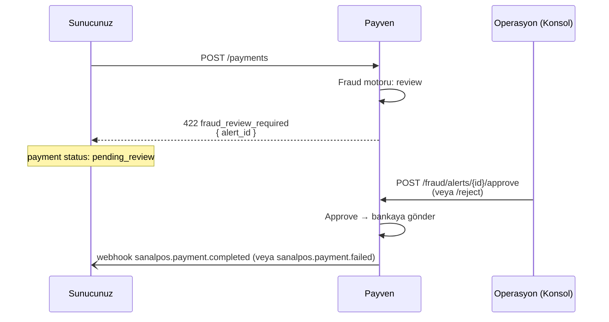

Payven Fraud modülü, Sanal POS akışlarına gömülü olarak çalışan **gerçek zamanlı bir kural motorudur**. Her ödeme isteği banka çağrısından önce kural setinden geçer; bir kural tetiklenirse işlem `fraud_blocked` veya `fraud_review_required` ile yanıtlanır.

<Note>
Fraud modülü Sanal POS akışı içinde **otomatik** çalışır — ayrı bir API çağrısı yapmanıza gerek yoktur. Ödeme isteği sırasında karar verilir, hata yanıtında neden döndürülür.
</Note>

## Bileşenler

<CardGroup cols={2}>
  <Card title="Blacklist" icon="ban" href="/api-reference/fraud/tenantfraudblacklist">
    Kart, e-posta, IP veya cihaz parmak izi tabanlı engelleme listesi.
  </Card>
  <Card title="Fraud Kuralları" icon="shield-halved" href="/api-reference/fraud/tenantfraudrules">
    Hız kontrolü, tutar eşiği, IBAN ülke uyuşmazlığı gibi kural tipleri.
  </Card>
  <Card title="Bayi Politikaları" icon="building-shield" href="/api-reference/fraud/tenantfraudmerchantpolicies">
    Tenant geneli kuralların yanında bayi-bazlı override'lar.
  </Card>
  <Card title="Fraud Uyarıları" icon="bell-on" href="/api-reference/fraud/tenantfraudalerts">
    Manuel inceleme kuyruğunda bekleyen işlemler — onaylama / reddetme akışı.
  </Card>
</CardGroup>

## Kural tipleri

| Tip (`rule_type`) | Açıklama | Örnek konfigürasyon |
|---|---|---|
| `velocity_count` | Belirli bir süre içinde aynı kart / IP / e-posta'dan kaç işlem geçebileceğini kısıtlar | "5 dakikada aynı karttan max 3 işlem" |
| `amount_threshold` | İşlem tutarı eşiğini (kuruş) aşan işlemleri engeller veya inceleme kuyruğuna düşürür | "10.000 ₺ (1.000.000 kuruş) üzeri işlem manuel inceleme" |
| `blacklist_match` | Blacklist eşleşmesi (kart/IBAN/e-posta/IP hash'i) | "Kart numarası blacklist'te → engelle" |
| `iban_country_mismatch` | IBAN ülkesi ile bayi ülkesi uyuşmazlığını yakalar | "TR-dışı IBAN → inceleme" |
| `custom_script` | Yönetici tarafından girilen özel C# ifadesi ile değerlendirme | Özel koşullar |

<Note>
3D Secure zorunluluğu Fraud kural tipi değildir — tenant ödeme politikası
(`PreferredThreeDFlow`, `AllowNon3D`) ve bayi banka profili üzerinden Identity'de yönetilir.
Yüksek tutarda 3DS zorlamak gibi senaryolar baseline seed'te `amount_threshold` kuralı ile
modellenir.
</Note>

## Karar tipleri

Bir ödeme fraud motoru tarafından üç farklı karar alabilir:

| Karar | API yanıtı | Sonraki adım |
|---|---|---|
| `allow` | İşlem normal akışla bankaya gider | — |
| `review` | `422 fraud_review_required` ile döner; işlem `pending_review` durumunda kalır | Konsoldan veya `POST /fraud/alerts/{id}/approve` ile onayla / reddet |
| `block` | `422 fraud_blocked` ile döner; işlem oluşmaz | Müşteriye genel hata mesajı göster — sebep paylaşma |

## Manuel inceleme akışı

```mermaid
sequenceDiagram
    participant App as Sunucunuz
    participant Payven
    participant Op as Operasyon (Konsol)

    App->>Payven: POST /payments
    Payven->>Payven: Fraud motoru: review
    Payven-->>App: 422 fraud_review_required<br/>{ alert_id }
    Note over App: payment status: pending_review
    Op->>Payven: POST /fraud/alerts/{id}/approve<br/>(veya /reject)
    Payven->>Payven: Approve → bankaya gönder
    Payven-)App: webhook sanalpos.payment.completed (veya sanalpos.payment.failed)
```

## Daha fazlası

- API referansı için [Fraud OpenAPI](/api-reference/fraud) bölümüne bakın
- Kural tasarımı, eşik belirleme ve A/B test yaklaşımı için [destek ekibimizle](/resources/support) iletişime geçin

<Note>
Bu modül için ayrıntılı narrative dokümantasyon (kural reçeteleri, performans tuning, ML skor entegrasyonu) önümüzdeki sürümde genişletilecek — bkz. [Changelog](/resources/changelog).
</Note>
