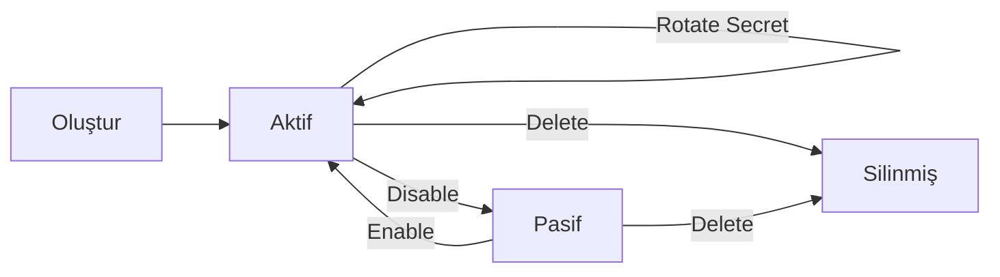

API anahtarları, ürün servislerine (Sanal POS, Para Transferi, Fraud, Fatura Ödeme) **sunucu-sunucu** kimlik doğrulaması için kullanılır. Anahtar yönetimi Identity servisi üzerinden yapılır.

## Anahtar yapısı

Bir anahtar iki bileşenden oluşur:

| Bileşen | Açıklama | Örnek |
|---|---|---|
| `apiKey` | Public tanımlayıcı | `pvk-prod-MaVpaXii` |
| `apiSecret` | Gizli imza anahtarı (yalnızca oluşturma anında bir kez gösterilir) | `ZQVHx6fpBJa4...` |

`apiKey` `pvk-` prefix'i ile başlar, ardından ortam (`prod` / `test`) ve rastgele segment gelir.

## Endpoint'ler

| İşlem | Endpoint | Auth |
|---|---|---|
| Anahtarları listele | `GET /api/v1/tenants/me/api-keys` | Bearer |
| Yeni anahtar oluştur | `POST /api/v1/tenants/me/api-keys` | Bearer + TenantAdmin |
| Anahtarı güncelle | `PUT /api/v1/tenants/me/api-keys/{id}` | Bearer + TenantAdmin |
| Secret rotasyonu | `POST /api/v1/tenants/me/api-keys/{id}/rotate-secret` | Bearer + TenantAdmin |
| Anahtarı revoke et | `DELETE /api/v1/tenants/me/api-keys/{id}` | Bearer + TenantAdmin |

## Yaşam döngüsü



## Anahtar listesi

```bash
curl https://identity.payven.com.tr/api/v1/tenants/me/api-keys \
  -H "Authorization: Bearer ..."
```

```json
{
  "isSuccess": true,
  "data": {
    "items": [
      {
        "id": "key_8e3f5c12",
        "apiKey": "pvk-prod-MaVpaXii",
        "name": "Production - Ödeme Servisi",
        "environment": "Production",
        "status": "Active",
        "ipWhitelist": ["52.18.42.10", "52.18.42.11"],
        "createdAt": "2026-01-15T10:00:00Z",
        "lastUsedAt": "2026-05-03T12:34:56Z",
        "secret": null
      }
    ],
    "totalCount": 4
  }
}
```

`secret` alanı **listeleme yanıtında her zaman `null`** döner. Secret yalnızca oluşturma ve rotasyon anında bir kez gösterilir.

## Kuralname

<Check>Her ortam (sandbox / production) için **ayrı anahtar** oluşturun.</Check>
<Check>Her servis için **ayrı anahtar** oluşturmayı düşünün — sızıntı durumunda etki alanı sınırlı kalır.</Check>
<Check>Production anahtarları için **IP whitelist** zorunlu kabul edin.</Check>
<Check>**6 ayda bir** rotasyona alın.</Check>
<Check>Ekipten ayrılan üye varsa o kişinin erişebildiği anahtarları **rotasyona alın**.</Check>

Detay: [API Anahtarı En İyi Uygulamaları](/documentation/security/api-key-best-practices).
