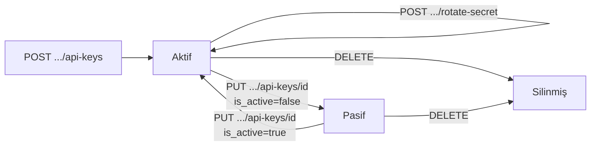

Payven'de bir API anahtarı, sunucu-sunucu entegrasyonlar için verilen bir **OAuth 2.0 client** çiftidir: `client_id` + `client_secret`. Bu çiftle [`/auth/{slug}/token`](/identity/auth/login) endpoint'inden JWT alır, ürün servislerine `Authorization: Bearer ...` ile çağrı yaparsınız.

<Note>
**JWT vs API Key kavramı:** Burada "API Key" diye bahsettiğimiz şey **uzun ömürlü kimlik bilgisi** (client_id + client_secret). API çağrılarında doğrudan kullanılmaz; **kısa ömürlü JWT alıp** onu kullanırsınız. Tek başına `client_id` ile API çağrısı yapamazsınız.
</Note>

## Anahtar yapısı

| Bileşen | Açıklama | Örnek |
|---|---|---|
| `client_id` | Public tanımlayıcı | `pvk-payven-a1b2c3` |
| `client_secret` | Gizli anahtar — yalnızca oluşturma ve rotasyon anında bir kez gösterilir | `whsec_AbC...XyZ` |

`client_id` formatı `pvk-{kuruluş-slug'ı}-{rastgele}` şeklindedir. Sandbox ve production ayrımı **kuruluş slug'ı** üzerinden yapılır (sandbox için ayrı slug + ayrı anahtar).

## Endpoint'ler

JWT Bearer auth gerektirir (kullanıcı `tenant-admin` rolünde olmalı).

```http
GET    /api/v1/tenants/me/api-keys                    # Liste (sayfalı)
GET    /api/v1/tenants/me/api-keys/{id}               # Tek anahtar
POST   /api/v1/tenants/me/api-keys                    # Yeni anahtar
PUT    /api/v1/tenants/me/api-keys/{id}               # Güncelleme
DELETE /api/v1/tenants/me/api-keys/{id}               # Silme (revoke)
POST   /api/v1/tenants/me/api-keys/{id}/rotate-secret # Secret rotasyonu
```

## Liste

```bash
curl https://identity.payven.com.tr/api/v1/tenants/me/api-keys \
  -H "Authorization: Bearer $PAYVEN_TOKEN"
```

Yanıt — sayfalı `ApiKeyDto` listesi:

```json
{
  "items": [
    {
      "id":                       "8e3f5c12-...",
      "tenant_id":                "1a2b3c4d-...",
      "keycloak_client_id":       "pvk-payven-a1b2c3",
      "display_name":             "Production — Ödeme Servisi",
      "contact_email":            "ops@example.com",
      "merchant_id":              "M-IST-001",
      "plan_id":                  "abc-...",
      "plan_code":                "standard",
      "plan_name":                "Standart Plan",
      "daily_limit_override":     null,
      "monthly_limit_override":   null,
      "rate_limit_override":      null,
      "effective_daily_limit":    100000,
      "effective_monthly_limit":  3000000,
      "effective_rate_limit":     200,
      "allowed_ips":              "52.18.42.10,52.18.42.0/24",
      "expires_at":               null,
      "is_active":                true,
      "created":                  "2026-01-15T10:00:00.000+00:00"
    }
  ],
  "page":              1,
  "total_pages":       1,
  "total_count":       4,
  "has_previous_page": false,
  "has_next_page":     false
}
```

| Alan | Açıklama |
|---|---|
| `keycloak_client_id` | Public tanımlayıcı — token alma çağrılarında `client_id` olarak gönderilir |
| `display_name` | İnsan-okur ad (raporlama için) |
| `merchant_id` | Bu anahtarın varsayılan merchant'ı — JWT claim'ine yansır |
| `plan_*` | Atanmış plan (rate limit ile günlük/aylık limit kaynağı) |
| `*_override` | Plan varsayılanını override eden kuruluş-bazlı limit |
| `effective_*` | Override'lar uygulanmış nihai limit (JWT claim olarak token'a basılır) |
| `allowed_ips` | Virgülle ayrılmış IP / CIDR listesi |
| `expires_at` | Anahtarın otomatik pasifleşeceği tarih (boş = sınırsız) |
| `is_active` | Pasif anahtarlar token üretemez |

<Note>
**`client_secret` listede her zaman gizli.** Sadece oluşturma + rotasyon yanıtında bir kez döner.
</Note>

## Yaşam döngüsü



## En iyi uygulamalar

<Check>**Ortam başına ayrı anahtar** — sandbox kuruluşu için ayrı `client_id` üretin, production'la karıştırmayın.</Check>
<Check>**Servis başına ayrı anahtar** — sızıntı durumunda etki alanı sınırlı kalır, audit kolaylaşır.</Check>
<Check>**Production için IP whitelist zorunlu** — `allowed_ips` doldurmadan production anahtar dağıtmayın.</Check>
<Check>**6 ayda bir rotasyon** — `rotate-secret` ile secret'ı yenileyin (eski 24 saat geçerli kalır, zero-downtime geçiş).</Check>
<Check>**Ekipten ayrılma protokolü** — bir kişi ayrıldığında o kişinin erişebildiği anahtarları rotasyona alın.</Check>

Detay: [API Anahtarı En İyi Uygulamaları](/documentation/security/api-key-best-practices).

## Sıradaki adımlar

<CardGroup cols={2}>
  <Card title="Yeni anahtar oluştur" icon="plus" href="/identity/api-keys/create">
    Adım adım kayıt + secret saklama.
  </Card>
  <Card title="Secret rotasyonu" icon="arrows-rotate" href="/identity/api-keys/rotate">
    Sızıntı şüphesi veya zamanlı rotation.
  </Card>
  <Card title="Anahtar revoke" icon="trash" href="/identity/api-keys/revoke">
    Pasif/sil — kullanılmayan anahtarları temizle.
  </Card>
  <Card title="JWT alma akışı" icon="key" href="/documentation/concepts/authentication">
    Aldığınız client_id+secret ile token nasıl alınır?
  </Card>
</CardGroup>
