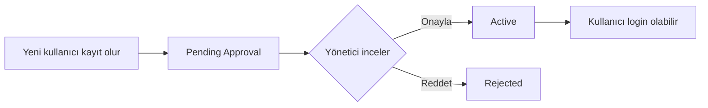

Kuruluşunuza bağlı yeni kullanıcılar self-service kayıt akışıyla başvurabilir. Kayıt sonrası hesap **onay bekleyen** statüde kalır — kuruluş yöneticisi onayladığında aktifleşir.

## Endpoint

```
POST /api/v1/auth/{slug}/register
```

## İstek

```bash
curl -X POST https://identity.payven.com.tr/api/v1/auth/acme-bank/register \
  -H "Content-Type: application/json" \
  -d '{
    "email": "yeni@acme-bank.com",
    "firstName": "Ayşe",
    "lastName": "Yılmaz",
    "phone": "+905551234567",
    "password": "GüçlüParola123!",
    "title": "Operasyon Uzmanı"
  }'
```

| Alan | Tip | Zorunlu | Açıklama |
|---|---|---|---|
| `email` | `string` | ✅ | Geçerli e-posta |
| `firstName` | `string` | ✅ | |
| `lastName` | `string` | ✅ | |
| `phone` | `string` | ⚠️ | E.164 formatında önerilir |
| `password` | `string` | ✅ | Min. 10 karakter, harf+rakam+sembol |
| `title` | `string` | ⚠️ | Kullanıcının ünvanı |

## Yanıt

```json
{
  "isSuccess": true,
  "message": "Kayıt başvurunuz alındı. Yönetici onayı bekleniyor.",
  "code": "201",
  "data": {
    "userId": "9f3d2b8e-5a4c-4a1d-9e2f-12cb24a8a8a8",
    "status": "PendingApproval"
  }
}
```

## Hata yanıtları

| HTTP | `code` | Anlam |
|---|---|---|
| `400` | `VALIDATION_INVALID_EMAIL` | E-posta formatı geçersiz |
| `400` | `VALIDATION_WEAK_PASSWORD` | Parola politikası karşılanmıyor |
| `409` | `USER_ALREADY_EXISTS` | Bu e-posta zaten kayıtlı |
| `404` | `TENANT_NOT_FOUND` | Slug bulunamadı |

## Onay süreci



Kuruluş yöneticileri bekleyen kullanıcıları konsoldaki **Kullanıcılar → Onay Bekleyenler** ekranından yönetir.
