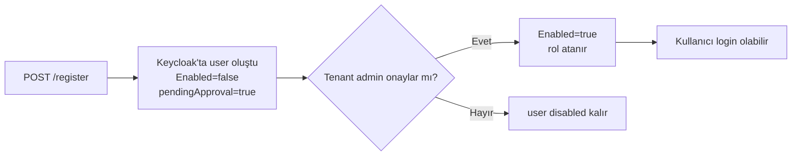

Bir tenant'a self-service kayıt akışıyla yeni kullanıcı eklenir. Kayıt sonrası hesap **onay bekleyen** statüde kalır (`Enabled=false`, `pendingApproval=true`); tenant yöneticisi konsolundan onayladığında aktifleşir ve rol atanır.

## Endpoint

```http
POST /api/v1/auth/{slug}/register
```

| Path parametresi | Açıklama |
|---|---|
| `slug` | Tenant slug. **`platform` slug'ı kabul edilmez** (platform admin sadece davet ile eklenebilir). |

<Note>
Bu endpoint **rate limited**: IP başına dakikada 10 istek. Aşımda `429 rate_limit_exceeded`.
</Note>

## İstek

```bash
curl -X POST https://identity.payven.com.tr/api/v1/auth/payven/register \
  -H "Content-Type: application/json" \
  -d '{
    "first_name":   "Ayşe",
    "last_name":    "Yılmaz",
    "email":        "ayse@example.com",
    "company_name": "Acme Ödeme Kuruluşu",
    "password":     "GüċlüParola123!"
  }'
```

| Alan | Tip | Zorunlu | Açıklama |
|---|---|---|---|
| `first_name` | string | ✅ | İsim |
| `last_name` | string | ✅ | Soyisim |
| `email` | string | ✅ | Geçerli e-posta — kullanıcı adı olarak kullanılır |
| `company_name` | string | ✅ | Şirket adı (Keycloak attribute olarak saklanır) |
| `password` | string | ✅ | Keycloak parola politikasına uygun (min uzunluk + karakter çeşitliliği) |

## Yanıt

`201 Created`:

```json
{
  "user_id": "9f3d2b8e-5a4c-4a1d-9e2f-12cb24a8a8a8",
  "email":   "ayse@example.com"
}
```

| Alan | Açıklama |
|---|---|
| `user_id` | Keycloak'ta oluşturulan kullanıcının kimliği |
| `email` | Doğrulanmış e-posta adresi |

## Onay süreci



Tenant adminleri **Konsol → Kullanıcılar → Onay Bekleyenler** ekranından bekleyenleri görür ve `PUT /api/v1/users/{id}` ile onaylar.

## Hata yanıtları

Hata zarfı RFC 9457 problem+json.

| HTTP | `code` | Anlam |
|---|---|---|
| `400` | `validation_failed` | Zorunlu alan eksik / format yanlış |
| `404` | `realm_not_found` | Slug bulunamadı veya `platform` denendi |
| `403` | `tenant_inactive` | Tenant askıya alınmış |
| `409` | `user_already_exists` | Bu e-posta zaten kayıtlı (aynı tenant içinde) |
| `422` | `weak_password` | Parola Keycloak politikasına uymuyor |
| `429` | `rate_limit_exceeded` | Çok fazla deneme — `Retry-After` header'ına uyun |
