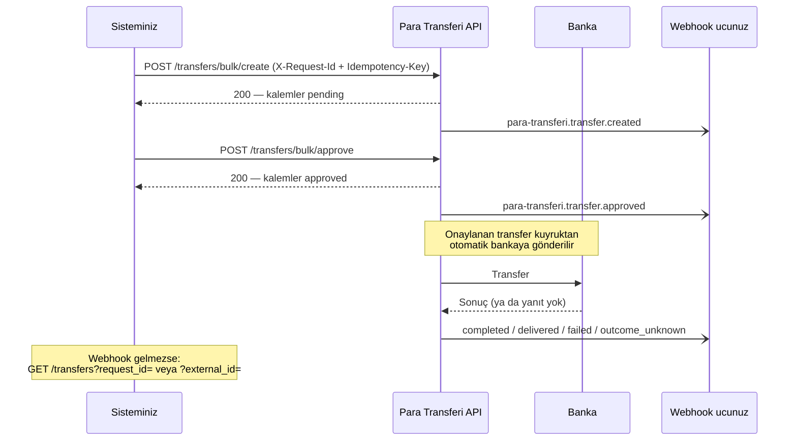

Bu sayfa Para Transferi API'sini **çift ödeme riski olmadan** kullanmak için önerilen uçtan uca
akışı anlatır. Kısaca: oluşturun, onaylayın, sonucu webhook ile dinleyin, webhook gelmezse kendi
referansınızla sorgulayın — **`processing` durumundaki transferi asla yeniden göndermeyin.**



## 1. Oluşturma — `POST /transfers/bulk/create`

Her paket için **benzersiz** iki başlık gönderin:

| Başlık | Ne işe yarar |
|---|---|
| `X-Request-Id` | Sizin **paket numaranız**. Transferlere `request_id` olarak yazılır; aynı değerle ikinci istek `409 PV_DUPLICATE_REQUEST` ile reddedilir. Sonradan `GET /transfers?request_id=` ile tüm paketi çekersiniz. |
| `Idempotency-Key` | Ağ kopmasına karşı. Yanıtını alamadığınız isteği **aynı anahtar ve aynı gövdeyle** tekrar gönderirseniz ilk yanıt döner, yeni transfer açılmaz (transfer uçlarında 24 saat). |

Her kalemde:

- **`external_id`** — sisteminizdeki tekil referans (ör. ödeme emri no). Aynı bayide ikinci kez
  kullanılamaz: tekrar gelirse **istek bütünüyle** `409 PV_TRANSFER_EXTERNAL_ID_DUPLICATE` ile
  reddedilir, hiçbir transfer oluşmaz. Aynı istek içinde tekrar eden `external_id` de aynı hatayı verir.
- **`source_account_id`** — paranın çıkacağı gönderici hesap (kalem başına).

```bash
curl -X POST https://transfer.payven.com.tr/api/v1/transfers/bulk/create \
  -H "Authorization: Bearer $PAYVEN_TOKEN" \
  -H "X-Request-Id: PAKET-2026-10-05-001" \
  -H "Idempotency-Key: 7c1d0a5e-2f4b-4c3a-9a51-0f3c6f1d2b11" \
  -H "Content-Type: application/json" \
  -d '{
    "items": [
      {
        "source_account_id": "550e8400-e29b-41d4-a716-446655440000",
        "external_id":       "ODEME-000123",
        "description":       "Ekim hakediş ödemesi",
        "transfer_type":     "fast",
        "amount":            { "value": 1500000, "currency_code": "TRY" },
        "recipient": {
          "holder_name": "Ahmet Yılmaz",
          "iban":        "TR330006100519786457841326"
        }
      }
    ]
  }'
```

<Tip>
`external_id` çakışması (`409 PV_TRANSFER_EXTERNAL_ID_DUPLICATE`) çoğu zaman **önceki denemenizin
başarılı olduğu** anlamına gelir. Yeni referansla tekrar oluşturmak yerine
`GET /transfers?external_id=ODEME-000123` ile mevcut transferi bulun.
</Tip>

## 2. Onay — `POST /transfers/bulk/approve`

Oluşturulan (`pending`) transferleri onaylayın. **Ayrıca gönderim çağrısı yapmanız gerekmez:**
onaylanan transfer gönderim kuyruğuna alınır ve otomatik olarak bankaya iletilir.

```bash
curl -X POST https://transfer.payven.com.tr/api/v1/transfers/bulk/approve \
  -H "Authorization: Bearer $PAYVEN_TOKEN" \
  -H "Content-Type: application/json" \
  -d '{ "transfers": [ { "transfer_id": "8e3f5c12-9a7b-4c8d-bc4e-2c963f66afa6" } ] }'
```

Organizasyonunuzda 4-göz (ayrı onaylayıcı) açıksa onayı, transferi oluşturan kullanıcıdan / API
anahtarından **farklı** bir kimlik vermelidir.

## 3. Sonucu webhook ile dinleyin

İşyeri API'sinde (`/api/v1/webhook-endpoints`) bir uç tanımlayın ve en az şu olaylara abone olun:

| Olay | Sizin yapacağınız |
|---|---|
| `para-transferi.transfer.completed` | Ödemeyi **başarılı** kapatın. |
| `para-transferi.transfer.failed` | Ödemeyi **başarısız** işaretleyin; gerekiyorsa açıkça yeniden gönderin (aşağıda). |
| `para-transferi.transfer.delivered` | Banka aldı, kesin sonuç sonra gelecek — **bekleyin**. |
| `para-transferi.transfer.outcome_unknown` | Banka yanıt vermedi — **bekleyin, yeniden göndermeyin**. |
| `para-transferi.transfer.rejected` | Transfer gönderilmeden reddedildi; para hareket etmedi. |
| `para-transferi.transfer.refunded` | Gönderilmiş transfer iade edildi. |

İsteğe bağlı: `para-transferi.transfer.created`, `para-transferi.transfer.approved` (ara durumlar)
ve Excel paketleri için `para-transferi.bulk_transfer.completed`. Tüm olaylar ve gövde alanları:
[Olay Kataloğu](/para-transferi/webhooks/events).

Webhook teslimi **en az bir kez**dir; aynı olay birden fazla gelebilir. `X-Payven-Event-Id` ile
tekilleştirin ve imzayı (`X-Payven-Signature`) doğrulayın — bkz. [Webhook'lar](/documentation/concepts/webhooks).

<Warning>
**`delivered` kesin sonuç değildir.** EFT valörü ya da kart transferinde banka önce kabul eder, kesin
sonucu sonra bildirir; `delivered`'dan sonra hem `completed` hem **`failed`** gelebilir. Ödemenizi
yalnız `completed`'da başarılı kapatın.
</Warning>

## 4. Webhook gelmezse — sorgu yedeği

Webhook ucunuz bir süre erişilemediyse kendi referanslarınızla sorgulayın (her transfer için tek tek
`GET /transfers/{id}` yapmanız gerekmez):

```http
GET /api/v1/transfers?request_id=PAKET-2026-10-05-001&page_size=100
GET /api/v1/transfers?external_id=ODEME-000123
```

`request_id` ve `external_id` **birebir** eşleşir. Ayrıntı: [Transfer Listesi](/para-transferi/inquiries/transfer-list).

Sorgu yedeğini seyrek tutun (ör. bekleyen paketler için birkaç dakikada bir); asıl kanal webhook'tur.

## 5. Yeniden gönderim kuralları

| Durum | Yeniden gönderilebilir mi? |
|---|---|
| `processing` | **Hayır.** Banka transferi işlemiş olabilir. Sonuç otomatik kesinleşir (banka sorgusu / banka bildirimi) ya da operatör banka kaydına bakarak sonuçlandırır; `completed` veya `failed` olayı gelir. |
| `delivered` | **Hayır.** Banka aldı; kesin sonucu bekleyin. |
| `failed` | **Evet, yalnız sizin açık kararınızla:** `POST /transfers/bulk/send`. `failed` bankanın kesin reddi ya da transferin bankaya hiç gidemediği (ör. banka oturumu alınamadı) anlamına gelir. |
| `rejected` | Gönderilemez; yeniden onaylanabilir (`bulk/approve`) ya da yeni transfer oluşturulur. |

`bulk/send` yanıtındaki bir kalemde `error_code: "PV_TRANSFER_OUTCOME_UNKNOWN"` görürseniz banka yanıt
vermemiştir: transfer `processing`'te kalır, **tekrar göndermeyin**, sonucu webhook ile bekleyin.

<Warning>
Kendi tarafınızda "zaman aşımı → yeni `external_id` ile yeniden oluştur" mantığı **kurmayın.** Bu,
bankanın ilk isteği işlediği durumda aynı alıcıya ikinci kez para gönderir. Belirsizlikte
`external_id` ile sorgulayın ve sonucu bekleyin.
</Warning>

## Kontrol listesi

<Check>Her paket için benzersiz `X-Request-Id` ve `Idempotency-Key`.</Check>
<Check>Her kalemde tekil `external_id` ve `source_account_id`.</Check>
<Check>Onaydan sonra ayrıca `bulk/send` çağrılmıyor.</Check>
<Check>Webhook ucu imza doğruluyor ve `X-Payven-Event-Id` ile tekilleştiriyor.</Check>
<Check>Ödeme yalnız `completed`'da başarılı kapatılıyor; `delivered` ve `outcome_unknown` bekleniyor.</Check>
<Check>`processing` / `delivered` transferler asla yeniden gönderilmiyor.</Check>
<Check>Webhook kesintisinde `GET /transfers?request_id=` / `?external_id=` ile yedek sorgu.</Check>
