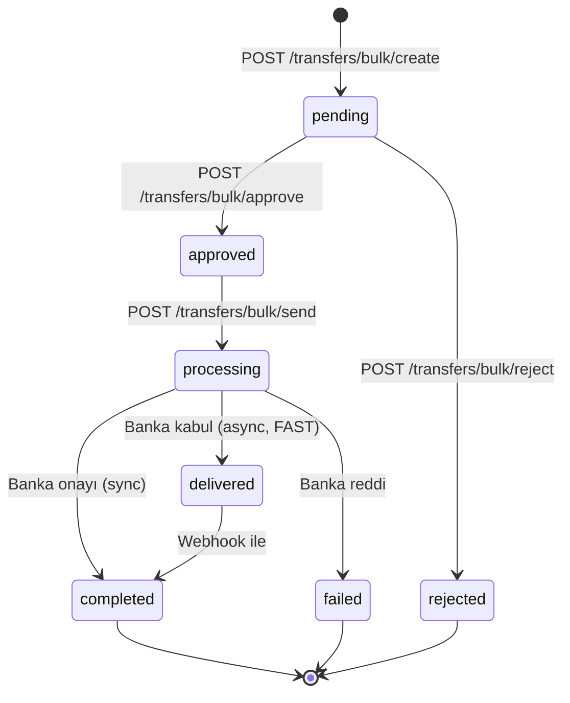

Payven Para Transferi modülü; lisanslı ödeme kuruluşları ve büyük platformlar için **çoklu banka transfer altyapısı** sunar. EFT, FAST ve havale işlemlerini tek API üzerinden 6 banka konnektörü üzerinden yürütür; toplu işlem desteği, otomatik mutabakat ve transfer iade yönetimi içerir.

## Temel özellikler

<CardGroup cols={2}>
  <Card title="Çoklu Banka Konnektörleri" icon="building-columns">
    Kuveyt Türk, Fibabanka, İş Bankası, Intertech, Akbank, HalkBank — REST/SOAP/OAuth2 farklarını Payven yönetir.
  </Card>
  <Card title="EFT + FAST + Havale" icon="arrow-right-arrow-left">
    Tek API ile üç transfer tipi. Bankaya göre otomatik FAST/EFT seçimi.
  </Card>
  <Card title="Bulk İşlem" icon="layer-group">
    Onlarca-yüzlerce transferi tek istekte gönderin; banka batch API'leri otomatik kullanılır.
  </Card>
  <Card title="Polly Resilience" icon="arrows-rotate">
    HTTP retry (3x exponential backoff), circuit breaker (3 failure → 30sn), token retry — hepsi otomatik.
  </Card>
  <Card title="Webhook + SignalR Dashboard" icon="bell">
    Transfer status değişimleri webhook ile teslim edilir; dashboard SignalR ile gerçek zamanlı güncellenir.
  </Card>
  <Card title="Multi-Tenant Soft Delete" icon="shield-keyhole">
    Tenant bazlı izolasyon (`X-Tenant-Id`), EF Core query filter ile otomatik kapsam.
  </Card>
</CardGroup>

## Base URL

| Ortam | URL |
|---|---|
| Sandbox | `https://transfer-sandbox.payven.com.tr` |
| Production | `https://transfer.payven.com.tr` |

## Transfer yaşam döngüsü



| Durum | Anlam |
|---|---|
| `pending` | Transfer oluşturuldu, onay bekliyor (4-eyes principle) |
| `approved` | Onaylandı, banka gönderimine hazır |
| `processing` | Bankaya gönderildi, yanıt bekleniyor |
| `completed` | Banka tarafından onaylandı (senkron başarı) |
| `delivered` | Banka kabul etti, hesap geçişi asenkron (FAST modeli) |
| `failed` | Banka reddetti veya teknik hata |
| `rejected` | İç onay sürecinde reddedildi |

## Endpoint kategorileri

| Kategori | Endpoint örnekleri |
|---|---|
| Transfer yaşam döngüsü | `POST /transfers/bulk/create`, `/approve`, `/reject`, `/send` |
| Sorgulama | `GET /transfers`, `GET /transfers/{id}` |
| Dekont | `GET /transfers/{id}/receipt/download`, `/base-64` |
| Hesaplar | `GET /accounts`, `/accounts/transactions` |
| Alıcılar | `POST /recipients`, `GET /receiveraccounts` |
| Tekrarlayan | `POST /recurringtransfers` |
| Validasyon | `POST /validation/iban` |

## Hızlı başlangıç

```bash
# 1. Bulk transfer oluştur (4-eyes: önce create)
curl -X POST https://transfer-sandbox.payven.com.tr/api/v1/transfers/bulk/create \
  -H "Authorization: Bearer $PAYVEN_TOKEN" \
  -H "Idempotency-Key: payroll-2026-05-01" \
  -H "Content-Type: application/json" \
  -d '{
    "transfers": [
      {
        "external_id":      "PAYROLL-001",
        "amount":           { "amount": 1500000, "currency": "TRY" },
        "transfer_type":    "fast",
        "sender_account_id": "3fa85f64-...",
        "receiver_account": {
          "iban":           "TR000006100000000000000001",
          "owner_name":     "Ahmet Yilmaz",
          "owner_tax_id":   "12345678901"
        },
        "description":      "Mayıs maaş ödemesi"
      }
    ]
  }'

# 2. Onayla (yetkilendirilmiş kullanıcı tarafından)
curl -X POST https://transfer-sandbox.payven.com.tr/api/v1/transfers/bulk/approve \
  -H "Authorization: Bearer $PAYVEN_TOKEN" \
  -H "Content-Type: application/json" \
  -d '{ "transfer_ids": ["8e3f5c12-..."] }'

# 3. Bankaya gönder
curl -X POST https://transfer-sandbox.payven.com.tr/api/v1/transfers/bulk/send \
  -H "Authorization: Bearer $PAYVEN_TOKEN" \
  -H "Content-Type: application/json" \
  -d '{ "transfer_ids": ["8e3f5c12-..."] }'
```

## Konnektör kapasitesi

| Konnektör | Auth | EFT | FAST | Havale | Kart Transferi | Dekont PDF | Bulk |
|---|---|---|---|---|---|---|---|
| Kuveyt Türk | OAuth2 | ✅ | ✅ | ✅ | ✅ | ✅ | ✅ |
| Fibabanka | REST + mTLS opsiyonel | — | — | — | ✅ | — | ✅ |
| İş Bankası | OAuth2 (scope: EFT/Fast/Remittance/Credit) | ✅ | ✅ | ✅ | ✅ | ✅ | ✅ |
| Akbank | OAuth2 | ✅ | ✅ | ✅ | ✅ | ✅ | Native bulk |
| HalkBank | SOAP/WCF | ✅ | ✅ | ✅ | — | ✅ | ✅ |
| Intertech | REST | (stub) | (stub) | (stub) | (stub) | — | — |

<Note>
Konnektör isimleri ve auth yöntemleri **konfigürasyon** üzerinden gelir; sizin
istek payload'unuz tüm bankalar için aynı şekildedir. Hangi banka kullanılacağı
**connector configuration**'a göre seçilir.
</Note>

## Webhook olayları

| Olay | Tetikleyici |
|---|---|
| `transfer.created` | Yeni transfer oluşturuldu (pending) |
| `transfer.approved` | Onaylandı |
| `transfer.rejected` | İç onayda reddedildi |
| `transfer.completed` | Banka senkron onay verdi |
| `transfer.delivered` | Banka asenkron kabul etti (FAST) |
| `transfer.failed` | Banka reddi veya teknik hata |

Webhook delivery: HMAC-SHA256 imzalı, 6 retry (1m / 5m / 30m / 2h / 24h), 15sn timeout, dead letter queue.

## Sorumlu kullanım

<Warning>
Para transferi modülü **iyi yapılandırılmış AML/KYC süreçlerinizle birlikte**
çalışır. IBAN doğrulama (`/validation/iban`) ve alıcı doğrulama
(`recipients` master) ile birlikte sahte transfer riskini düşürün.
</Warning>

## Yol haritası

Para transferi referans dokümanı genişlemeye devam ediyor. Yakında:
- **Transfer Object** — tüm alanların referansı
- **Transfer akışları** — create/approve/send adımlarının ayrı detay sayfaları
- **Recurring Transfers** — periyodik transfer kurulumu
- **Hesap & Alıcı yönetimi** — master data yapıları

API referansı için: [Para Transferi OpenAPI](/api-reference/transfer).
