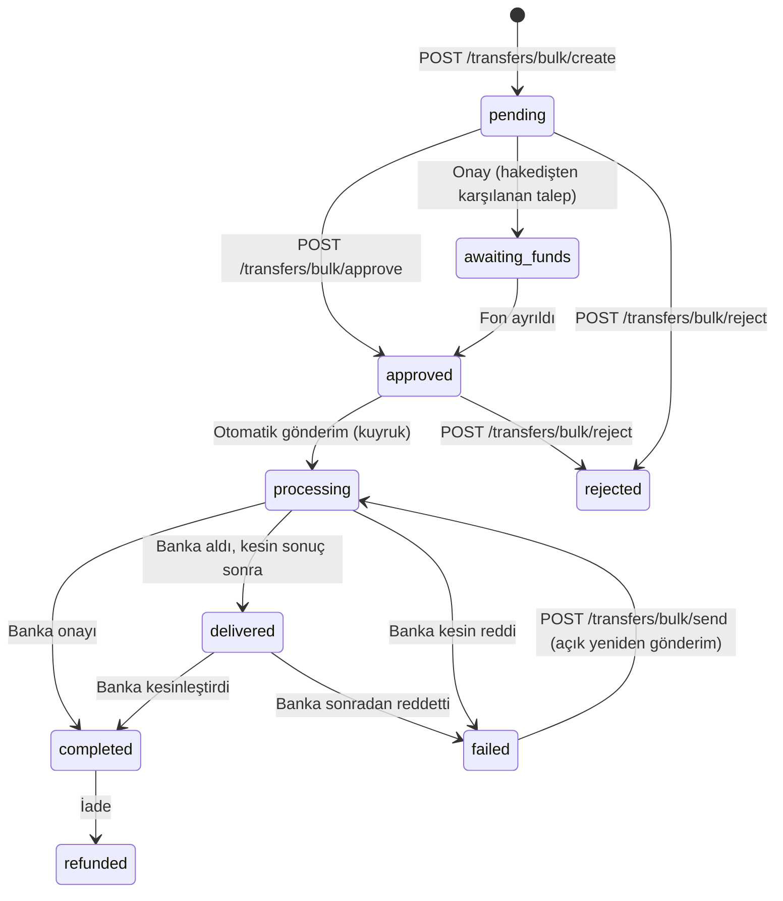

Payven Para Transferi modülü; lisanslı ödeme kuruluşları ve büyük platformlar için **çoklu banka transfer altyapısı** sunar. EFT, FAST ve havale işlemlerini tek API üzerinden çoklu banka konnektörü üzerinden yürütür; toplu işlem desteği, otomatik mutabakat ve transfer iade yönetimi içerir.

## Temel özellikler

<CardGroup cols={2}>
  <Card title="Çoklu Banka Konnektörleri" icon="building-columns">
    Kuveyt Türk, Fibabanka, İş Bankası, Akbank, HalkBank ve diğerleri — banka entegrasyonlarının teknik farklarını Payven soyutlar; sizin payload'unuz tüm bankalarda aynıdır.
  </Card>
  <Card title="EFT + FAST + Havale" icon="arrow-right-arrow-left">
    Tek API ile üç transfer tipi. Bankaya göre otomatik FAST / EFT seçimi.
  </Card>
  <Card title="Bulk İşlem" icon="layer-group">
    Onlarca-yüzlerce transferi tek istekte gönderin; banka batch API'leri otomatik kullanılır.
  </Card>
  <Card title="Otomatik Resilience" icon="arrows-rotate">
    Geçici hatalarda exponential backoff retry, eşik aşımında devre kesici, token tazeleme — hepsi otomatik.
  </Card>
  <Card title="Webhook + Realtime Dashboard" icon="bell">
    Transfer durum değişimleri webhook ile teslim edilir; konsol gerçek zamanlı güncellenir.
  </Card>
  <Card title="Tenant İzolasyonu" icon="shield-keyhole">
    Her organizasyonun verisi diğer organizasyonlardan tamamen yalıtılmıştır.
  </Card>
</CardGroup>

## Base URL

| Ortam | URL |
|---|---|
| Sandbox | `https://transfer-sandbox.payven.com.tr` |
| Production | `https://transfer.payven.com.tr` |

## Transfer yaşam döngüsü


```mermaid
stateDiagram-v2
    [*] --> pending: POST /transfers/bulk/create
    pending --> approved: POST /transfers/bulk/approve
    pending --> awaiting_funds: Onay (hakedişten karşılanan talep)
    awaiting_funds --> approved: Fon ayrıldı
    approved --> processing: Otomatik gönderim (kuyruk)
    processing --> completed: Banka onayı
    processing --> delivered: Banka aldı, kesin sonuç sonra
    processing --> failed: Banka kesin reddi
    delivered --> completed: Banka kesinleştirdi
    delivered --> failed: Banka sonradan reddetti
    failed --> processing: POST /transfers/bulk/send (açık yeniden gönderim)
    completed --> refunded: İade
    pending --> rejected: POST /transfers/bulk/reject
    approved --> rejected: POST /transfers/bulk/reject
```

| Durum | Anlam |
|---|---|
| `pending` | Transfer oluşturuldu, onay bekliyor (4-göz) |
| `awaiting_funds` | Onaylandı; bayinin talebi hakedişinden karşılanacak, fon bekleniyor |
| `approved` | Onaylandı, gönderim kuyruğunda — **ayrıca gönderim çağrısı gerekmez** |
| `processing` | Bankaya gönderildi, kesin sonuç henüz yok. Banka yanıt vermediyse (zaman aşımı) transfer **burada kalır, `failed` olmaz** ve yeniden gönderilmemelidir; sonuç banka sorgusu / banka bildirimiyle ya da operatör tarafından kesinleştirilir |
| `delivered` | Banka aldı, kesin sonuç bekleniyor (EFT valörü, kart transferi); sonradan `completed` ya da `failed` olabilir |
| `completed` | Banka transferi gerçekleştirdi |
| `failed` | Bankanın kesin reddi ya da transfer bankaya gönderilemedi (ör. banka oturumu alınamadı). Yalnız sizin açık kararınızla `POST /transfers/bulk/send` ile yeniden gönderilebilir |
| `rejected` | Gönderilmeden reddedildi; para hareket etmedi |
| `refunded` | Gönderilmiş transfer iade edildi (defter düzeltmesi) |

Önerilen akış ve yeniden gönderim kuralları: [Önerilen Entegrasyon Akışı](/para-transferi/integration-guide).

## Endpoint kategorileri

| Kategori | Endpoint örnekleri |
|---|---|
| Transfer yaşam döngüsü | `POST /transfers/bulk/create`, `/approve`, `/reject`, `/send` |
| Sorgulama | `GET /transfers` (`external_id`, `request_id` ile birebir), `GET /transfers/{id}` |
| Dekont | `GET /transfers/{id}/receipt/download`, `/base64` |
| Hesaplar | `GET /accounts`, `/accounts/transactions` |
| Alıcılar | `POST /recipients`, `GET /receiveraccounts` |
| Tekrarlayan | `POST /recurringtransfers` |
| Validasyon | `POST /validation/iban` |

## Hızlı başlangıç

```bash
# 1. Toplu transfer oluştur (4-göz: önce oluştur)
curl -X POST https://transfer-sandbox.payven.com.tr/api/v1/transfers/bulk/create \
  -H "Authorization: Bearer $PAYVEN_TOKEN" \
  -H "X-Request-Id: PAYROLL-2026-05" \
  -H "Idempotency-Key: payroll-2026-05-01" \
  -H "Content-Type: application/json" \
  -d '{
    "items": [
      {
        "source_account_id": "550e8400-e29b-41d4-a716-446655440000",
        "external_id":       "PAYROLL-001",
        "description":       "Mayıs maaş ödemesi",
        "transfer_type":     "fast",
        "amount":            { "value": 1500000, "currency_code": "TRY" },
        "recipient": {
          "holder_name": "Ahmet Yılmaz",
          "iban":        "TR330006100519786457841326"
        }
      }
    ]
  }'

# 2. Onayla — onaylanan transfer otomatik olarak bankaya gönderilir
curl -X POST https://transfer-sandbox.payven.com.tr/api/v1/transfers/bulk/approve \
  -H "Authorization: Bearer $PAYVEN_TOKEN" \
  -H "Content-Type: application/json" \
  -d '{ "transfers": [ { "transfer_id": "8e3f5c12-..." } ] }'

# 3. Sonucu webhook ile alın; webhook gelmezse kendi paket numaranızla sorgulayın
curl "https://transfer-sandbox.payven.com.tr/api/v1/transfers?request_id=PAYROLL-2026-05" \
  -H "Authorization: Bearer $PAYVEN_TOKEN"
```

`POST /transfers/bulk/send` normal akışta gerekmez; yalnız `failed` transferi bilinçli olarak yeniden
göndermek için kullanılır.

## Konnektör kapasitesi

| Konnektör | EFT | FAST | Havale | Kart Transferi | Dekont PDF | Bulk |
|---|---|---|---|---|---|---|
| Kuveyt Türk |  | Evet |  | Evet |  | Evet |
| Fibabanka | Evet | Evet | Evet | Evet | — | Evet |
| İş Bankası |  | Evet |  | Evet |  | Evet |
| Akbank |  | Evet |  | Evet |  | Evet |
| HalkBank |  | Evet |  | — |  | Evet |
| DenizBank | Evet | Evet | Evet | — | Evet | Evet |
| VakıfBank | Evet | Evet | Evet | — | — | Evet |

<Note>
İstek payload'unuz tüm bankalarda aynıdır. Hangi banka konnektörünün kullanılacağı
konsoldan tanımlanan **konnektör konfigürasyonuna** göre seçilir.
</Note>

## Webhook olayları

| Olay | Tetikleyici |
|---|---|
| `para-transferi.transfer.created` | Transfer oluşturuldu, onay bekliyor |
| `para-transferi.transfer.approved` | Transfer onaylandı, gönderim kuyruğunda |
| `para-transferi.transfer.outcome_unknown` | Banka yanıt vermedi; transfer `processing`'te kalır, **yeniden gönderilmemeli** — kesin sonuç sonra `completed` / `failed` olarak gelir |
| `para-transferi.transfer.delivered` | Banka aldı; kesin sonuç sonra bildirilir |
| `para-transferi.transfer.completed` | Banka transferi gerçekleştirdi |
| `para-transferi.transfer.failed` | Bankanın kesin reddi ya da gönderilemedi (`delivered`'dan sonra da gelebilir) |
| `para-transferi.transfer.rejected` | Transfer gönderilmeden reddedildi; para hareket etmedi |
| `para-transferi.transfer.refunded` | Gönderilmiş transfer iade edildi (defter düzeltmesi) |
| `para-transferi.bulk_transfer.completed` | Toplu transfer paketinin tüm kalemleri sonuçlandı (paket başına bir kez) |
| `para-transferi.recurring_execution.succeeded` / `.failed` | Tekrarlayan transferin günlük çekilimi başarılı / başarısız |
| `para-transferi.recurring_transfer.suspended` | Tekrarlayan transfer ardışık hatalarla askıya alındı |

Webhook uçları İşyeri API'sinde (`/api/v1/webhook-endpoints`) yönetilir; tek uç tüm ürünlerin
olaylarını alabilir. Teslim: HMAC-SHA256 imzalı, 10 deneme / ~2,5 gün (±%20 sapma), 15 sn zaman
aşımı; tükenen teslim panelden ya da API ile yeniden gönderilir. Detay:
[Webhook'lar](/documentation/concepts/webhooks).

## Sorumlu kullanım

<Warning>
Para transferi modülü **iyi yapılandırılmış AML/KYC süreçlerinizle birlikte**
çalışır. IBAN doğrulama (`/validation/iban`) ve alıcı doğrulama
(`recipients` master) ile birlikte sahte transfer riskini düşürün.
</Warning>

## Yol haritası

Para transferi referans dokümanı genişlemeye devam ediyor. Yakında:
- **Transfer Object** — tüm alanların referansı
- **Transfer akışları** — create/approve/send adımlarının ayrı detay sayfaları
- **Recurring Transfers** — periyodik transfer kurulumu
- **Hesap & Alıcı yönetimi** — master data yapıları

API referansı için: [Para Transferi OpenAPI](/api-reference/transfer).
