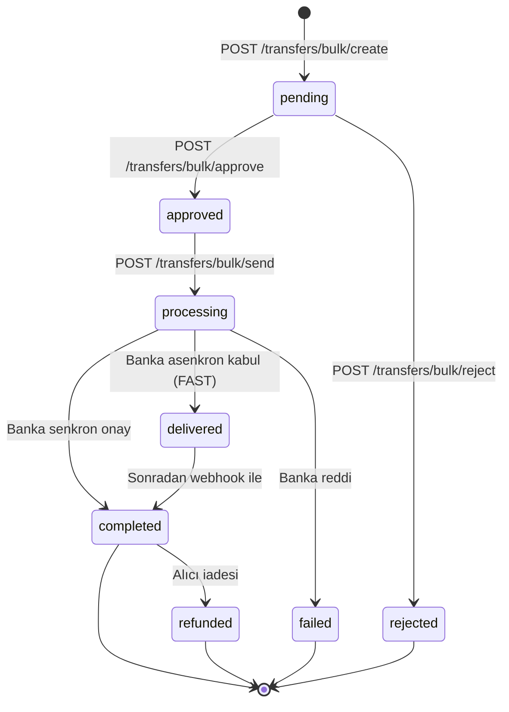

Transfer objesi bir transferin **mevcut durumunu**, kaynak ve hedef hesap bilgilerini, tutarı ve banka tarafından dönen detayları taşır. Tüm ödeme alanları kuruş cinsindendir; tarihler ISO 8601 + UTC formatındadır.

## Yanıt örneği

```http
HTTP/1.1 200 OK
Content-Type: application/json
```

```json
{
  "id":                       "8e3f5c12-9a7b-4c8d-bc4e-2c963f66afa6",
  "merchant_id":              "3fa85f64-5717-4562-b3fc-2c963f66afa6",
  "external_id":              "EXT-2026-001",
  "request_id":               "9f1c8e76-2a3b-4f12-9c8d-12cb24a8a8a8",
  "description":              "Mayıs maaş ödemesi",
  "receipt_no":               "TRF-20260503-0001",

  "receiver_account_id":      "11111111-2222-3333-4444-555555555555",
  "request_sender_account_id":"66666666-7777-8888-9999-aaaaaaaaaaaa",
  "success_sender_account_id":"66666666-7777-8888-9999-aaaaaaaaaaaa",

  "amount":                   1500000,
  "currency":                 "TRY",
  "fee_amount":               350,

  "request_transfer_type":    "fast",
  "success_transfer_type":    "fast",

  "scheduled_date":           "2026-05-03T12:00:00.000+00:00",
  "validate_date":            "2026-05-03T12:34:55.000+00:00",
  "sent_date":                "2026-05-03T12:34:58.000+00:00",
  "processed_date":           "2026-05-03T12:35:00.000+00:00",

  "status":                   "completed",
  "retry_count":              0
}
```

## Alan referansı

### Kimlik alanları

| Alan | Tip | Açıklama |
|---|---|---|
| `id` | UUID | Payven tarafından atanan benzersiz transfer kimliği. Sorgulama / aksiyon endpoint'lerinde URL parametresi olarak kullanılır. |
| `merchant_id` | UUID | Transferin merchant kimliği |
| `external_id` | string | Sizin sisteminizdeki transfer kimliği (istek body'sinden gelir, echo edilir) |
| `request_id` | UUID | İstek korelasyon kimliği — destek talebinde paylaşın |
| `description` | string \| null | Transfer açıklaması (banka ekstresine yansıyabilir) |
| `receipt_no` | string \| null | Banka makbuz numarası (yalnız `delivered`/`completed` durumda dolar) |

### Hesap alanları

| Alan | Tip | Açıklama |
|---|---|---|
| `receiver_account_id` | UUID | Alıcı hesabın Payven kimliği |
| `request_sender_account_id` | UUID | İstek anında talep edilen kaynak hesap |
| `success_sender_account_id` | UUID \| null | Banka tarafında işlem yapılan gerçek kaynak hesap (akıllı yönlendirme sonrası farklı olabilir) |

### Tutar alanları

| Alan | Tip | Açıklama |
|---|---|---|
| `amount` | long (kuruş) | Transfer tutarı — kuruş cinsinden 64-bit tam sayı (1.500.000 = 15.000,00 TL) |
| `currency` | enum | Şu an yalnız `"TRY"` |
| `fee_amount` | long (kuruş) | Banka komisyonu — `delivered`/`completed` durumda dolar |

Tutar formatı detayı: [Tutarlar ve Para Birimleri](/documentation/concepts/amounts).

### Transfer tipi

| Alan | Tip | Açıklama |
|---|---|---|
| `request_transfer_type` | enum | İstek anında belirlenen tip (`eft`, `fast`, `remittance`, `credit_card`) |
| `success_transfer_type` | enum \| null | Banka tarafında gerçekleşen tip — istekten farklı olabilir (örn. `fast` yerine `eft` kullanıldı) |

Detay: [Transfer Tipleri](#transfer-tipleri).

### Zaman damgaları

| Alan | Tip | Açıklama |
|---|---|---|
| `scheduled_date` | datetime | Transferin işleme alınması gereken zaman (zamanlanmış transfer için ileri tarih, anlık için oluşturulma anı) |
| `validate_date` | datetime \| null | Transferin onaylandığı zaman |
| `sent_date` | datetime \| null | Transferin bankaya gönderildiği zaman |
| `processed_date` | datetime \| null | Banka yanıtının alındığı zaman |

### Durum alanları

| Alan | Tip | Açıklama |
|---|---|---|
| `status` | enum | Transferin mevcut durumu — bkz. [Status değerleri](#status-degerleri) |
| `retry_count` | int | Banka tarafında kaç kez yeniden denendiği |

## Status değerleri

| `status` | Anlam | Sonraki adım |
|---|---|---|
| `pending` | Transfer oluşturuldu, **onay bekliyor** (4-eyes principle) | `POST /transfers/bulk/approve` veya `/reject` |
| `approved` | Onaylandı, banka gönderimine hazır | `POST /transfers/bulk/send` |
| `rejected` | İç onayda reddedildi | — (yeni transfer oluşturmak gerekir) |
| `processing` | Bankaya gönderildi, yanıt bekleniyor | Asenkron — webhook veya `GET` ile takip |
| `delivered` | Banka kabul etti, hesap geçişi asenkron (FAST modeli) | Banka kesinleştirince `completed` |
| `completed` | Banka senkron onayladı veya `delivered`'dan ilerledi | İade/geri dönüş yapılabilir |
| `failed` | Banka reddetti veya teknik hata | — |
| `refunded` | Transfer iade edildi (alıcı tarafından geri çekildi) | — |

## Yaşam döngüsü diyagramı



## Transfer tipleri

| Tip | Açıklama |
|---|---|
| `fast` | FAST sistemi — **anlık** havale (7×24, ≤ 200.000 TL). Banka kabul ederse `delivered`, sonra `completed`. |
| `eft` | EFT — günlük/iş saati zamanlamalı, geleneksel havale. Yüksek tutarlar için. |
| `remittance` | Banka içi havale (sender ve receiver aynı bankada) — anlık. |
| `credit_card` | Karta para gönderme (P2C) — kart numarasıyla transfer. |

İstek tarafında `transfer_type` belirtirsiniz; banka müsaitse o tip kullanılır, değilse Payven uygun alternatife düşürür ve `success_transfer_type` farklı dönebilir.

## Hata response'ları

İstek reddi veya iş kuralı ihlali durumunda Payven [RFC 9457 problem+json](/documentation/concepts/errors) yanıtı döner. Tipik hatalar:

```json
{
  "type":          "https://docs.payven.com.tr/errors/insufficient_balance",
  "title":         "Kaynak hesapta yeterli bakiye yok",
  "status":        422,
  "code":          "insufficient_balance",
  "detail":        "Talep edilen tutar (1.500.000 kuruş) hesap bakiyesini aşıyor.",
  "instance":      "/api/v1/transfers/bulk/send",
  "correlation_id": "9f1c8e76-..."
}
```

`failed` durumda olan bir transferin sebebi sonradan `GET /api/v1/transfers/{id}` ile sorgulanabilir; banka detayları response body'sindeki `error_code` ve `provider_error_code` alanlarında taşınır.

Tam hata kodu listesi: [Hata Kodları](/para-transferi/errors/overview).
