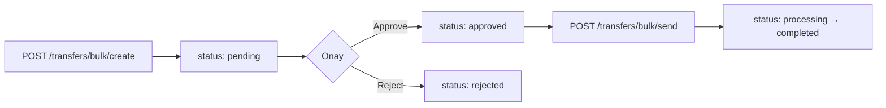

Para Transferi 4-eyes (çift onay) prensibiyle çalışır: bir transfer **oluşturmak**, **onaylamak** ve **göndermek** üç ayrı API çağrısı ve genellikle iki farklı kullanıcı gerektirir. Bu sayfa **birinci adım** olan oluşturmayı anlatır.

## Endpoint

```http
POST /api/v1/transfers/bulk/create
```

**Yetki:** `transfer-admin` veya `transfer-operator` rolü gerektirir.

## Akış



Oluşturulan transfer **`pending`** durumunda kaydedilir; onaylanana kadar bankaya gönderilmez.

## İstek

Tek bir istek içinde **bir veya daha fazla** transfer kalemi gönderilir:

```bash
curl -X POST https://transfer.payven.com.tr/api/v1/transfers/bulk/create \
  -H "Authorization: Bearer $PAYVEN_TOKEN" \
  -H "X-Tenant-Id: $TENANT_ID" \
  -H "Idempotency-Key: payroll-2026-05-01" \
  -H "Content-Type: application/json" \
  -d '{
    "items": [
      {
        "source_account_id": "550e8400-e29b-41d4-a716-446655440000",
        "external_id":       "PAYROLL-001",
        "description":       "Mayıs maaş ödemesi",
        "transfer_type":     "fast",
        "amount":            { "value": 1500000, "currency_code": "TRY" },
        "recipient": {
          "holder_name":  "Ahmet Yılmaz",
          "iban":         "TR330006100519786457841326",
          "tax_id":       "12345678901"
        }
      },
      {
        "source_account_id": "550e8400-e29b-41d4-a716-446655440000",
        "external_id":       "PAYROLL-002",
        "transfer_type":     "fast",
        "amount":            { "value": 2000000, "currency_code": "TRY" },
        "recipient": {
          "recipient_id":  "abc-12345-..."
        }
      }
    ]
  }'
```

### İstek alanları

| Alan | Tip | Zorunlu | Açıklama |
|---|---|---|---|
| `items[]` | array | ✅ | Bir veya daha fazla transfer kalemi (max 1000 / istek) |
| `items[].source_account_id` | UUID | ✅ | Organizasyonunuzun hangi hesabından gönderim yapılacağı |
| `items[].external_id` | string | önerilir | Sizin sisteminizdeki transfer kimliği (raporlama + idempotency için) |
| `items[].description` | string | ❌ | Banka ekstresi açıklaması (max 100 karakter) |
| `items[].transfer_type` | enum | ✅ | `fast`, `eft`, `remittance` veya `credit_card` |
| `items[].amount.value` | long (kuruş) | ✅ | Tutar — kuruş cinsinden 64-bit tam sayı |
| `items[].amount.currency_code` | string | ✅ | Şu an yalnız `"TRY"` |
| `items[].recipient` | object | ✅ | Alıcı bilgisi (aşağıdaki üç moddan biri) |
| `items[].scheduled_date` | datetime | ❌ | İleri tarihli transfer için. Boş = anlık. |

### Alıcı bilgisi — üç mod

`recipient` objesini üç farklı şekilde dolduarbilirsiniz:

**Mod 1 — Saklı alıcı (önerilir):**

```json
"recipient": {
  "recipient_id": "abc-12345-..."
}
```

`recipient_id`, [`POST /recipients`](/para-transferi/recipients/overview) ile önceden kaydettiğiniz alıcının kimliğidir. Alıcı master data'sından IBAN, isim, vergi kimliği bilgileri çekilir.

**Mod 2 — IBAN ile (ad-hoc):**

```json
"recipient": {
  "holder_name": "Ahmet Yılmaz",
  "iban":        "TR330006100519786457841326",
  "tax_id":      "12345678901"
}
```

Tek seferlik transferler için. IBAN'ın geçerliliği [IBAN doğrulama](/para-transferi/validation/iban) ile önceden kontrol edilebilir.

**Mod 3 — Karta para gönderme (P2C):**

```json
"recipient": {
  "holder_name":  "Ahmet Yılmaz",
  "card_details": {
    "card_number":  "4546711234567894",
    "expire_month": "12",
    "expire_year":  "2030"
  }
}
```

`transfer_type: "credit_card"` ile birlikte kullanılır.

## Yanıt

```http
HTTP/1.1 201 Created
Content-Type: application/json
```

```json
{
  "transfers": [
    {
      "id":             "8e3f5c12-9a7b-4c8d-bc4e-2c963f66afa6",
      "external_id":    "PAYROLL-001",
      "status":         "pending",
      "amount":         1500000,
      "currency":       "TRY",
      "transfer_type":  "fast",
      "scheduled_date": "2026-05-03T12:00:00.000+00:00",
      "created":        "2026-05-03T12:00:00.123+00:00"
    },
    {
      "id":             "9f3d2b8e-...",
      "external_id":    "PAYROLL-002",
      "status":         "pending",
      "amount":         2000000,
      "currency":       "TRY",
      "transfer_type":  "fast",
      "scheduled_date": "2026-05-03T12:00:00.000+00:00",
      "created":        "2026-05-03T12:00:00.156+00:00"
    }
  ],
  "total_count":  2,
  "total_amount": 3500000
}
```

Yanıttaki her transferin `id` değerini saklayın — onay (`approve`) ve gönderim (`send`) adımlarında kullanacaksınız.

`status: "pending"` → transferler oluşturuldu ama henüz onay bekliyor. Bankaya hiçbir istek gönderilmedi, hesaplarınızdan henüz para çekilmedi.

## Hata yanıtları

| HTTP | `code` | Anlam |
|---|---|---|
| `400` | `validation_failed` | Eksik / geçersiz alan (örn. IBAN format) |
| `403` | `forbidden` | `transfer-admin` veya `transfer-operator` rolü yok |
| `404` | `source_account_not_found` | `source_account_id` bulunamadı |
| `404` | `recipient_not_found` | `recipient_id` bulunamadı |
| `422` | `invalid_iban` | IBAN checksum'ı geçmiyor |
| `422` | `invalid_amount` | Tutar pozitif değil veya minimum altında |
| `422` | `unsupported_transfer_type` | Bu kaynak hesap bu transfer tipini desteklemiyor |
| `409` | `idempotency_key_in_use` | Aynı `Idempotency-Key` farklı body için kullanılmış |

Hata yanıtı RFC 9457 problem+json. Detay: [Hata Yönetimi](/documentation/concepts/errors).

## Sonraki adım

<CardGroup cols={2}>
  <Card title="2. Adım — Onayla" icon="check" href="/para-transferi/transfers/bulk-approve">
    Yetkili kullanıcı transferleri onaylar.
  </Card>
  <Card title="2. Adım (alternatif) — Reddet" icon="xmark" href="/para-transferi/transfers/bulk-reject">
    Yanlışlıkla oluşturulan transferleri iptal edin.
  </Card>
</CardGroup>
