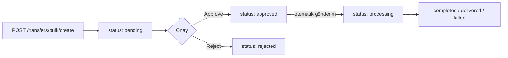

Para Transferi 4-göz (çift onay) prensibiyle çalışır: bir transfer önce **oluşturulur**, sonra
**onaylanır**; onaylanan transfer otomatik olarak bankaya gönderilir. Bu sayfa **birinci adım** olan
oluşturmayı anlatır. Uçtan uca akış: [Önerilen Entegrasyon Akışı](/para-transferi/integration-guide).

## Endpoint

```http
POST /api/v1/transfers/bulk/create
```

**Yetki:** transfer oluşturma izni (`transfer-admin` veya `transfer-operator`).

## Akış


```mermaid
flowchart LR
    A[POST /transfers/bulk/create] --> B[status: pending]
    B --> C{Onay}
    C -->|Approve| D[status: approved]
    C -->|Reject| E[status: rejected]
    D -->|otomatik gönderim| F[status: processing]
    F --> G[completed / delivered / failed]
```

Oluşturulan transfer **`pending`** durumunda kaydedilir; onaylanana kadar bankaya gönderilmez.

## Başlıklar

| Başlık | Zorunluluk | Açıklama |
|---|---|---|
| `X-Request-Id` | Önerilir | Sizin **paket numaranız**. Pakette oluşan her transfere `request_id` olarak yazılır; `GET /transfers?request_id=` ile paketin tamamını sorgularsınız. Aynı değer **ikinci kez kullanılamaz** (`409 PV_DUPLICATE_REQUEST`). |
| `Idempotency-Key` | Önerilir | Yanıtı kopan isteği **aynı anahtar + aynı gövdeyle** tekrarlarsanız ilk yanıt döner, yeni transfer açılmaz. Transfer uçlarında 24 saat saklanır. |

## İstek

Tek bir istek içinde **bir veya daha fazla** transfer kalemi gönderilir:

```bash
curl -X POST https://transfer.payven.com.tr/api/v1/transfers/bulk/create \
  -H "Authorization: Bearer $PAYVEN_TOKEN" \
  -H "X-Request-Id: PAYROLL-2026-05" \
  -H "Idempotency-Key: payroll-2026-05-01" \
  -H "Content-Type: application/json" \
  -d '{
    "items": [
      {
        "source_account_id": "550e8400-e29b-41d4-a716-446655440000",
        "external_id":       "PAYROLL-001",
        "description":       "Mayıs maaş ödemesi",
        "transfer_type":     "fast",
        "amount":            { "value": 1500000, "currency_code": "TRY" },
        "recipient": {
          "holder_name": "Ahmet Yılmaz",
          "iban":        "TR330006100519786457841326"
        }
      },
      {
        "source_account_id": "550e8400-e29b-41d4-a716-446655440000",
        "external_id":       "PAYROLL-002",
        "transfer_type":     "fast",
        "amount":            { "value": 2000000, "currency_code": "TRY" },
        "recipient": {
          "recipient_id": "abc-12345-...",
          "holder_name":  "Ayşe Demir"
        }
      }
    ]
  }'
```

### İstek alanları

| Alan | Tip | Zorunluluk | Açıklama |
|---|---|---|---|
| `items[]` | array | Zorunlu | Bir veya daha fazla transfer kalemi |
| `items[].source_account_id` | UUID | Önerilir | Paranın çıkacağı gönderici hesap (kalem başına). Boş bırakılırsa transfer bir **talep** olarak açılır, hesap onayda seçilir |
| `items[].external_id` | string | Önerilir | Sizin sisteminizdeki tekil referans (en fazla 250 karakter). **Aynı bayide tekildir** — aşağıya bakın. Verilmezse Payven bir GUID atar |
| `items[].description` | string | Opsiyonel | Transfer açıklaması (en fazla 500 karakter) |
| `items[].transfer_type` | enum | Zorunlu | `fast`, `eft`, `remittance` veya `credit_card` |
| `items[].amount.value` | long (kuruş) | Zorunlu | Tutar — kuruş cinsinden 64-bit tam sayı |
| `items[].amount.currency_code` | string | Zorunlu | Şu an yalnız `"TRY"` |
| `items[].recipient` | object | Zorunlu | Alıcı bilgisi (aşağıdaki modlardan biri); `holder_name` her modda zorunlu |
| `items[].metadata` | object | Opsiyonel | Serbest anahtar-değer (en fazla 50 anahtar; anahtar 40, değer 500 karakter). Webhook gövdesinde aynen geri döner |

### `external_id` tekilliği

- Aynı bayide daha önce kullanılmış bir `external_id` gelirse **istek bütünüyle** reddedilir:
  `409 PV_TRANSFER_EXTERNAL_ID_DUPLICATE`. **Hiçbir transfer oluşturulmaz** (geçerli kalemler dahil).
- Aynı `external_id`'nin **istek içinde** tekrarlanması da aynı hatayı verir.
- Bu kural, yanıtını kaybeden bir isteğin tekrarının ikinci bir havale açmasını engeller. 409 aldığınızda
  önce `GET /transfers?external_id=...` ile mevcut transferi kontrol edin.

### Alıcı bilgisi — modlar

**Mod 1 — Saklı alıcı (önerilir):**

```json
"recipient": {
  "recipient_id": "abc-12345-...",
  "holder_name":  "Ayşe Demir"
}
```

`recipient_id`, [`POST /recipients`](/para-transferi/recipients/overview) ile önceden kaydettiğiniz alıcının kimliğidir.

**Mod 2 — IBAN ile (ad-hoc):**

```json
"recipient": {
  "holder_name": "Ahmet Yılmaz",
  "iban":        "TR330006100519786457841326"
}
```

Tek seferlik transferler için. IBAN'ın geçerliliği [IBAN doğrulama](/para-transferi/validation/iban) ile önceden kontrol edilebilir.

**Mod 3 — Karta para gönderme:**

```json
"recipient": {
  "holder_name":  "Ahmet Yılmaz",
  "card_details": {
    "card_number": "4546711234567894"
  }
}
```

`transfer_type: "credit_card"` ile birlikte kullanılır. Kart transferini destekleyen bankalar:
[Genel Bakış › Konnektör kapasitesi](/para-transferi/overview).

## Yanıt

```http
HTTP/1.1 200 OK
Content-Type: application/json
```

Oluşturulan her kalem, gönderdiğiniz alanlarla birlikte Payven'in atadığı `transfer_id` ile döner:

```json
[
  {
    "transfer_id":       "8e3f5c12-9a7b-4c8d-bc4e-2c963f66afa6",
    "source_account_id": "550e8400-e29b-41d4-a716-446655440000",
    "external_id":       "PAYROLL-001",
    "description":       "Mayıs maaş ödemesi",
    "transfer_type":     "fast",
    "amount":            { "value": 1500000, "currency_code": "try" },
    "recipient":         { "holder_name": "Ahmet Yılmaz", "iban": "TR330006100519786457841326" }
  }
]
```

Yanıttaki `transfer_id` değerlerini saklayın — onay (`approve`) adımında kullanacaksınız. Transferler
`pending` durumundadır: bankaya hiçbir istek gönderilmedi, hesaplarınızdan para çekilmedi.

İsteğe bağlı olarak `para-transferi.transfer.created` webhook olayına abone olabilirsiniz.

## Hata response'ları

| HTTP | `code` | Anlam |
|---|---|---|
| `409` | `PV_TRANSFER_EXTERNAL_ID_DUPLICATE` | `external_id` bu bayide zaten kullanılmış ya da istek içinde tekrar ediyor — istek bütünüyle reddedildi, transfer oluşmadı |
| `409` | `PV_DUPLICATE_REQUEST` | Bu `X-Request-Id` ile daha önce transfer oluşturulmuş |
| `409` | `idempotency_key_in_use` | Aynı `Idempotency-Key` farklı gövde için kullanılmış |
| `422` | `validation_failed` | Eksik / geçersiz alan — `errors` ile detay |
| `403` | `forbidden` | Transfer oluşturma izni yok |

Hata yanıtı RFC 9457 problem+json. Detay: [Hata Kodları](/para-transferi/errors/overview).

## Sonraki adım

<CardGroup cols={2}>
  <Card title="2. Adım — Onayla" icon="check" href="/para-transferi/transfers/bulk-approve">
    Yetkili kullanıcı transferleri onaylar; onaylanan transfer otomatik gönderilir.
  </Card>
  <Card title="2. Adım (alternatif) — Reddet" icon="xmark" href="/para-transferi/transfers/bulk-reject">
    Yanlışlıkla oluşturulan transferleri iptal edin.
  </Card>
</CardGroup>
