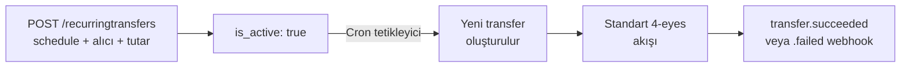

Tekrarlayan transferler (recurring transfers), belirli bir takvim üzerinde **otomatik olarak transfer üreten** kayıtlardır. Maaş ödemesi, kira, abonelik veya tedarikçi düzenli ödemesi senaryolarında uygulanır.

## Akış



Her takvim tetiklemesinde Payven, sizin adınıza yeni bir transfer **otomatik oluşturur** (`POST /transfers/bulk/create` muadili). Transferin **onay ve gönderim** adımları (4-eyes) operatör eylemiyle veya konsol otomasyonuyla yapılır.

## Endpoint'ler

```http
POST   /api/v1/recurringtransfers              # Yeni
GET    /api/v1/recurringtransfers              # Liste
GET    /api/v1/recurringtransfers/{id}         # Tek detay
PUT    /api/v1/recurringtransfers/{id}         # Güncelle
DELETE /api/v1/recurringtransfers/{id}         # Sil
POST   /api/v1/recurringtransfers/{id}/pause   # Geçici durdur
POST   /api/v1/recurringtransfers/{id}/resume  # Yeniden başlat
```

**Yetki:** `transfer-admin` rolü.

## Oluşturma

```bash
curl -X POST https://transfer.payven.com.tr/api/v1/recurringtransfers \
  -H "Authorization: Bearer $PAYVEN_TOKEN" \
  -H "X-Tenant-Id: $TENANT_ID" \
  -H "Idempotency-Key: salary-team-yazilim-2026" \
  -H "Content-Type: application/json" \
  -d '{
    "name":              "Yazılım ekibi maaşı",
    "external_id":       "SALARY-TEAM-DEV",
    "source_account_id": "550e8400-e29b-41d4-a716-446655440000",
    "recipient_id":      "abc-12345-...",
    "amount":            { "value": 5000000, "currency_code": "TRY" },
    "transfer_type":     "fast",
    "description":       "Aylık maaş",
    "schedule": {
      "frequency":   "monthly",
      "day_of_month": 1,
      "hour":         "09:00",
      "timezone":     "Europe/Istanbul"
    },
    "starts_at":         "2026-06-01T09:00:00+03:00",
    "ends_at":           null
  }'
```

| Alan | Tip | Zorunlu | Açıklama |
|---|---|---|---|
| `name` | string | ✅ | İnsan-okur ad (raporlama için) |
| `external_id` | string | önerilir | Sizin sisteminizdeki kayıt kimliği |
| `source_account_id` | UUID | ✅ | Hangi hesaptan çekilecek |
| `recipient_id` | UUID | ✅ | Saklı alıcı kimliği (tek kullanımlık IBAN desteklenmez) |
| `amount.value` | long (kuruş) | ✅ | Sabit tutar |
| `transfer_type` | enum | ✅ | `fast`, `eft`, `remittance` |
| `schedule` | object | ✅ | Takvim — bkz. aşağıda |
| `starts_at` | datetime | ✅ | İlk üretim zamanı |
| `ends_at` | datetime | ❌ | Son tarih (boş = sınırsız) |

### Schedule yapısı

| `frequency` | Açıklama | Ek alanlar |
|---|---|---|
| `daily` | Her gün | `hour` |
| `weekly` | Her hafta | `day_of_week` (`monday`–`sunday`), `hour` |
| `monthly` | Her ay | `day_of_month` (1–28; ay sonu için `last`), `hour` |
| `cron` | İleri seviye | `cron_expression` (örn. `"0 9 1 * *"`) |

`timezone` IANA formatındadır (örn. `Europe/Istanbul`); takvim hesaplamaları bu zona göre yapılır, gönderim anında UTC'ye normalize edilir.

## Yanıt

```json
{
  "id":             "rec-8e3f5c12-...",
  "name":           "Yazılım ekibi maaşı",
  "is_active":      true,
  "next_run_at":    "2026-06-01T09:00:00.000+03:00",
  "last_run_at":    null,
  "total_runs":     0,
  "created":        "2026-05-07T10:00:00.123+03:00"
}
```

## Pause / Resume

Tekrarlayan transferi geçici olarak durdurmak için:

```bash
curl -X POST https://transfer.payven.com.tr/api/v1/recurringtransfers/rec-8e3f5c12-.../pause \
  -H "Authorization: Bearer $PAYVEN_TOKEN" \
  -H "X-Tenant-Id: $TENANT_ID"
```

Pause sonrası `is_active: false` olur, sonraki tetiklemeler atlanır. Aktif etmek için `/resume`:

```bash
curl -X POST https://transfer.payven.com.tr/api/v1/recurringtransfers/rec-8e3f5c12-.../resume \
  -H "Authorization: Bearer $PAYVEN_TOKEN" \
  -H "X-Tenant-Id: $TENANT_ID"
```

## Yetersiz bakiye senaryosu

Tetikleme anında kaynak hesapta yeterli bakiye yoksa transfer **`failed`** statüsünde oluşur (`error_code: "insufficient_balance"`). Tekrarlayan kayıt **devam eder** — sonraki periyodda yeniden denenir. Operasyonel olarak `transfer.failed` webhook'una abone olmanız önerilir.

## Hata yanıtları

| HTTP | `code` | Anlam |
|---|---|---|
| `403` | `forbidden` | `transfer-admin` rolü yok |
| `404` | `recipient_not_found` | `recipient_id` bulunamadı veya pasif |
| `404` | `source_account_not_found` | `source_account_id` bulunamadı |
| `422` | `invalid_schedule` | Takvim parametreleri uyumsuz (örn. `weekly` ama `day_of_week` yok) |
| `422` | `invalid_state_transition` | Pasif kaydı pause veya aktif kaydı resume etme denemesi |

## Webhook olayları

Tekrarlayan kayıt **kendisi** olay yayınlamaz; ancak ürettiği her transfer için standart `transfer.created` / `.succeeded` / `.failed` olayları yayınlanır. Webhook payload'unda `data.recurring_transfer_id` alanı, hangi tekrarlayan kayıttan geldiğini gösterir.
