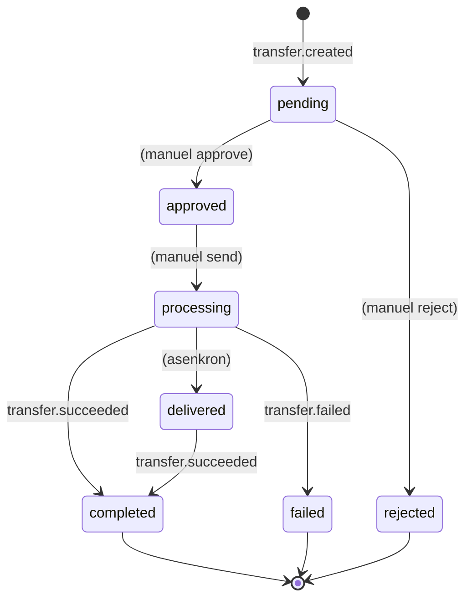

Para Transferi şu anda **3 olay tipi** yayınlar. Subscription oluştururken `events[]` dizisinde dinlemek istediklerinizi belirtirsiniz.

## Genel yapı

Tüm olaylar şu yapıda gönderilir:

```json
{
  "id":         "evt_8e3f5c129a7b4c8dbc4e",
  "type":       "transfer.succeeded",
  "created_at": "2026-05-03T12:34:58.123+00:00",
  "data": { /* olaya özel payload — aşağıda */ }
}
```

| Alan | Açıklama |
|---|---|
| `id` | Olay kimliği — idempotency için kullanın. **Aynı olay birden fazla kez gönderilebilir** ama `id` aynıdır. |
| `type` | Olay tipi |
| `created_at` | Olayın Payven tarafında oluşturulma zamanı (UTC, ISO 8601) |
| `data` | Olaya özel payload |

## `data` ortak alanları

Tüm `data` payload'ları aşağıdaki alanları içerir:

| Alan | Açıklama |
|---|---|
| `transfer_id` | Transferin Payven kimliği (UUID) |
| `external_id` | Sizin sisteminizdeki transfer kimliği |
| `merchant_id` | Transferin merchant kimliği |
| `status` | Transfer mevcut durumu |
| `amount` | Tutar (kuruş) |
| `currency` | Para birimi (`"TRY"`) |
| `transfer_type` | `fast`, `eft`, `remittance` veya `credit_card` |

## Olay tipleri

### `transfer.created`

**Tetikleyici:** Yeni transfer oluşturuldu (`POST /transfers/bulk/create` ile, `pending` durumda).

```json
{
  "id":         "evt_...",
  "type":       "transfer.created",
  "created_at": "2026-05-03T12:00:00.123+00:00",
  "data": {
    "transfer_id":     "8e3f5c12-...",
    "external_id":     "PAYROLL-001",
    "merchant_id":     "3fa85f64-...",
    "status":          "pending",
    "amount":          1500000,
    "currency":        "TRY",
    "transfer_type":   "fast",
    "scheduled_date":  "2026-05-03T12:00:00.000+00:00"
  }
}
```

Bu olay **operasyonel sürecinize** entegre olmak için faydalıdır: 4-eyes onay sürecinizde "yeni transfer onay bekliyor" bildirimi tetikleyebilirsiniz.

### `transfer.succeeded`

**Tetikleyici:** Transfer başarıyla tamamlandı (`completed` veya `delivered` → `completed` geçişi).

```json
{
  "id":         "evt_...",
  "type":       "transfer.succeeded",
  "created_at": "2026-05-03T12:34:58.123+00:00",
  "data": {
    "transfer_id":     "8e3f5c12-...",
    "external_id":     "PAYROLL-001",
    "merchant_id":     "3fa85f64-...",
    "status":          "completed",
    "amount":          1500000,
    "currency":        "TRY",
    "transfer_type":   "fast",
    "fee_amount":      350,
    "receipt_no":      "TRF-20260503-0001",
    "sent_date":       "2026-05-03T12:34:58.000+00:00",
    "processed_date":  "2026-05-03T12:34:59.234+00:00",
    "success_sender_account_id": "66666666-..."
  }
}
```

`receipt_no` makbuz numarasını saklayın — sonradan dekont indirme akışında kullanırsınız.

### `transfer.failed`

**Tetikleyici:** Banka reddi, teknik hata veya konnektör sağlık sorunu.

```json
{
  "id":         "evt_...",
  "type":       "transfer.failed",
  "created_at": "2026-05-03T12:34:58.123+00:00",
  "data": {
    "transfer_id":          "8e3f5c12-...",
    "external_id":          "PAYROLL-001",
    "merchant_id":          "3fa85f64-...",
    "status":               "failed",
    "amount":               1500000,
    "currency":             "TRY",
    "transfer_type":        "fast",
    "error_code":           "insufficient_balance",
    "error_message":        "Kaynak hesapta yeterli bakiye yok",
    "provider_error_code":  "01",
    "retry_count":          2,
    "processed_date":       "2026-05-03T12:34:59.234+00:00"
  }
}
```

`error_code` (Payven domain kodu) ve `provider_error_code` (banka ham kodu) birlikte değerlendirilir. Tam hata kodu listesi: [Hata Kodları](/para-transferi/errors/overview).

## Olay → Transfer durumu eşleşmesi



Onay (`approve`) ve gönderim (`send`) şu an webhook olayı yayınlamaz — bunlar **manuel operatör eylemleri** olduğu için konsol audit log'una düşer. İleride `transfer.approved` ve `transfer.sent` olayları eklenebilir.

## Webhook subscription örneği

```bash
curl -X POST https://transfer.payven.com.tr/api/v1/webhooks \
  -H "Authorization: Bearer $PAYVEN_TOKEN" \
  -H "X-Tenant-Id: $TENANT_ID" \
  -H "Content-Type: application/json" \
  -d '{
    "url":    "https://example.com/webhooks/payven-transfers",
    "events": ["transfer.created", "transfer.succeeded", "transfer.failed"]
  }'
```

## Yol haritası

İleride eklenmesi planlanan olaylar:

- `transfer.approved` — onaylandığında
- `transfer.sent` — bankaya gönderildiğinde
- `transfer.delivered` — banka asenkron kabul ettiğinde (FAST için ara durum)
- `transfer.refunded` — alıcı tarafından iade edildiğinde
- `recurring.transfer.scheduled` — tekrarlayan transfer üretildiğinde

Güncellemeler için: [Changelog](/resources/changelog).
