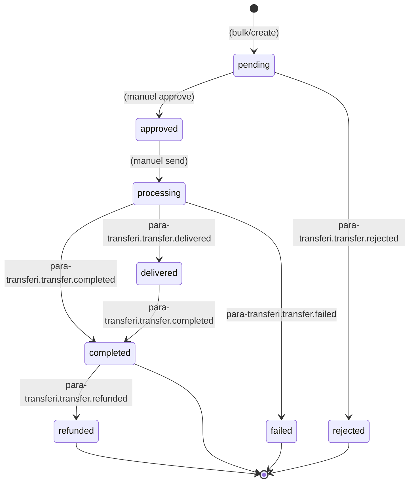

Para Transferi şu anda **8 olay tipi** yayınlar: transfer yaşam döngüsü (5) + tekrarlayan transfer
(3); ayrıca hakediş olayları (`para-transferi.settlement.*`). Webhook ucunu oluştururken
`enabled_events` dizisinde dinlemek istediklerinizi belirtirsiniz. Tüm ürünlerin kodları:
[Webhook Olay Referansı](/documentation/concepts/webhook-events).

## Genel yapı

Olay tipi ve teslimat metadata'sı **HTTP header'larında** da taşınır:

| Header | Açıklama |
|---|---|
| `X-Payven-Event` | Olay tipi (`para-transferi.transfer.completed`, `para-transferi.transfer.failed`, ...) |
| `X-Payven-Event-Id` | Olay kimliği (`evt_...`) — idempotency için kullanın. **Aynı olay birden fazla kez gönderilebilir** ama event id aynıdır. |
| `X-Payven-Delivery-Id` | Teslim kimliği |
| `X-Payven-Signature` | `sha256=<hex>` HMAC imzası — bkz. [İmza Doğrulama](/sanal-pos/webhooks/signature) |
| `X-Payven-Timestamp` | İmza zaman damgası (Unix saniye) |

Gövde varsayılan olarak **olay zarfıdır** (`{id, object: "event", type, created, livemode, api_version, resource_id, data: {object}}`); aşağıdaki alanlar **`data.object`** altındadır. Uç
`payload_format: flat` ile açıldıysa gövde yalnız bu nesnedir. Zarf ayrıntısı:
[Webhook'lar](/documentation/concepts/webhooks).

## Payload ortak alanları

Transfer olaylarının (`para-transferi.transfer.*`) tümü aynı gövde şemasını kullanır:

| Alan | Açıklama |
|---|---|
| `event_type` | Olay tipi (header'daki `X-Payven-Event` ile aynı) |
| `transfer_id` | Transferin Payven kimliği (UUID) |
| `tenant_id` | Tenant kimliği |
| `merchant_id` | Transferin merchant kimliği (UUID, opsiyonel) |
| `external_merchant_id` | Merchant'ın dış (string) kimliği |
| `status` | Transfer mevcut durumu (snake_case string) |
| `amount` | Tutar (kuruş) |
| `currency` | Para birimi (`"try"`) |
| `external_id` | Sizin sisteminizdeki transfer kimliği |
| `description` | Transfer açıklaması |
| `message` | Banka/konnektör mesajı (hatada anlamlı; `rejected`'da red gerekçesi) |
| `receipt_no` | Makbuz numarası (başarıda dolu) |
| `occurred_at` | Olayın gerçekleşme zamanı (+03:00 Türkiye saati) |
| `metadata` | Transfere verdiğiniz serbest anahtar-değer çiftleri |

## Olay tipleri

### `para-transferi.transfer.completed`

**Tetikleyici:** Banka transferi **senkron** onayladı — terminal başarı.

```json
{
  "event_type":           "para-transferi.transfer.completed",
  "transfer_id":          "8e3f5c12-9a7b-4c8d-bc4e-2c963f66afa6",
  "tenant_id":            "11111111-1111-1111-1111-111111111111",
  "merchant_id":          "3fa85f64-5717-4562-b3fc-2c963f66afa6",
  "external_merchant_id": "MRCH-001",
  "status":               "completed",
  "amount":               1500000,
  "currency":             "try",
  "external_id":          "PAYROLL-001",
  "description":          "Mayıs maaş ödemesi",
  "message":              "Transfer başarılı",
  "receipt_no":           "TRF-20260503-0001",
  "occurred_at":          "2026-05-03T15:34:58.123+03:00"
}
```

`receipt_no` makbuz numarasını saklayın — sonradan dekont indirme akışında kullanırsınız.

### `para-transferi.transfer.delivered`

**Tetikleyici:** Banka transferi **asenkron** kabul etti (örn. FAST) — Payven tarafında
başarı sayılır; banka kesinleştirme bildirimi gelirse durum `completed`'a ilerler.

Payload şeması `para-transferi.transfer.completed` ile aynıdır; `status` alanı `delivered` gelir.

### `para-transferi.transfer.failed`

**Tetikleyici:** Banka reddi, teknik hata veya konnektör sağlık sorunu — terminal başarısızlık.

```json
{
  "event_type":           "para-transferi.transfer.failed",
  "transfer_id":          "8e3f5c12-9a7b-4c8d-bc4e-2c963f66afa6",
  "tenant_id":            "11111111-1111-1111-1111-111111111111",
  "merchant_id":          "3fa85f64-5717-4562-b3fc-2c963f66afa6",
  "external_merchant_id": "MRCH-001",
  "status":               "failed",
  "amount":               1500000,
  "currency":             "try",
  "external_id":          "PAYROLL-001",
  "description":          "Mayıs maaş ödemesi",
  "message":              "Kaynak hesapta yeterli bakiye yok",
  "receipt_no":           null,
  "occurred_at":          "2026-05-03T15:34:58.123+03:00"
}
```

Hata detayı `message` alanındadır; hata kodu eşlemesi için [Hata Kodları](/para-transferi/errors/overview).

### `para-transferi.transfer.rejected`

**Tetikleyici:** Transfer bankaya gönderilmeden reddedildi (onay adımında reddetme ya da toplu
reddetme). **Para hiç hareket etmedi.** `status: "rejected"`, red gerekçesi `message` alanındadır.

### `para-transferi.transfer.refunded`

**Tetikleyici:** Gönderilmiş transfer iade edildi. Banka reversal API'si olmadığı için bu bir
**defter düzeltmesidir** — tutar bayinin cüzdanına geri yazılır. `status: "refunded"`.

## Tekrarlayan transfer olayları

[Tekrarlayan transfer](/para-transferi/transfers/recurring) planlarının günlük çekilimleri için
yayınlanır. Payload şeması transfer olaylarından farklıdır:

| Alan | Açıklama |
|---|---|
| `event_type` | Olay tipi |
| `recurring_transfer_id` | Plan kimliği (UUID) |
| `execution_id` | İlgili çekilimin kimliği (UUID) |
| `tenant_id` / `merchant_id` / `external_merchant_id` | Kimlikler |
| `plan_name` | Plan adı |
| `amount` / `currency` | Çekilim tutarı (kuruş) |
| `error_message` | Hata mesajı (yalnız başarısız / askıya alma olaylarında) |
| `consecutive_failure_count` | Ardışık başarısız çekilim sayısı |
| `transfer_request_id` | Çekilimin ürettiği transfer (başarıda dolu) |
| `occurred_at` | Olay zamanı (+03:00) |

| Olay | Tetikleyici |
|---|---|
| `para-transferi.recurring_execution.succeeded` | Günlük çekilim bankaya başarıyla iletildi |
| `para-transferi.recurring_execution.failed` | Günlük çekilim başarısız oldu; plan hâlâ aktif |
| `para-transferi.recurring_transfer.suspended` | Plan ardışık hatalar nedeniyle otomatik askıya alındı; manuel devam ettirmek gerekir |

Çekilimin ürettiği transfer ayrıca kendi `para-transferi.transfer.*` olaylarını yayınlar.

## Olay → Transfer durumu eşleşmesi


```mermaid
stateDiagram-v2
    [*] --> pending: (bulk/create)
    pending --> approved: (manuel approve)
    approved --> processing: (manuel send)
    processing --> completed: para-transferi.transfer.completed
    processing --> delivered: para-transferi.transfer.delivered
    delivered --> completed: para-transferi.transfer.completed
    processing --> failed: para-transferi.transfer.failed
    pending --> rejected: para-transferi.transfer.rejected
    completed --> refunded: para-transferi.transfer.refunded
    completed --> [*]
    failed --> [*]
    rejected --> [*]
    refunded --> [*]
```

Oluşturma (`bulk/create`), onay (`approve`) ve gönderim (`send`) adımları webhook olayı
yayınlamaz — bunlar **operatör eylemleri** olduğu için konsol audit log'una düşer. Webhook
yalnızca **terminal sonuçlarda** (tamamlandı, teslim edildi, başarısız, reddedildi, iade edildi)
tetiklenir.

## Webhook ucu örneği

Uçlar Para Transferi API'sinde değil **İşyeri API'sinde** yönetilir (aynı uç diğer ürünlerin
olaylarını da alabilir):

```bash
curl -X POST https://merchant.payven.com.tr/api/v1/webhook-endpoints \
  -H "Authorization: Bearer $PAYVEN_TOKEN" \
  -H "Content-Type: application/json" \
  -d '{
    "url":            "https://example.com/webhooks/payven-transfers",
    "enabled_events": [
      "para-transferi.transfer.completed",
      "para-transferi.transfer.delivered",
      "para-transferi.transfer.failed",
      "para-transferi.transfer.rejected",
      "para-transferi.transfer.refunded"
    ]
  }'
```

## Yol haritası

Oluşturma / onay / gönderim gibi operasyonel adımlar için ayrı olaylar planlanmaktadır; kodlar
yayınlandığında [Webhook Olay Referansı](/documentation/concepts/webhook-events)'na eklenir.

Güncellemeler için: [Changelog](/resources/changelog).
