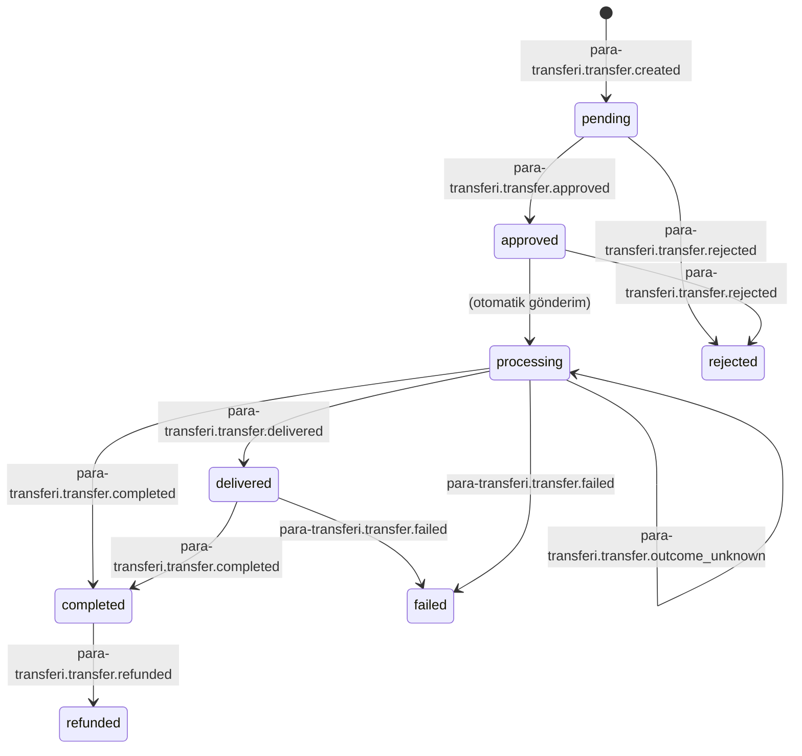

Para Transferi şu olay gruplarını yayınlar: transfer yaşam döngüsü (8), toplu transfer paketi (1) ve
tekrarlayan transfer (3); ayrıca hakediş olayları (`para-transferi.settlement.*`). Webhook ucunu
oluştururken `enabled_events` dizisinde dinlemek istediklerinizi belirtirsiniz. Tüm ürünlerin kodları:
[Webhook Olay Referansı](/documentation/concepts/webhook-events).

## Genel yapı

Olay tipi ve teslimat metadata'sı **HTTP header'larında** da taşınır:

| Header | Açıklama |
|---|---|
| `X-Payven-Event` | Olay tipi (`para-transferi.transfer.completed`, `para-transferi.transfer.failed`, ...) |
| `X-Payven-Event-Id` | Olay kimliği (`evt_...`) — idempotency için kullanın. **Aynı olay birden fazla kez gönderilebilir** ama event id aynıdır. |
| `X-Payven-Delivery-Id` | Teslim kimliği |
| `X-Payven-Signature` | `sha256=<hex>` HMAC imzası — bkz. [İmza Doğrulama](/sanal-pos/webhooks/signature) |
| `X-Payven-Timestamp` | İmza zaman damgası (Unix saniye) |

Gövde varsayılan olarak **olay zarfıdır** (`{id, object: "event", type, created, livemode, api_version, resource_id, data: {object}}`); aşağıdaki alanlar **`data.object`** altındadır. Uç
`payload_format: flat` ile açıldıysa gövde yalnız bu nesnedir. Zarf ayrıntısı:
[Webhook'lar](/documentation/concepts/webhooks).

## Transfer olayları

| Olay | Tetikleyici | `status` |
|---|---|---|
| `para-transferi.transfer.created` | Transfer oluşturuldu, onay bekliyor; para hareket etmedi | `pending` |
| `para-transferi.transfer.approved` | Transfer onaylandı ve gönderim kuyruğuna alındı (hakedişten karşılanan talepte fon ayrıldığı anda) | `approved` |
| `para-transferi.transfer.outcome_unknown` | Bankaya gönderildi ama **yanıt alınamadı** (zaman aşımı). Transfer başarısız değildir, **yeniden gönderilmemelidir**; kesin sonuç sonra `completed` / `failed` olarak gelir | `processing` |
| `para-transferi.transfer.delivered` | Banka transferi aldı; kesin sonuç (EFT valörü, kart transferi) ayrıca bildirilir | `delivered` |
| `para-transferi.transfer.completed` | Banka transferi gerçekleştirdi | `completed` |
| `para-transferi.transfer.failed` | Bankanın kesin reddi ya da transfer bankaya gönderilemedi. `delivered`'dan **sonra** da gelebilir (banka önce alıp sonra reddettiğinde) | `failed` |
| `para-transferi.transfer.rejected` | Transfer bankaya gönderilmeden reddedildi; **para hiç hareket etmedi**. Red gerekçesi `message`'da | `rejected` |
| `para-transferi.transfer.refunded` | Gönderilmiş transfer iade edildi (banka reversal API'si olmadığı için defter düzeltmesi) | `refunded` |

<Warning>
**`delivered` ve `outcome_unknown` kesin sonuç değildir.** Ödemenizi yalnız `completed`'da başarılı,
`failed`'da başarısız kapatın. `outcome_unknown` alan transferi yeniden göndermeyin — banka ilk isteği
işlemiş olabilir.
</Warning>

### Transfer payload alanları

Tüm `para-transferi.transfer.*` olayları aynı gövde şemasını kullanır:

| Alan | Açıklama |
|---|---|
| `event_type` | Olay tipi (header'daki `X-Payven-Event` ile aynı) |
| `transfer_id` | Transferin Payven kimliği (UUID) |
| `tenant_id` | Tenant kimliği |
| `merchant_id` | Transferin bayi kimliği (UUID; tenant'ın kendi transferinde `null`) |
| `external_merchant_id` | Bayinin dış (string) kimliği |
| `status` | Transferin olay anındaki durumu (snake_case) |
| `amount` | Tutar (kuruş) |
| `currency` | Para birimi (`"try"`) |
| `external_id` | Sizin sisteminizdeki transfer kimliği |
| `description` | Transfer açıklaması |
| `message` | Banka/konnektör mesajı (hatada anlamlı; `rejected`'da red gerekçesi) |
| `receipt_no` | Banka işlem / makbuz numarası (varsa) |
| `error_code` | Payven hata kodu (başarısızlıkta; kararınızı buna dayandırın). Katalogda eşlemesi olmayan banka redlerinde `null` olabilir |
| `provider_error_code` | Bankanın ham hata kodu (destek talebinde paylaşın). `outcome_unknown`'da `"PV_CONNECTOR_NO_RESPONSE"` |
| `transfer_type` | Gerçekleşen kanal; yoksa talep edilen (`eft`, `fast`, `remittance`, `credit_card`) |
| `request_id` | Oluşturma isteğindeki `X-Request-Id` (paket numaranız) |
| `bulk_transfer_batch_id` | Transfer bir toplu transfer paketinden (Excel) geldiyse paket kimliği; aksi halde `null` |
| `metadata` | Transfere verdiğiniz serbest anahtar-değer çiftleri (anahtarlar değiştirilmeden) |
| `occurred_at` | Olayın gerçekleşme zamanı (`+03:00`) |

### Örnek — `para-transferi.transfer.completed`

```json
{
  "event_type":             "para-transferi.transfer.completed",
  "transfer_id":            "8e3f5c12-9a7b-4c8d-bc4e-2c963f66afa6",
  "tenant_id":              "11111111-1111-1111-1111-111111111111",
  "merchant_id":            "3fa85f64-5717-4562-b3fc-2c963f66afa6",
  "external_merchant_id":   "MRCH-001",
  "status":                 "completed",
  "amount":                 1500000,
  "currency":               "try",
  "external_id":            "PAYROLL-001",
  "description":            "Mayıs maaş ödemesi",
  "message":                "Transfer başarılı",
  "receipt_no":             "TRF-20260503-0001",
  "error_code":             null,
  "provider_error_code":    null,
  "transfer_type":          "fast",
  "request_id":             "PAYROLL-2026-05",
  "bulk_transfer_batch_id": null,
  "metadata":               { "order_id": "SO-1042" },
  "occurred_at":            "2026-05-03T15:34:58.123+03:00"
}
```

`receipt_no` değerini saklayın — sonradan dekont indirme akışında kullanırsınız.

### Örnek — `para-transferi.transfer.outcome_unknown`

```json
{
  "event_type":             "para-transferi.transfer.outcome_unknown",
  "transfer_id":            "8e3f5c12-9a7b-4c8d-bc4e-2c963f66afa6",
  "status":                 "processing",
  "amount":                 1500000,
  "currency":               "try",
  "external_id":            "PAYROLL-001",
  "message":                "Banka yanıtı alınamadı; transferin sonucu bankayla eşitlenerek kesinleşecek.",
  "error_code":             null,
  "provider_error_code":    "PV_CONNECTOR_NO_RESPONSE",
  "transfer_type":          "fast",
  "request_id":             "PAYROLL-2026-05",
  "occurred_at":            "2026-05-03T15:35:28.000+03:00"
}
```

(Kısalık için bazı ortak alanlar çıkarıldı.) Bu olaydan sonra aynı `transfer_id` için
`para-transferi.transfer.completed` ya da `para-transferi.transfer.failed` gelir.

### Örnek — `para-transferi.transfer.failed`

```json
{
  "event_type":             "para-transferi.transfer.failed",
  "transfer_id":            "8e3f5c12-9a7b-4c8d-bc4e-2c963f66afa6",
  "status":                 "failed",
  "amount":                 1500000,
  "currency":               "try",
  "external_id":            "PAYROLL-001",
  "message":                "Kaynak hesapta yeterli bakiye yok",
  "receipt_no":             null,
  "error_code":             "<payven_kodu>",
  "provider_error_code":    "01",
  "transfer_type":          "fast",
  "request_id":             "PAYROLL-2026-05",
  "occurred_at":            "2026-05-03T15:34:58.123+03:00"
}
```

`failed` transferi yeniden göndermek sizin kararınızdır (`POST /transfers/bulk/send`); kod eşlemesi
için [Hata Kodları](/para-transferi/errors/overview).

## Toplu transfer paketi olayı

### `para-transferi.bulk_transfer.completed`

**Tetikleyici:** Toplu transfer paketinin (Excel / `POST /bulk-transfers`) **tüm kalemleri
sonuçlandı** — tamamı, bir kısmı ya da hiçbiri başarılı. Paket başına **bir kez** yayınlanır. Kalem
ayrıntısı için `GET /transfers?bulk_transfer_batch_id=` kullanın.

<Note>
Bu olay yalnız toplu transfer **paketleri** içindir. `POST /transfers/bulk/create` ile oluşturulan
transferler bir paket kaydı açmaz; onların sonucunu transfer olaylarından ve
`GET /transfers?request_id=` sorgusundan izlersiniz.
</Note>

| Alan | Açıklama |
|---|---|
| `event_type` | `para-transferi.bulk_transfer.completed` |
| `bulk_transfer_batch_id` | Paket kimliği (UUID) |
| `tenant_id` / `merchant_id` / `external_merchant_id` | Kimlikler |
| `title` | Paket başlığı |
| `status` | `completed` (tümü başarılı), `partially_completed` (bir kısmı başarılı) ya da `failed` (hiçbiri başarılı değil) |
| `total_count` | Paketteki kalem sayısı |
| `success_count` / `failed_count` | Başarılı / başarısız kalem sayısı |
| `total_amount` / `success_amount` | Toplam / başarılı tutar (kuruş) |
| `completed_at` | Paketin sonuçlandığı zaman (`+03:00`) |
| `occurred_at` | Olay zamanı (`+03:00`) |

```json
{
  "event_type":             "para-transferi.bulk_transfer.completed",
  "bulk_transfer_batch_id": "4b6f2c1e-0d3a-4e8b-9f21-7a5c3e9d1b02",
  "tenant_id":              "11111111-1111-1111-1111-111111111111",
  "merchant_id":            "3fa85f64-5717-4562-b3fc-2c963f66afa6",
  "external_merchant_id":   "MRCH-001",
  "title":                  "Ekim maaşları",
  "status":                 "partially_completed",
  "total_count":            120,
  "success_count":          118,
  "failed_count":           2,
  "total_amount":           180000000,
  "success_amount":         177000000,
  "completed_at":           "2026-10-05T11:42:10.000+03:00",
  "occurred_at":            "2026-10-05T11:42:10.000+03:00"
}
```

## Tekrarlayan transfer olayları

[Tekrarlayan transfer](/para-transferi/transfers/recurring) planlarının günlük çekilimleri için
yayınlanır. Payload şeması transfer olaylarından farklıdır:

| Alan | Açıklama |
|---|---|
| `event_type` | Olay tipi |
| `recurring_transfer_id` | Plan kimliği (UUID) |
| `execution_id` | İlgili çekilimin kimliği (UUID) |
| `tenant_id` / `merchant_id` / `external_merchant_id` | Kimlikler |
| `plan_name` | Plan adı |
| `amount` / `currency` | Çekilim tutarı (kuruş) |
| `error_message` | Hata mesajı (yalnız başarısız / askıya alma olaylarında) |
| `consecutive_failure_count` | Ardışık başarısız çekilim sayısı |
| `transfer_request_id` | Çekilimin ürettiği transfer (başarıda dolu) |
| `occurred_at` | Olay zamanı (+03:00) |

| Olay | Tetikleyici |
|---|---|
| `para-transferi.recurring_execution.succeeded` | Günlük çekilim bankaya başarıyla iletildi |
| `para-transferi.recurring_execution.failed` | Günlük çekilim başarısız oldu; plan hâlâ aktif |
| `para-transferi.recurring_transfer.suspended` | Plan ardışık hatalar nedeniyle otomatik askıya alındı; manuel devam ettirmek gerekir |

Çekilimin ürettiği transfer ayrıca kendi `para-transferi.transfer.*` olaylarını yayınlar.

## Olay → Transfer durumu eşleşmesi


```mermaid
stateDiagram-v2
    [*] --> pending: para-transferi.transfer.created
    pending --> approved: para-transferi.transfer.approved
    approved --> processing: (otomatik gönderim)
    processing --> processing: para-transferi.transfer.outcome_unknown
    processing --> completed: para-transferi.transfer.completed
    processing --> delivered: para-transferi.transfer.delivered
    delivered --> completed: para-transferi.transfer.completed
    delivered --> failed: para-transferi.transfer.failed
    processing --> failed: para-transferi.transfer.failed
    pending --> rejected: para-transferi.transfer.rejected
    approved --> rejected: para-transferi.transfer.rejected
    completed --> refunded: para-transferi.transfer.refunded
```

Bankaya gönderim adımının kendisi ayrı bir olay yayınlamaz; gönderimin sonucu (`completed` /
`delivered` / `failed` / `outcome_unknown`) yayınlanır.

## Sıralama ve tekrar

- Olaylar **en az bir kez** teslim edilir; `X-Payven-Event-Id` ile tekilleştirin.
- Farklı olayların size ulaşma sırası garanti değildir (ör. yeniden denenen bir `created` teslimi,
  `completed`'dan sonra gelebilir). Durumu `occurred_at` ve `status` ile değerlendirin; kesin sonuca
  (`completed` / `failed` / `rejected` / `refunded`) ulaşmış bir transferi ara durum olayıyla geri almayın.

## Webhook ucu örneği

Uçlar Para Transferi API'sinde değil **İşyeri API'sinde** yönetilir (aynı uç diğer ürünlerin
olaylarını da alabilir):

```bash
curl -X POST https://merchant.payven.com.tr/api/v1/webhook-endpoints \
  -H "Authorization: Bearer $PAYVEN_TOKEN" \
  -H "Content-Type: application/json" \
  -d '{
    "url":            "https://example.com/webhooks/payven-transfers",
    "enabled_events": [
      "para-transferi.transfer.outcome_unknown",
      "para-transferi.transfer.delivered",
      "para-transferi.transfer.completed",
      "para-transferi.transfer.failed",
      "para-transferi.transfer.rejected",
      "para-transferi.transfer.refunded",
      "para-transferi.bulk_transfer.completed"
    ]
  }'
```

Güncellemeler için: [Changelog](/resources/changelog).
