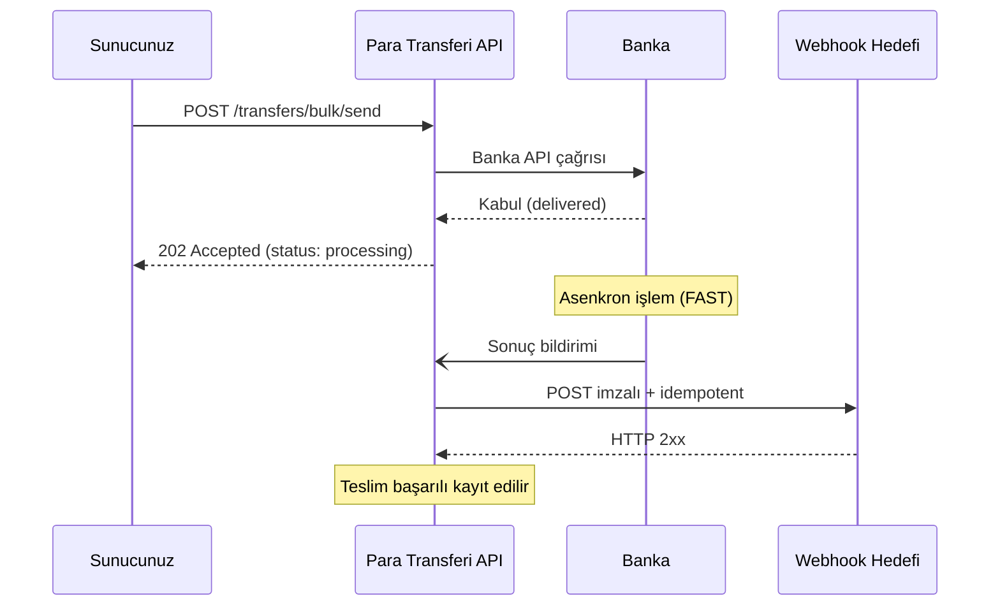

Webhook'lar; transfer oluşturma, başarılı tamamlanma ve başarısızlık olaylarını **sunucunuza HTTP POST** ile gönderir. EFT/FAST işlemlerinin **asenkron** yapısı nedeniyle webhook entegrasyonu pratikte zorunludur — `processing` veya `delivered` durumdaki transferin son sonucunu webhook ile yakalarsınız.

## Akış



## Endpoint kuralları

Webhook hedef endpoint'iniz aşağıdaki kurallara uymalıdır:

<Check>**HTTPS zorunlu** — HTTP URL'leri reddedilir.</Check>
<Check>**Public erişilebilir** — özel ağ veya VPN arkasında olamaz.</Check>
<Check>**15 saniye içinde HTTP 2xx döner** — uzun süren işler için iş kuyruğa atılmalıdır.</Check>
<Check>**Idempotent çalışır** — aynı `X-Payven-Event-Id` ile aynı olay birden fazla kez gelebilir.</Check>
<Check>**İmzayı doğrular** — sahte istekleri reddeder. Bkz. [İmza Doğrulama](/sanal-pos/webhooks/signature).</Check>

## İstek formatı

```http
POST /webhooks/payven HTTP/1.1
Host: example.com
Content-Type: application/json
X-Payven-Event:        transfer.succeeded
X-Payven-Event-Id:     evt_8e3f5c129a7b4c8dbc4e
X-Payven-Delivery-Id:  9f1c8e76-2a3b-4f12-9c8d-12cb24a8a8a8
X-Payven-Signature:    sha256=4f1d8c92ab7e3bcf9...
X-Payven-Timestamp:    1714742400
```

```json
{
  "id":         "evt_8e3f5c129a7b4c8dbc4e",
  "type":       "transfer.succeeded",
  "created_at": "2026-05-03T12:34:58.123+00:00",
  "data": {
    "transfer_id":   "8e3f5c12-9a7b-4c8d-bc4e-2c963f66afa6",
    "external_id":   "PAYROLL-001",
    "status":        "completed",
    "amount":        1500000,
    "currency":      "TRY",
    "transfer_type": "fast",
    "receipt_no":    "TRF-20260503-0001",
    "sent_date":     "2026-05-03T12:34:58.000+00:00",
    "processed_date":"2026-05-03T12:34:59.234+00:00"
  }
}
```

| Header | Açıklama |
|---|---|
| `X-Payven-Event` | Olay tipi (`transfer.created`, `transfer.succeeded`, `transfer.failed`) |
| `X-Payven-Event-Id` | **Olay kimliği** — aynı olay birden fazla teslim edilse bile aynı kalır. Idempotent handler'ınızda bu değeri kullanın. |
| `X-Payven-Delivery-Id` | **Teslim kimliği** — her teslim denemesinde farklıdır. |
| `X-Payven-Signature` | Request body'nin HMAC-SHA256 imzası (`sha256=<hex>`) |
| `X-Payven-Timestamp` | İmzalanan Unix zaman damgası (saniye). Replay saldırılarına karşı 5 dk tolerans dışındaki istekleri reddedin. |

## Abone olma

```bash
curl -X POST https://transfer.payven.com.tr/api/v1/webhooks \
  -H "Authorization: Bearer $PAYVEN_TOKEN" \
  -H "X-Tenant-Id: $TENANT_ID" \
  -H "Content-Type: application/json" \
  -d '{
    "url":    "https://example.com/webhooks/payven-transfers",
    "events": ["transfer.created", "transfer.succeeded", "transfer.failed"]
  }'
```

Yanıttaki `secret` değerini saklayın — imza doğrulamasında kullanacaksınız.

<Warning>
**`secret` değeri yalnızca bu yanıtta bir kez döner.** Liste/detay endpoint'lerinde gizlenir. Hemen secret manager'ınıza kaydedin. Kaybedilirse `POST /webhooks/{id}/rotate-secret` ile yenileyin.
</Warning>

## Yeniden deneme

İlk denemede `2xx` dönmezse Payven otomatik olarak yeniden dener:

| Deneme | Bekleme süresi |
|---|---|
| 1 | Hemen |
| 2 | 1 dakika |
| 3 | 5 dakika |
| 4 | 30 dakika |
| 5 | 2 saat |
| 6 | 24 saat |

Tüm bekleme süreleri ±%20 jitter ile uygulanır. 6. denemeden sonra teslim "kalıcı başarısız" olarak işaretlenir; konsoldan manuel olarak yeniden tetiklenebilir.

Detay: [Webhook Yeniden Deneme](/sanal-pos/webhooks/retry-policy).

## At-least-once teslim

Aynı olay birden fazla kez gelebilir. Sebepler:

- Sizin endpoint'iniz timeout / 5xx döndü → retry
- Network kesintisi → response kaybı → retry
- Konsoldan manuel replay yapıldı

Bu nedenle handler'larınızı **idempotent** yazın:

```javascript
async function handleTransferWebhook(req, res) {
  const eventId = req.headers["x-payven-event-id"];

  // Veritabanında bu eventId daha önce işlendi mi?
  if (await db.processedEvents.exists(eventId)) {
    return res.status(200).end();   // ack but skip
  }

  const event = req.body;
  if (event.type === "transfer.succeeded") {
    await markPayrollPaid(event.data.external_id, event.data.receipt_no);
  } else if (event.type === "transfer.failed") {
    await flagPayrollForReview(event.data.external_id, event.data);
  }

  await db.processedEvents.insert({ id: eventId, processedAt: new Date() });
  res.status(200).end();
}
```

## Sonraki adımlar

<CardGroup cols={2}>
  <Card title="Olay Kataloğu" icon="list" href="/para-transferi/webhooks/events">
    3 olay tipi ve payload alanlarının detayı.
  </Card>
  <Card title="İmza Doğrulama" icon="shield-check" href="/sanal-pos/webhooks/signature">
    HMAC-SHA256 verifikasyon kodu (5 dilde).
  </Card>
</CardGroup>
