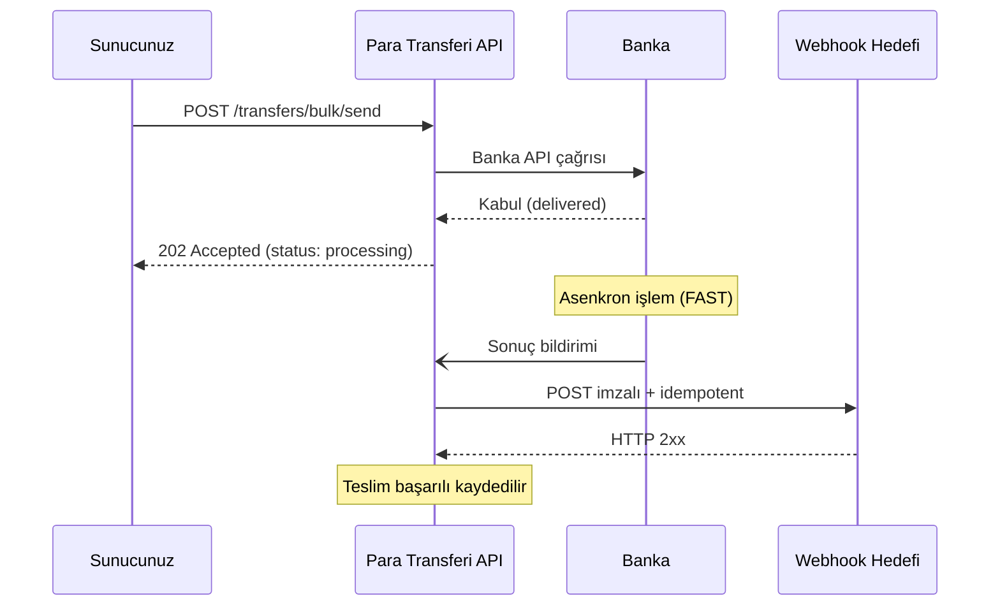

Webhook'lar; transferin başarılı tamamlanma, asenkron kabul (delivered), başarısızlık, red ve iade olaylarını — ve tekrarlayan transfer çekilimlerinin sonuçlarını — **sunucunuza HTTP POST** ile gönderir. EFT/FAST işlemlerinin **asenkron** yapısı nedeniyle webhook entegrasyonu pratikte zorunludur — `processing` veya `delivered` durumdaki transferin son sonucunu webhook ile yakalarsınız.

## Akış


```mermaid
sequenceDiagram
    participant App as Sunucunuz
    participant API as Para Transferi API
    participant Bank as Banka
    participant Webhook as Webhook Hedefi

    App->>API: POST /transfers/bulk/send
    API->>Bank: Banka API çağrısı
    Bank-->>API: Kabul (delivered)
    API-->>App: 202 Accepted (status: processing)
    Note over Bank: Asenkron işlem (FAST)
    Bank-)API: Sonuç bildirimi
    API->>Webhook: POST imzalı + idempotent
    Webhook-->>API: HTTP 2xx
    Note over API: Teslim başarılı kaydedilir
```

## Endpoint kuralları

Webhook hedef endpoint'iniz aşağıdaki kurallara uymalıdır:

<Check>**HTTPS zorunlu** — HTTP URL'leri reddedilir.</Check>
<Check>**Public erişilebilir** — özel ağ veya VPN arkasında olamaz.</Check>
<Check>**15 saniye içinde HTTP 2xx döner** — uzun süren işler için iş kuyruğa atılmalıdır.</Check>
<Check>**Idempotent çalışır** — aynı `X-Payven-Event-Id` ile aynı olay birden fazla kez gelebilir.</Check>
<Check>**İmzayı doğrular** — sahte istekleri reddeder. Bkz. [İmza Doğrulama](/sanal-pos/webhooks/signature).</Check>

## İstek formatı

```http
POST /webhooks/payven HTTP/1.1
Host: example.com
Content-Type: application/json
X-Payven-Event:        para-transferi.transfer.completed
X-Payven-Event-Id:     evt_8e3f5c129a7b4c8dbc4e
X-Payven-Delivery-Id:  9f1c8e76-2a3b-4f12-9c8d-12cb24a8a8a8
X-Payven-Signature:    sha256=4f1d8c92ab7e3bcf9...
X-Payven-Timestamp:    1714742400
```

Gövde varsayılan olarak **olay zarfıdır**; Para Transferi'nin olay gövdesi `data.object`
altındadır (uç `payload_format: flat` ile açıldıysa gövde yalnız bu nesnedir):

```json
{
  "id":          "evt_8e3f5c129a7b4c8dbc4e2c963f66afa6",
  "object":      "event",
  "type":        "para-transferi.transfer.completed",
  "created":     "2026-05-03T15:34:58.123+03:00",
  "livemode":    true,
  "api_version": "2026-09-24",
  "resource_id": "8e3f5c12-9a7b-4c8d-bc4e-2c963f66afa6",
  "data": {
    "object": {
      "event_type":           "para-transferi.transfer.completed",
      "transfer_id":          "8e3f5c12-9a7b-4c8d-bc4e-2c963f66afa6",
      "tenant_id":            "11111111-1111-1111-1111-111111111111",
      "merchant_id":          "3fa85f64-5717-4562-b3fc-2c963f66afa6",
      "external_merchant_id": "MRCH-001",
      "status":               "completed",
      "amount":               1500000,
      "currency":             "try",
      "external_id":          "PAYROLL-001",
      "description":          "Mayıs maaş ödemesi",
      "message":              "Transfer başarılı",
      "receipt_no":           "TRF-20260503-0001",
      "occurred_at":          "2026-05-03T15:34:58.123+03:00"
    }
  }
}
```

| Header | Açıklama |
|---|---|
| `X-Payven-Event` | Olay tipi (`para-transferi.transfer.completed`, `para-transferi.transfer.failed`, ... — bkz. [Olay Kataloğu](/para-transferi/webhooks/events)) |
| `X-Payven-Event-Id` | **Olay kimliği** (`evt_...`, zarftaki `id`) — aynı olay birden fazla teslim edilse bile aynı kalır. Idempotent handler'ınızda bu değeri kullanın. |
| `X-Payven-Delivery-Id` | **Teslim kimliği** — her teslim denemesinde farklıdır. |
| `X-Payven-Signature` | Request body'nin HMAC-SHA256 imzası (`sha256=<hex>`; sır yenileme geçişinde virgülle iki imza) |
| `X-Payven-Timestamp` | İmzalanan Unix zaman damgası (saniye). Replay saldırılarına karşı 5 dk tolerans dışındaki istekleri reddedin. |

## Abone olma

Uçlar Para Transferi API'sinde değil **İşyeri API'sinde** yönetilir; tek uç tüm ürünlerin
olaylarını alabilir. API anahtarınızın **İşyeri API'si (`merchant`)** kapsamı seçili olmalıdır.

```bash
curl -X POST https://merchant.payven.com.tr/api/v1/webhook-endpoints \
  -H "Authorization: Bearer $PAYVEN_TOKEN" \
  -H "Content-Type: application/json" \
  -d '{
    "url":            "https://example.com/webhooks/payven-transfers",
    "enabled_events": ["para-transferi.transfer.completed", "para-transferi.transfer.delivered", "para-transferi.transfer.failed"]
  }'
```

Yanıttaki `secret` değerini saklayın — imza doğrulamasında kullanacaksınız.

<Warning>
**`secret` değeri yalnızca bu yanıtta bir kez döner.** Liste/detay uçlarında dönmez. Hemen secret manager'ınıza kaydedin. Kaybedilirse `POST /webhook-endpoints/{id}/rotate-secret` ile yenileyin.
</Warning>

## Yeniden deneme

İlk denemede `2xx` dönmezse Payven yalnız o uca otomatik olarak yeniden dener: toplam **10 deneme,
~2,5 gün** (1 dk, 5 dk, 30 dk, 2 sa, 5 sa, 10 sa, 10 sa, 12 sa, 12 sa aralıklarla; ±%20 sapma).
Tükenen teslim panelden ya da `POST /webhook-endpoints/deliveries/{id}/retry` ile yeniden
gönderilir. 3 gün boyunca hiç başarılı teslim yapamayan uç otomatik kapatılır.

Detay: [Webhook Yeniden Deneme](/sanal-pos/webhooks/retry-policy).

## At-least-once teslim

Aynı olay birden fazla kez gelebilir. Sebepler:

- Sizin endpoint'iniz timeout / 5xx döndü → retry
- Network kesintisi → response kaybı → retry
- Teslim panelden ya da API ile yeniden gönderildi

Bu nedenle handler'larınızı **idempotent** yazın:

```javascript
async function handleTransferWebhook(req, res) {
  const eventId = req.headers["x-payven-event-id"];

  // Veritabanında bu eventId daha önce işlendi mi?
  if (await db.processedEvents.exists(eventId)) {
    return res.status(200).end();   // ack but skip
  }

  const event = req.body.data.object;   // olay zarfı; flat uçta: req.body
  const eventType = req.headers["x-payven-event"];
  if (eventType === "para-transferi.transfer.completed" || eventType === "para-transferi.transfer.delivered") {
    await markPayrollPaid(event.external_id, event.receipt_no);
  } else if (eventType === "para-transferi.transfer.failed") {
    await flagPayrollForReview(event.external_id, event);
  }

  await db.processedEvents.insert({ id: eventId, processedAt: new Date() });
  res.status(200).end();
}
```

## Sonraki adımlar

<CardGroup cols={2}>
  <Card title="Olay Kataloğu" icon="list" href="/para-transferi/webhooks/events">
    8 olay tipi ve payload alanlarının detayı.
  </Card>
  <Card title="İmza Doğrulama" icon="shield-check" href="/sanal-pos/webhooks/signature">
    HMAC-SHA256 verifikasyon kodu (5 dilde).
  </Card>
</CardGroup>
