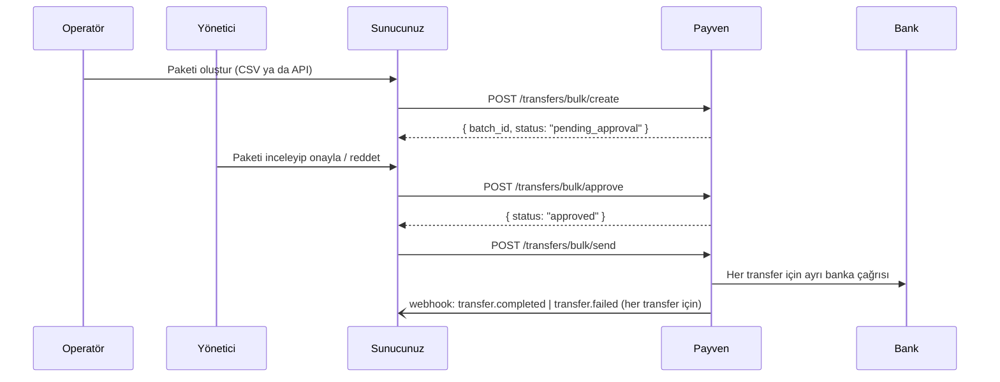

Para Transferi modülünde **4-eyes (iki onay) ilkesi** zorunludur: bir kullanıcı (örn. operatör) toplu transfer paketi oluşturur, ikinci kullanıcı (örn. yönetici) onaylar, ardından paket bankaya gönderilir. Bu reçete uçtan uca akışı gösterir.

## Akış



## 1. Paketi oluştur

```bash
curl -X POST https://transfer.payven.com.tr/api/v1/transfers/bulk/create \
  -H "Authorization: Bearer $PAYVEN_TOKEN" \
  -H "Idempotency-Key: payroll-2026-05-batch-1" \
  -H "Content-Type: application/json" \
  -d '{
    "external_batch_id": "PAYROLL-2026-05",
    "description":       "Mayis 2026 maas",
    "transfers": [
      {
        "external_id":    "PR-2026-05-001",
        "amount":         { "amount": 5000000, "currency": "TRY" },
        "recipient_id":   "rcp_8e3f5c12...",
        "description":    "Mayis maas — Ahmet Yilmaz",
        "transfer_type":  "EFT"
      },
      {
        "external_id":    "PR-2026-05-002",
        "amount":         { "amount": 4500000, "currency": "TRY" },
        "recipient_id":   "rcp_9f3d2b8e...",
        "description":    "Mayis maas — Ayse Demir",
        "transfer_type":  "FAST"
      }
    ]
  }'
```

Yanıt:

```json
{
  "batch_id":          "btc_8e3f5c12...",
  "status":            "pending_approval",
  "transfer_count":    2,
  "total_amount":      9500000,
  "currency":          "TRY",
  "created_by":        "user_op_123",
  "created_at":        "2026-05-08T09:00:00+00:00"
}
```

<Note>
**Alıcılar (recipients)** önceden tanımlı olmalıdır. Yeni alıcı için: [Alıcılar](/para-transferi/recipients/overview).
</Note>

## 2. Paketi onayla (ikinci kullanıcı)

Onay yapan kullanıcı **paketi oluşturandan farklı** olmalı. Backend bunu rol bazlı kontrol eder (`transfer-admin` rolü).

```bash
curl -X POST https://transfer.payven.com.tr/api/v1/transfers/bulk/approve \
  -H "Authorization: Bearer $MANAGER_TOKEN" \
  -H "Content-Type: application/json" \
  -d '{ "batch_id": "btc_8e3f5c12..." }'
```

Aynı kullanıcı onaylamaya çalışırsa:

```http
HTTP/1.1 422 Unprocessable Entity
Content-Type: application/problem+json
```
```json
{
  "type":   "https://docs.payven.com.tr/errors/four_eyes_violation",
  "title":  "4-eyes ihlali",
  "status": 422,
  "code":   "four_eyes_violation",
  "detail": "Paketi oluşturan kullanıcı kendi paketini onaylayamaz."
}
```

### Reddetme

Hata fark edilirse paket reddedilir:

```bash
curl -X POST https://transfer.payven.com.tr/api/v1/transfers/bulk/reject \
  -H "Authorization: Bearer $MANAGER_TOKEN" \
  -d '{ "batch_id": "btc_8e3f5c12...", "reason": "Tutar yanlis — Ayse'nin maasi 4500 degil 5500" }'
```

Reddedilen paket bir daha kullanılamaz; yeni bir paket oluşturmanız gerekir.

## 3. Paketi gönder (banka çağrıları başlar)

Onay sonrası her transfer **bağımsız** olarak bankaya gönderilir.

```bash
curl -X POST https://transfer.payven.com.tr/api/v1/transfers/bulk/send \
  -H "Authorization: Bearer $PAYVEN_TOKEN" \
  -H "Idempotency-Key: send-payroll-2026-05" \
  -d '{ "batch_id": "btc_8e3f5c12..." }'
```

`status: "sending"` döner. Asenkron çalışır — webhook ile her transferin sonucunu yakalayın:

```json
{
  "id":   "evt_...",
  "type": "transfer.completed",
  "data": {
    "transfer_id":     "trf_...",
    "external_id":     "PR-2026-05-001",
    "batch_id":        "btc_8e3f5c12...",
    "status":          "completed",
    "bank_reference":  "EFT-REF-789",
    "completed_at":    "2026-05-08T09:01:23+00:00"
  }
}
```

Bir transfer başarısız olursa diğerleri devam eder — paket kısmi başarılı (`partially_completed`) olabilir.

## 4. Paket durumunu sorgula

```bash
curl https://transfer.payven.com.tr/api/v1/transfers?batch_id=btc_... \
  -H "Authorization: Bearer $PAYVEN_TOKEN"
```

Yanıt: paketteki tüm transferler ve mevcut durumları.

## Hata senaryoları

| Hata | HTTP | `code` | Çözüm |
|---|---|---|---|
| Aynı kullanıcı onaylamaya çalışıyor | 422 | `four_eyes_violation` | İkinci kullanıcı yetkili olmalı |
| Hesap yetersiz bakiye | 422 | `insufficient_account_balance` | Kaynak hesaba para aktarın |
| IBAN hatası (alıcı) | 422 | `invalid_iban` | Alıcı kayıt bilgisini kontrol edin |
| Banka bağlantı hatası | 503 | `connector_unavailable` | Smart Retry alternatif konnektör dener |
| Paket zaten onaylanmış | 409 | `invalid_state_transition` | Paket durumunu sorgulayın |

## Dekont (receipt)

Başarılı her transferin dekontunu indirin:

```bash
# PDF olarak
curl -O https://transfer.payven.com.tr/api/v1/transfers/{id}/receipt/download \
  -H "Authorization: Bearer $PAYVEN_TOKEN"

# Base64 olarak (e-posta eki için)
curl https://transfer.payven.com.tr/api/v1/transfers/{id}/receipt/base-64 \
  -H "Authorization: Bearer $PAYVEN_TOKEN"
```

## Kontrol listesi

<Check>Operatör ve yönetici **farklı** rollere sahip mi (4-eyes)?</Check>
<Check>Alıcılar (`recipients`) onboarding sırasında IBAN doğrulaması ile eklendi mi?</Check>
<Check>`Idempotency-Key` paket-bazlı (`payroll-2026-05-batch-1`) mi?</Check>
<Check>Webhook handler'ınız `transfer.completed` ve `transfer.failed` olaylarını dinliyor mu?</Check>
<Check>Paket reddetme akışı UI'da var mı (operatöre geri bildirim)?</Check>

## İlgili sayfalar

- [Para Transferi Genel Bakış](/para-transferi/overview)
- [Toplu Transfer Akışı](/para-transferi/transfers/bulk-create)
- [Webhook Olayları (Transfer)](/para-transferi/webhooks/events)
