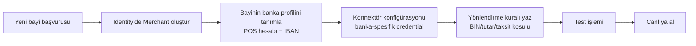
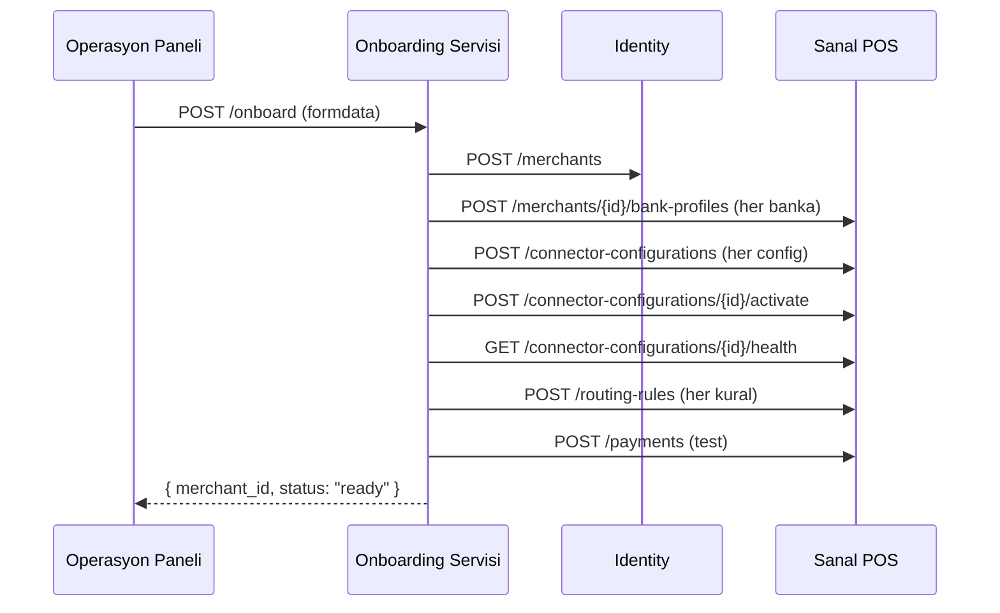

Bu reçete, **marketplace** veya **alt bayi yönetimi** olan bir senaryoyu kapsar: ödeme kuruluşu olarak müşterilerinize (bayilere) hizmet veriyorsunuz, her bayi kendi POS hesabıyla işlem alıyor, akıllı yönlendirme bayi-bazlı kurallarla bankaya yönlendirme yapıyor.

## Akış



## 1. Identity'de bayi (merchant) oluştur

```bash
curl -X POST https://identity.payven.com.tr/api/v1/merchants \
  -H "Authorization: Bearer $PAYVEN_TOKEN" \
  -H "Content-Type: application/json" \
  -d '{
    "name":        "Acme Online",
    "external_id": "ACME-001",
    "tax_number":  "1234567890",
    "mcc_code":    "5732",
    "contact": {
      "email":     "finance@acme.example",
      "phone":     "+905551112233"
    },
    "billing_address": {
      "city":         "Istanbul",
      "country":      "TR",
      "address":      "Maslak Mh. ...",
      "postal_code":  "34485"
    }
  }'
```

Yanıt `id` (Guid) ve `external_id` döner. Her ikisini de saklayın — Sanal POS'ta `X-Merchant-Id` veya `X-External-Merchant-Id` header'ında geçer.

## 2. Bayi banka profilini tanımla

Bayinin hangi bankalarda POS hesabı olduğunu Payven'e bildirin. Mutabakat ve raporlama bu profil üzerinden çalışır.

```bash
curl -X POST https://vpos.payven.com.tr/api/v1/merchants/{merchant_id}/bank-profiles \
  -H "Authorization: Bearer $PAYVEN_TOKEN" \
  -H "Content-Type: application/json" \
  -d '{
    "bank_code":     "ZIRAATBANK",
    "iban":          "TR330006100519786457841326",
    "account_name":  "Acme Online Ticaret A.S.",
    "merchant_id_at_bank": "MID-12345"
  }'
```

Birden fazla banka için bu adımı tekrarlayın.

## 3. Konnektör konfigürasyonu

Konnektör = banka entegrasyon sürücüsü. Konfigürasyon = bu konnektörün **bu bayi için** çalışması gereken credential'ları (mağaza kodu, terminal ID, secret).

```bash
curl -X POST https://vpos.payven.com.tr/api/v1/connector-configurations \
  -H "Authorization: Bearer $PAYVEN_TOKEN" \
  -H "Content-Type: application/json" \
  -d '{
    "connector_id":  "<ZIRAATBANK_CONNECTOR_ID>",
    "merchant_id":   "<merchant_id>",
    "name":          "Acme — Ziraat POS",
    "credentials": {
      "store_id":    "...",
      "terminal_id": "...",
      "username":    "...",
      "password":    "..."
    }
  }'
```

Aktif et:

```bash
curl -X POST https://vpos.payven.com.tr/api/v1/connector-configurations/{id}/activate \
  -H "Authorization: Bearer $PAYVEN_TOKEN"
```

Bağlantıyı test et:

```bash
curl https://vpos.payven.com.tr/api/v1/connector-configurations/{id}/health \
  -H "Authorization: Bearer $PAYVEN_TOKEN"
```

`status: "healthy"` görene kadar credential'ı kontrol edin.

## 4. Yönlendirme kuralı (akıllı routing)

Bu bayinin işlemlerini hangi bankaya, hangi koşulda yönlendireceğini tanımlayın. Örnek: 1.000 ₺ üzerinde Garanti, altında Ziraat.

```bash
curl -X POST https://vpos.payven.com.tr/api/v1/routing-rules \
  -H "Authorization: Bearer $PAYVEN_TOKEN" \
  -H "Content-Type: application/json" \
  -d '{
    "merchant_id":  "<merchant_id>",
    "name":         "Acme — Yüksek tutar Garanti",
    "score":        100,
    "is_active":    true,
    "conditions": [
      { "field": "amount", "op": "gte", "value": 100000 }
    ],
    "target": {
      "connector_configuration_id": "<garanti_config_id>"
    }
  }'
```

Daha düşük öncelikli (`score: 10`) bir varsayılan kural ile fallback tanımlayın:

```bash
curl -X POST https://vpos.payven.com.tr/api/v1/routing-rules \
  -d '{
    "merchant_id": "<merchant_id>",
    "name":        "Acme — Varsayılan Ziraat",
    "score":       10,
    "is_active":   true,
    "conditions":  [],
    "target":      { "connector_configuration_id": "<ziraat_config_id>" }
  }'
```

<Tip>
Birden fazla kural tetiklenirse Payven en yüksek `score`'a sahip kuralı seçer. Score 0-1000 aralığında olmalı; tipik yapı: belirli BIN/tutar koşullarına 100+, varsayılana 10.
</Tip>

## 5. Test işlemi

Sandbox'ta yeni bayi adına bir test işlemi gönderin:

```bash
curl -X POST https://vpos-sandbox.payven.com.tr/api/v1/payments \
  -H "Authorization: Bearer $PAYVEN_TOKEN" \
  -H "X-Merchant-Id: <merchant_id>" \
  -H "Content-Type: application/json" \
  -d '{
    "external_id": "ACME-TEST-001",
    "amount":      { "amount": 150000, "currency": "TRY" },
    "installment": 1,
    "card":        { ... }
  }'
```

Yanıttaki `extra_properties.connector_code` → `"ZIRAATBANK"` veya `"GARANTI"` olmalı (yönlendirme kuralının doğru uyguladığını doğrular).

## 6. Canlıya alma

<Check>Sandbox'ta her banka için en az 5 başarılı + 2 başarısız test işlemi yapıldı mı?</Check>
<Check>Webhook subscription bu bayi için kurulu mu?</Check>
<Check>Bayinin operasyon ekibi konsola erişim aldı mı?</Check>
<Check>Mutabakat dosyası şablonu bayi tarafından kabul edildi mi?</Check>
<Check>Identity'de bayiye uygun rol (`pos-merchant-admin` / `pos-merchant-user`) atandı mı?</Check>

Production'a aynı adımları **prod organizasyon slug'ı + prod credential'lar** ile tekrarlayın.

## Çoklu bayi yönetimi

Birden fazla bayi için bu işlemi otomatize edebilirsiniz. Tipik bir onboarding API'si:



## İlgili sayfalar

- [Hesap Modeli](/documentation/account-model)
- [Yönlendirme Genel Bakış](/sanal-pos/routing/overview)
- [Konnektör Yönetimi (API ref)](/api-reference/sanal-pos/connectors)
