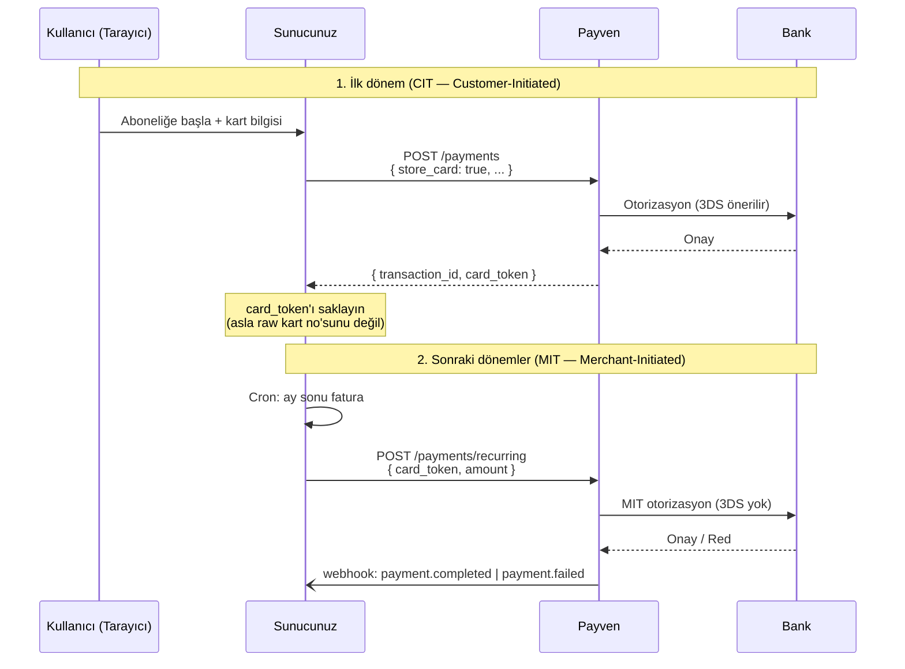

Bu reçete, abonelik (örn. aylık SaaS, bağış, sigorta primi) gibi **tekrarlayan ödeme** senaryolarını gösterir. İlk işlemde kart bilgisi alınır ve **token** olarak Payven'e kaydedilir; sonraki dönemlerde kart bilgisi olmadan, yalnız bu token ile ödeme alınır (Card-on-File / Merchant-Initiated Transaction — MIT).

## Akış



## 1. İlk işlem — kartı kaydet

İlk dönemde standart bir 3DS ödemesi başlatın ve `store_card: true` ile kartın saklanmasını isteyin. **Tüketici akışında 3DS kullanın** — chargeback sorumluluğu bankaya geçer ve banka sonraki MIT'leri bağlamak için CIT auth'unu kullanır.

```bash
curl -X POST https://vpos.payven.com.tr/api/v1/payments/3d/init \
  -H "Authorization: Bearer $PAYVEN_TOKEN" \
  -H "Idempotency-Key: subscription-1001-init" \
  -H "Content-Type: application/json" \
  -d '{
    "external_id": "SUB-1001-INIT",
    "amount":      { "amount": 9900, "currency": "TRY" },
    "installment": 1,
    "store_card":  true,
    "card": {
      "holder_name":  "Test Kullanici",
      "number":       "4546711234567894",
      "expire_month": "12",
      "expire_year":  "2030",
      "cvv":          "000"
    },
    "buyer": {
      "id":    "cust-001",
      "email": "user@example.com"
    },
    "callback_url": "https://example.com/3ds/return"
  }'
```

3DS akışı tamamlandığında yanıt:

```json
{
  "transaction_id": "8e3f5c12-...",
  "status":         "completed",
  "card_token":     "ctok_2025_NF8a9P...",
  "extra_properties": {
    "auth_code":      "123456",
    "card_brand":     "visa",
    "last_four":      "7894"
  }
}
```

`card_token`'ı veritabanınıza, **kullanıcı kimliğine bağlı** olarak saklayın. Ham PAN'ı asla saklamayın — token zaten size bunu sağlıyor.

<Warning>
**`card_token` zorunlu olarak ilgili kullanıcıya bağlı saklanır.** Farklı bir kullanıcının abonelik ödemesinde başkasının token'ını kullanmayın — fraud kuralı tetiklenir ve Payven işlemi reddeder.
</Warning>

## 2. Sonraki dönemler — token ile çekim

Bir sonraki dönem geldiğinde (cron, billing event, manuel tetikleme):

```bash
curl -X POST https://vpos.payven.com.tr/api/v1/payments/recurring \
  -H "Authorization: Bearer $PAYVEN_TOKEN" \
  -H "Idempotency-Key: subscription-1001-month-2026-06" \
  -H "Content-Type: application/json" \
  -d '{
    "external_id": "SUB-1001-2026-06",
    "card_token":  "ctok_2025_NF8a9P...",
    "amount":      { "amount": 9900, "currency": "TRY" },
    "installment": 1,
    "buyer": {
      "id":    "cust-001",
      "email": "user@example.com"
    }
  }'
```

Yanıt başarılı senaryoda:

```json
{
  "transaction_id": "9b2e4d70-...",
  "status":         "completed",
  "extra_properties": {
    "auth_code":     "789012",
    "scheme_indicator": "MIT",
    "original_transaction_id": "8e3f5c12-..."
  }
}
```

<Tip>
**`Idempotency-Key`'i ay+abonelik kimliğinden deterministik üretin** (`subscription-1001-month-2026-06`). Cron iki kez çalıştığında aynı ay için ikinci ödeme oluşmaz.
</Tip>

## 3. Başarısız ödemenin yönetimi

MIT işleminde 3DS olmadığı için banka reddi olası — yetersiz bakiye, kart limit aşımı, kart süresi dolmuş vb. Webhook ile yakalayın:

```json
{
  "id":   "evt_...",
  "type": "payment.failed",
  "data": {
    "transaction_id":          "9b2e4d70-...",
    "status":                  "failed",
    "error_code":              "insufficient_funds",
    "provider_error_code":     "51"
  }
}
```

Önerilen retry stratejisi:

| Banka kodu | Anlam | Retry stratejisi |
|---|---|---|
| `51` | Yetersiz bakiye | 3-5 gün sonra 1-2 retry; sonra kullanıcıya kart güncelleme bildirimi |
| `54` | Kart süresi dolmuş | Retry yapma; kullanıcıdan yeni kart iste |
| `62` | Kısıtlı kart | Retry yapma; bayi onayı / banka değişikliği gerekli |
| `91`/`96` | Banka sistemi | Smart Retry zaten devreye girer; otomatik alternatif konnektör denenir |
| `61` | Limit aşımı | 1-2 gün sonra retry |

Üç başarısız retry sonrası **dunning flow**'a (e-posta + uygulama-içi bildirim) geçin.

## 4. Aboneliği iptal etme

Token'ı iptal etmek (kullanıcı aboneliği sonlandırdı):

```bash
curl -X POST https://vpos.payven.com.tr/api/v1/payments/{transaction_id}/recurring/cancel \
  -H "Authorization: Bearer $PAYVEN_TOKEN"
```

Bu endpoint, ilk aboneliğin `transaction_id`'sini alır ve ona bağlı saklı kart token'ını iptal eder. Sonraki MIT denemesi `422 token_revoked` döner.

## Kontrol listesi (canlıya çıkmadan)

<Check>İlk işlem (CIT) **3DS ile** yapıldı mı?</Check>
<Check>`card_token` veritabanında **kullanıcı ID'si** ile birlikte saklanıyor mu?</Check>
<Check>Recurring isteklerinde **`Idempotency-Key`** dönem-bazlı deterministik mi?</Check>
<Check>`payment.failed` webhook'u handler'ınız retry kuyruğuna yazıyor mu?</Check>
<Check>Kart süresi dolan kullanıcıya bildirim akışı kurulu mu?</Check>
<Check>Token iptal endpoint'i abonelik iptal akışına bağlı mı?</Check>

## İlgili sayfalar

- [3D Secure Ödeme](/sanal-pos/payments/3d-secure)
- [Idempotency](/documentation/concepts/idempotency)
- [Webhook olay kataloğu](/sanal-pos/webhooks/events)
- [Banka yanıt kodları](/sanal-pos/errors/bank-codes)
