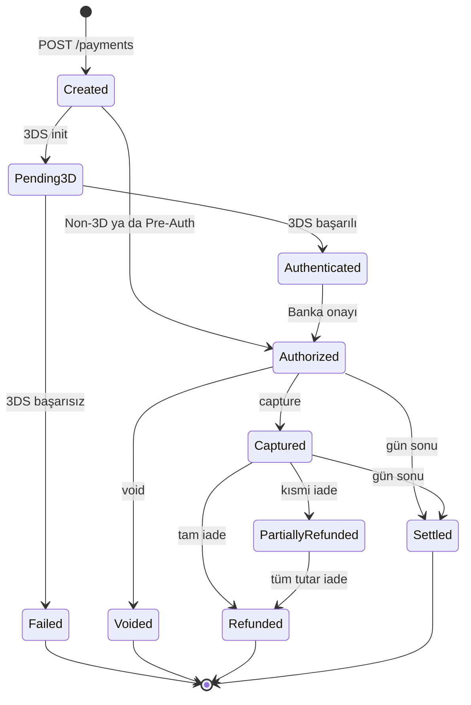

Payven Sanal POS, ödeme kuruluşları ve büyük platformlar için **çoklu banka entegrasyonlu** bir ödeme alma altyapısıdır. Tek bir API ile birden fazla bankaya ödeme yönlendirir, akıllı yönlendirme motoruyla başarı oranını maksimize eder.

## Temel özellikler

<CardGroup cols={2}>
  <Card title="Çoklu Banka" icon="building-columns">
    Türkiye'nin önde gelen bankalarıyla tek API üzerinden entegrasyon. Yeni konnektör eklemek anlaşma değil, konfigürasyon meselesidir.
  </Card>
  <Card title="Akıllı Yönlendirme" icon="route">
    BIN, tutar, taksit, kart birliği ve banka sağlığını dikkate alan bileşik skor motoru ile dinamik yönlendirme.
  </Card>
  <Card title="3D Secure 2.x" icon="shield-check">
    Tüm bankalar için tek tip 3DS akışı. Frictionless ve challenge mode ayrımı otomatiktir.
  </Card>
  <Card title="Smart Retry" icon="arrows-rotate">
    Geçici banka hatasında işlem alternatif konnektöre yönlendirilir; kullanıcı yeniden ödeme yapmaz.
  </Card>
  <Card title="Hosted Checkout" icon="window-maximize">
    Kart girişi Payven'in barındırdığı sayfada yapılır; siz sadece yönlendirme URL'si alırsınız. PCI-DSS yükünü minimize eder.
  </Card>
  <Card title="Tek Mutabakat" icon="scale-balanced">
    Tüm bankaların gün sonu hareketleri tek bir mutabakat akışında konsolide edilir.
  </Card>
</CardGroup>

## Base URL

| Ortam | URL |
|---|---|
| Sandbox | `https://vpos-sandbox.payven.com.tr` |
| Production | `https://vpos.payven.com.tr` |

## Hangi entegrasyonu seçmeliyim?

<Tabs>
  <Tab title="Hosted Checkout (önerilir)">
    **Sizin akış:**
    1. Sunucunuz `POST /checkout/sessions` ile bir oturum oluşturur.
    2. Müşteriyi dönen URL'ye yönlendirirsiniz.
    3. Müşteri kart bilgilerini Payven sayfasında girer.
    4. Sonuç webhook ile size iletilir.

    **Avantajlar:** En düşük PCI-DSS yükü (SAQ-A), banka sayfası gibi görünür, 3DS otomatik.

    **Uygunsa:** Çoğu B2C entegrasyonu için tercih bu olmalı.

    [Detay →](/sanal-pos/payments/hosted-checkout)
  </Tab>
  <Tab title="Pay-by-Link">
    **Sizin akış:**
    1. Sunucunuz `POST /payments/order-link` ile link üretir.
    2. SMS, e-posta veya WhatsApp ile müşteriye gönderirsiniz.
    3. Müşteri linkten ödemeyi yapar.

    **Avantajlar:** Sıfır frontend geliştirme, çağrı merkezi senaryoları için ideal.

    [Detay →](/sanal-pos/payments/pay-by-link)
  </Tab>
  <Tab title="Direct API">
    **Sizin akış:**
    1. Kart bilgilerini kendi formunuzdan toplarsınız.
    2. `POST /payments` ile Payven'e iletirsiniz.
    3. 3DS gerekiyorsa müşteriyi yönlendirme URL'sine yönlendirirsiniz.
    4. Callback ile dönüş alırsınız.

    **Avantajlar:** UI üzerinde tam kontrol.

    **Maliyet:** PCI-DSS denetim kapsamı yüksek (SAQ-D veya ROC). Yalnızca sertifikalı organizasyonlar kullanmalı.

    [Non-3D →](/sanal-pos/payments/non-3d) · [3D Secure →](/sanal-pos/payments/3d-secure)
  </Tab>
</Tabs>

## Endpoint kategorileri

| Kategori | Endpoint örnekleri | Auth |
|---|---|---|
| Ödeme oluşturma | `POST /payments`, `POST /payments/3d/init`, `POST /checkout/sessions` | Bearer |
| Ödeme aksiyonları | `POST /payments/{id}/refund`, `/void`, `/capture` | Bearer |
| Sorgulama | `GET /transactions`, `GET /payments/{id}` | Bearer |
| Webhook yönetimi | `POST /webhooks` | Bearer |
| Mutabakat | `POST /reconciliations/start` | Bearer |
| Backoffice | `GET /connectors`, `/connector-configurations` | Bearer |

## İşlem yaşam döngüsü

## Sıradaki adım

<CardGroup cols={2}>
  <Card title="Kimlik Doğrulama" icon="key" href="/sanal-pos/authentication">
    Sanal POS'a özgü header'lar ve kurallar.
  </Card>
  <Card title="Payment Objesi" icon="cube" href="/sanal-pos/payment-object">
    Tüm ödeme yanıtlarında dönen alanların referansı.
  </Card>
  <Card title="İlk Non-3D Ödeme" icon="credit-card" href="/sanal-pos/payments/non-3d">
    En basit ödeme akışıyla başlayın.
  </Card>
  <Card title="3D Secure" icon="shield-check" href="/sanal-pos/payments/3d-secure">
    Müşteri doğrulama akışının tam detayı.
  </Card>
</CardGroup>
