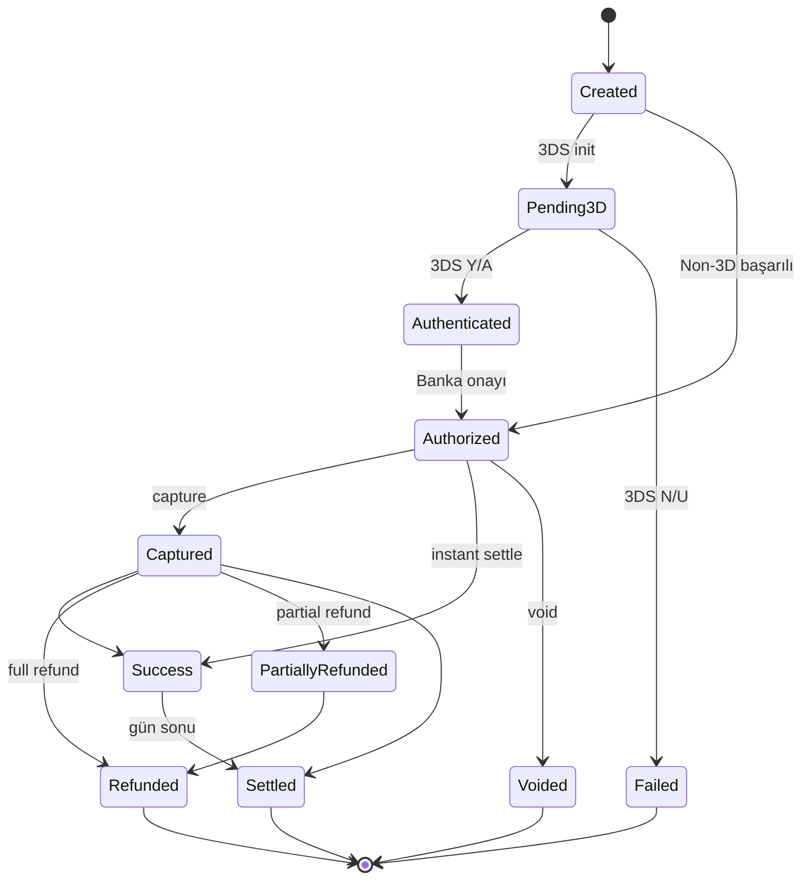

Payment objesi, bir ödemenin **mevcut durumunu ve geçmişini** tek bir yapıda taşır. Her ödeme oluşturma, sorgulama ve aksiyon endpoint'inden bu yapı döner.

## Tam yapı

```json
{
  "id": "8e3f5c12-9a7b-4c8d-bc4e-2c963f66afa6",
  "externalId": "ORDER-1001",
  "merchantId": "3fa85f64-5717-4562-b3fc-2c963f66afa6",
  "status": "Success",
  "operationType": "Sale",
  "amount": 15000,
  "capturedAmount": 15000,
  "refundedAmount": 0,
  "currency": "TRY",
  "installment": 1,
  "use3D": false,
  "card": {
    "holderName": "Test Kullanici",
    "binNumber": "454671",
    "lastFourDigits": "7894",
    "scheme": "Visa",
    "type": "Credit",
    "program": "Bonus",
    "bankCode": "GARANTI",
    "bankName": "Garanti BBVA"
  },
  "connector": {
    "code": "GarantiVPOS",
    "configurationId": "...",
    "responseCode": "00",
    "responseMessage": "Onaylandı",
    "hostReference": "PAYVEN-REF-789",
    "authCode": "123456",
    "transactionId": "9f3d2b8e-..."
  },
  "threeDS": null,
  "fraud": {
    "score": 12,
    "decision": "Allow",
    "rulesTriggered": []
  },
  "metadata": {
    "campaignId": "summer-2026"
  },
  "createdAt": "2026-05-03T12:34:56Z",
  "completedAt": "2026-05-03T12:34:58Z",
  "settlementDate": null
}
```

## Alanlar

### Tanımlayıcılar
| Alan | Tip | Açıklama |
|---|---|---|
| `id` | UUID | Payven tarafından atanan benzersiz ödeme kimliği |
| `externalId` | string | Sizin sisteminizdeki sipariş/işlem kimliği. Tekrarlanan ödemeler için tekil olmalı |
| `merchantId` | UUID | İşlemin hangi merchant adına yapıldığı |

### Durum
| Alan | Tip | Değerler |
|---|---|---|
| `status` | enum | `Created`, `Pending3D`, `Authenticated`, `Authorized`, `Captured`, `Success`, `Failed`, `Voided`, `Refunded`, `PartiallyRefunded`, `Settled` |
| `operationType` | enum | `Sale` (varsayılan), `PreAuth`, `Capture`, `Refund`, `Void` |

`status` değerlerinin akışı için: [Sanal POS Genel Bakış](/sanal-pos/overview).

### Tutar
| Alan | Tip | Açıklama |
|---|---|---|
| `amount` | int (kuruş) | İlk yetkilendirilen tutar |
| `capturedAmount` | int | Çekilen tutar (Pre-Auth + Capture senaryosu için < `amount` olabilir) |
| `refundedAmount` | int | İade edilen toplam tutar |
| `currency` | enum | `TRY`, `USD`, `EUR`, `GBP` |
| `installment` | int | Taksit sayısı (1 = peşin) |

### Kart bilgileri
| Alan | Tip | Açıklama |
|---|---|---|
| `card.holderName` | string | Kart üzerindeki isim |
| `card.binNumber` | string | İlk 6 hane |
| `card.lastFourDigits` | string | Son 4 hane |
| `card.scheme` | enum | `Visa`, `Mastercard`, `Troy`, `Amex` |
| `card.type` | enum | `Credit`, `Debit`, `Prepaid` |
| `card.program` | string | Banka programı (Bonus, Maximum, Axess, ...) |
| `card.bankCode`, `bankName` | string | BIN'den çözümlenen banka |

<Note>
Payven kart numarasının tamamını **saklamaz** ve yanıtta dönmez. Yalnızca BIN ve son 4 hane referans için döndürülür.
</Note>

### Konnektör (banka) bilgileri
| Alan | Açıklama |
|---|---|
| `connector.code` | İşlemi gerçekleştiren konnektörün kodu (örn. `GarantiVPOS`, `AkbankNestpay`) |
| `connector.responseCode` | Bankadan dönen yanıt kodu (`00` = başarı) |
| `connector.responseMessage` | Bankadan dönen mesaj |
| `connector.hostReference` | Bankadaki referans numarası |
| `connector.authCode` | 6 haneli onay kodu |
| `connector.transactionId` | Bankadaki işlem kimliği |

### 3D Secure (sadece 3DS işlemlerde)
| Alan | Açıklama |
|---|---|
| `threeDS.status` | `Y`, `N`, `U`, `A` (3DS sonucu) |
| `threeDS.eci` | Electronic Commerce Indicator (`05`, `06`, vb.) |
| `threeDS.cavv` | Cardholder Authentication Verification Value |
| `threeDS.xid` | Transaction ID (3DS spec) |
| `threeDS.protocolVersion` | `1.0`, `2.1`, `2.2` |

### Fraud
| Alan | Açıklama |
|---|---|
| `fraud.score` | 0-100 arası risk skoru |
| `fraud.decision` | `Allow`, `Review`, `Block` |
| `fraud.rulesTriggered[]` | Tetiklenen fraud kuralları |

### Metadata
`metadata` alanı **sizin tanımladığınız** anahtar-değer çiftleridir. 50 anahtara kadar, her değer max 500 karakter. Raporlama ve filtreleme için kullanışlıdır.

### Tarihler
| Alan | Açıklama |
|---|---|
| `createdAt` | Ödemenin oluşturulduğu zaman (UTC) |
| `completedAt` | Banka onayı geldiği zaman |
| `settlementDate` | Mutabakata dahil edildiği gün (gün sonunda doldurulur) |

## Status diyagramı


