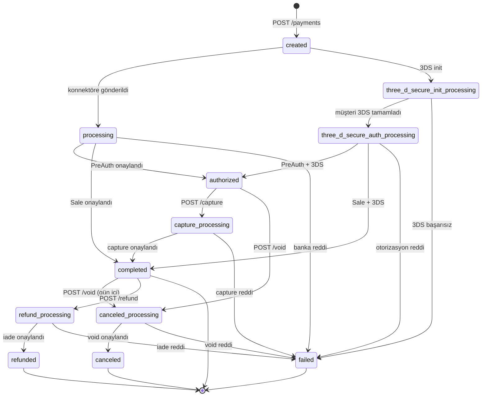

Payment objesi, bir ödemenin **mevcut durumu** ve banka tarafından dönen detayları tek bir yapıda taşır. İki varyantı vardır:

- **`PaymentOperationResult`** — yazma operasyonlarında (`POST /payments`, `/refund`, `/void`, `/capture`) döner
- **`PaymentStatus`** — sorgulama operasyonunda (`GET /payments/{id}`) döner; `PaymentOperationResult` üzerine ek alanlar koyar

## PaymentOperationResult

Yazma endpoint'lerinden dönen temel yapı:

```json
{
  "transaction_id": "8e3f5c12-9a7b-4c8d-bc4e-2c963f66afa6",
  "status":         "completed",
  "extra_properties": {
    "processed_at":            "2026-05-03T12:34:58.123+00:00",
    "receipt_id":              "RCPT-20260503-0001",
    "external_id":             "ORDER-1001",
    "provider_transaction_id": "9f3d2b8e-...",
    "auth_code":               "123456",
    "host_reference":          "PAYVEN-REF-789"
  }
}
```

| Alan | Tip | Açıklama |
|---|---|---|
| `transaction_id` | UUID | Payven tarafından atanan benzersiz işlem kimliği. Sorgulama / aksiyon endpoint'lerinde URL parametresi olarak kullanılır. |
| `status` | enum | İşlemin mevcut durumu — bkz. [Status değerleri](#status-degerleri) |
| `extra_properties` | object \| null | Banka-spesifik ek alanlar — anahtarları konnektöre göre değişir |

İşlem başarılı mı bilgisini **HTTP durum kodundan** okuyun (`2xx` → başarılı). Hata durumunda yanıt `application/problem+json` formatında döner (aşağıda).

### `extra_properties` içeriği

Tüm konnektörler aşağıdaki anahtarları doldurmaya çalışır (banka desteklemiyorsa boş string olur):

| Anahtar | Açıklama |
|---|---|
| `processed_at` | Banka tarafında işlem tamamlanma zamanı (ISO-8601) |
| `receipt_id` | Banka makbuz numarası |
| `external_id` | Sizin sisteminizdeki sipariş kimliği (istek body'sindeki `external_id` echo edilir) |
| `provider_transaction_id` | Bankadaki işlem kimliği (banka log'larında arama için) |
| `auth_code` | 6 haneli onay kodu (Visa/MC için) |
| `host_reference` | Bankadaki kalıcı referans numarası |

Konnektöre özgü ek alanlar (HalkBank `tax_certificate_no`, NestPay `xid`, vb.) aynı sözlükte döner. Hangi alanların doldurulduğunu test ortamında görerek doğrulamanız önerilir.

## PaymentStatus

`GET /api/v1/payments/{transaction_id}` ile sorgulamada `PaymentOperationResult` üzerine **ek alanlar** koyar. Başarısız ödemenin sorgusunda da yanıt `200 OK` döner (kaynak vardır, yalnızca `status: "failed"`); banka tarafından gelen hata detayı `error_code` ve `provider_error_code` alanlarıyla birlikte taşınır.

```json
{
  "transaction_id":      "8e3f5c12-...",
  "status":              "completed",
  "amount":              15000,
  "currency":            "TRY",
  "is_3d_secure":        false,
  "created":             "2026-05-03T12:34:56.789+00:00",
  "basket_id":           "BASKET-2026-001",
  "error_code":          null,
  "provider_error_code": null,
  "extra_properties":    { ... }
}
```

| Ek alan | Tip | Açıklama |
|---|---|---|
| `amount` | long (kuruş) | İşlem tutarı |
| `currency` | string | İşlem para birimi (genelde `TRY`; DCC akışında yabancı kart için yerel kart para birimi) |
| `is_3d_secure` | bool | İşlem 3D Secure ile mi yapıldı |
| `created` | datetime | İşlemin Payven tarafında oluşturulma zamanı |
| `basket_id` | string \| null | İstek body'sinden gelen sepet kimliği |
| `error_code` | string \| null | Yalnız `failed` ödemelerde dolar — örn. `bank_declined` |
| `provider_error_code` | string \| null | Yalnız `failed` ödemelerde dolar — bankanın orijinal yanıt kodu (örn. `51` yetersiz bakiye) |

## Status değerleri

`status` alanı `TransactionStatus` enum'unun **snake_case wire formatı**dır. Tam liste:

| `status` (wire) | Anlam | Sonraki adım |
|---|---|---|
| `created` | İşlem kaydedildi, henüz konnektöre gönderilmedi | Otomatik — handler bankaya iletir |
| `processing` | Konnektörde, banka yanıtı bekleniyor | Asenkron — webhook veya `GET` ile takip |
| `three_d_secure_init_processing` | 3DS init başlatıldı, müşteri bankaya yönlendirilmeli | Müşteriyi yanıttaki `html_content` veya bank URL'sine yönlendirin |
| `three_d_secure_auth_processing` | 3DS auth tamamlanmayı bekliyor (callback yolda) | Asenkron — webhook ile takip |
| `authorized` | Banka onayladı, ön provizyon (PreAuth) | `/capture` ile çekim yapın |
| `capture_processing` | Capture isteği konnektörde | Asenkron |
| `completed` | İşlem tamamlandı (Sale veya Capture sonrası) | İade/iptal yapılabilir |
| `refund_processing` | İade isteği konnektörde | Asenkron |
| `refunded` | Tüm tutar iade edildi | — |
| `canceled_processing` | İptal (void) isteği konnektörde | Asenkron |
| `canceled` | İptal edildi | — |
| `failed` | Banka reddetti veya teknik hata | `error_code` + `provider_error_code` inceleyin |

<Note>
**Hesaplanan (calculated) durumlar — wire'da `status` alanında görünmez:**

- **Kısmi iade (partially refunded):** Üst Transaction `status` alanı `completed` kalır; iade alt-Transaction'ı ayrı kayıt olarak yazılır (`status: refunded`). Kısmi mi tam mı iade olduğu `Transaction.RefundedAmount` ve `Transaction.Amount` karşılaştırmasından runtime'da hesaplanır.
- **Settlement (gün sonu mutabakat):** `status` enum'unda `settled` değeri yoktur. Settlement durumu ayrı `Settlement` kaynağında izlenir — bkz. [Settlement Kayıtları](/sanal-pos/reporting/settlements).
</Note>



## Hata response'ları

İşlem reddi, iş kuralı ihlali ve banka reddi dahil tüm hata durumları [RFC 9457 problem+json](/documentation/concepts/errors#hata-yanit-formati) formatında, uygun HTTP durum koduyla döner. Banka kodları için: [Banka Yanıt Kodları](/sanal-pos/errors/bank-codes).

Failed bir ödemeyi sonradan `GET /api/v1/payments/{id}` ile sorgularsanız `200 OK` döner; `error_code` ve `provider_error_code` response body'sinde yer alır.

## Yol haritası — zenginleştirilmiş alanlar

Aşağıdaki sub-objeler ileride yanıta eklenecektir (kontrat genişlemesi, breaking change değil):

- **`card`** — `bin_number`, `last_four_digits`, `scheme` (`visa`/`mastercard`/`troy`/`amex`), `type` (`credit`/`debit`/`prepaid`), `program` (`bonus`/`maximum`/`axess`/`paraf`/`world`), `bank_code`, `bank_name`
- **`connector`** — `code`, `configuration_id` — şu an `extra_properties` içinde
- **`three_ds`** — `protocol_version` (`1.0`/`2.1`/`2.2`), `cavv`, `eci`, `xid`, `result` (`Y`/`N`/`U`/`A`)
- **`fraud`** — `score` (0-100), `decision` (`allow`/`review`/`block`), `rules_triggered[]`
- **`metadata`** — sizin tanımladığınız anahtar-değer çiftleri (max 50 anahtar)
- **`captured_amount`**, **`refunded_amount`**, **`completed_at`**, **`settlement_date`**

Geçişin tarihi [Changelog](/resources/changelog) üzerinden duyurulacaktır. Şu an bu alanların ekvivalanları `extra_properties` veya ayrı endpoint'lerle elde edilebilir.
