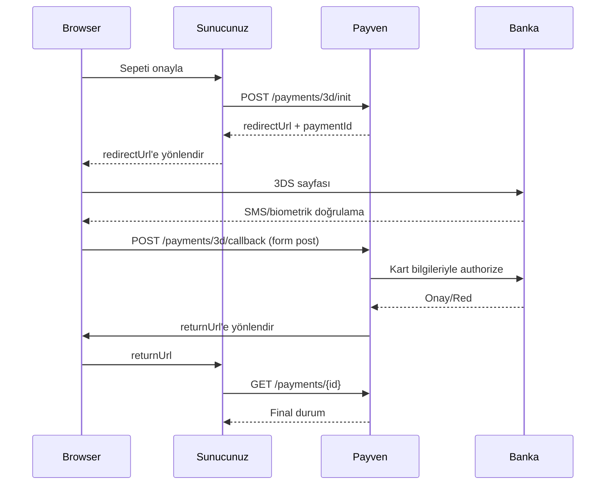

3D Secure, kart sahibinin işlemi onaylamasını isteyen ek bir güvenlik katmanıdır. Başarılı 3DS doğrulaması durumunda **chargeback sorumluluğu bankaya geçer**. Tüketici e-ticaret işlemlerinde **şiddetle önerilir**.

## Akışın özeti



## 1. Adım — 3DS Init

```
POST /api/v1/payments/3d/init
```

```bash
curl -X POST https://vpos.payven.com.tr/api/v1/payments/3d/init \
  -H "X-API-Key: $KEY" \
  -H "X-API-Secret: $SECRET" \
  -H "X-Merchant-Id: $MERCHANT" \
  -H "Idempotency-Key: order-1001-payment" \
  -H "Content-Type: application/json" \
  -d '{
    "externalId": "ORDER-1001",
    "amount": 15000,
    "currency": "TRY",
    "installment": 1,
    "card": {
      "holderName": "Test Kullanici",
      "number": "4546711234567894",
      "expireMonth": "12",
      "expireYear": "2030",
      "cvv": "000"
    },
    "callbackUrl": "https://api.example.com/webhooks/3d-callback",
    "returnUrl": "https://example.com/odeme/sonuc",
    "buyer": {
      "id": "cust-001",
      "email": "musteri@example.com",
      "ip": "85.105.10.10"
    }
  }'
```

| Alan | Açıklama |
|---|---|
| `callbackUrl` | 3DS sonrası bankanın form-post yapacağı endpoint. **Sunucu tarafı** olmalı. |
| `returnUrl` | Müşterinin son olarak yönlendirileceği URL. Genellikle frontend sayfası. |
| Diğer alanlar | [Non-3D ile aynı](/sanal-pos/payments/non-3d). |

### Yanıt

```json
{
  "isSuccess": true,
  "data": {
    "id": "8e3f5c12-...",
    "externalId": "ORDER-1001",
    "status": "Pending3D",
    "redirect": {
      "method": "GET",
      "url": "https://3ds.example-bank.com/auth?token=abc123"
    }
  }
}
```

Müşteriyi `redirect.url`'e **HTTP 302** ile yönlendirin (veya tarayıcıda `window.location.href` ile).

## 2. Adım — 3DS Sayfasında Doğrulama

Müşteri bankanın 3DS sayfasında SMS, mobil uygulama veya biometrik onay sağlar. Bu adım **Payven kapsamı dışındadır** — banka kendi sürecini yürütür.

## 3. Adım — Callback (Banka → Payven)

Banka, 3DS sonucunu Payven'e iletir. Bu kısım otomatik gerçekleşir, müdahale gerektirmez.

## 4. Adım — Return URL (Payven → Tarayıcı)

Payven, müşteriyi `returnUrl` adresine yönlendirir. URL'ye query parametresi olarak `paymentId` ve `status` eklenir:

```
https://example.com/odeme/sonuc?paymentId=8e3f5c12-...&status=Success
```

<Warning>
`returnUrl`'deki query parametreleri **güvenilmez** — kullanıcı tarafından manipüle edilebilir. Mutlaka aşağıdaki adımla durumu sunucu tarafından doğrulayın.
</Warning>

## 5. Adım — Sunucu Tarafında Durum Doğrulama

```
GET /api/v1/payments/{id}
```

```bash
curl https://vpos.payven.com.tr/api/v1/payments/8e3f5c12-... \
  -H "X-API-Key: $KEY" \
  -H "X-API-Secret: $SECRET" \
  -H "X-Merchant-Id: $MERCHANT"
```

Yanıt, Non-3D ile aynı [payment objesi](/sanal-pos/payment-object) yapısındadır. Final durum için `status` alanına bakın:

| `status` | Anlam |
|---|---|
| `Success` | Ödeme başarılı, sipariş tamamlanabilir |
| `Failed` | 3DS başarısız veya banka reddetti |
| `Pending3D` | Henüz tamamlanmadı (callback bekleniyor) |

## Frictionless vs Challenge

3D Secure 2.0'da banka iki moda karar verir:

| Mod | Anlam |
|---|---|
| **Frictionless** | Banka kart sahibini doğrulamak için müşteriye soru sormaz; risk skoruna güvenir. Akış 1-2 saniyedir. |
| **Challenge** | Banka SMS, mobil uygulama veya biometrik doğrulama ister. |

Hangisinin uygulanacağını **banka belirler** — siz etkileyemezsiniz. Yanıttaki `threeDS.protocolVersion` ve `threeDS.eci` alanları akışın türünü gösterir.

## Hata senaryoları

| Senaryo | `status` | `code` |
|---|---|---|
| Müşteri 3DS sayfasını kapattı | `Failed` | `THREEDS_USER_CANCELLED` |
| 3DS doğrulaması başarısız | `Failed` | `THREEDS_AUTH_FAILED` |
| 3DS timeout | `Failed` | `THREEDS_TIMEOUT` |
| Banka 3DS sonrası reddetti | `Failed` | `BANK_DECLINED` |

## Önemli: Webhook ile asenkron sonucu yakala

`returnUrl`'e yönlendirme **müşteri tarafıdır** — müşteri tarayıcıyı kapatırsa sonucu kaçırırsınız. Webhook entegre edin:

```bash
curl -X POST https://vpos.payven.com.tr/api/v1/webhooks \
  -H "X-API-Key: $KEY" -H "X-API-Secret: $SECRET" -H "X-Merchant-Id: $MERCHANT" \
  -d '{
    "url": "https://api.example.com/webhooks/payven",
    "events": ["payment.succeeded", "payment.failed"]
  }'
```

Detay: [Webhook Genel Bakış](/sanal-pos/webhooks/overview).

## Test ortamında

Sandbox 3DS sayfasında banka simülasyonu çalışır. Test kartlarına ve şifrelerine [Test Kartları](/sanal-pos/test/test-cards) sayfasından bakın.
