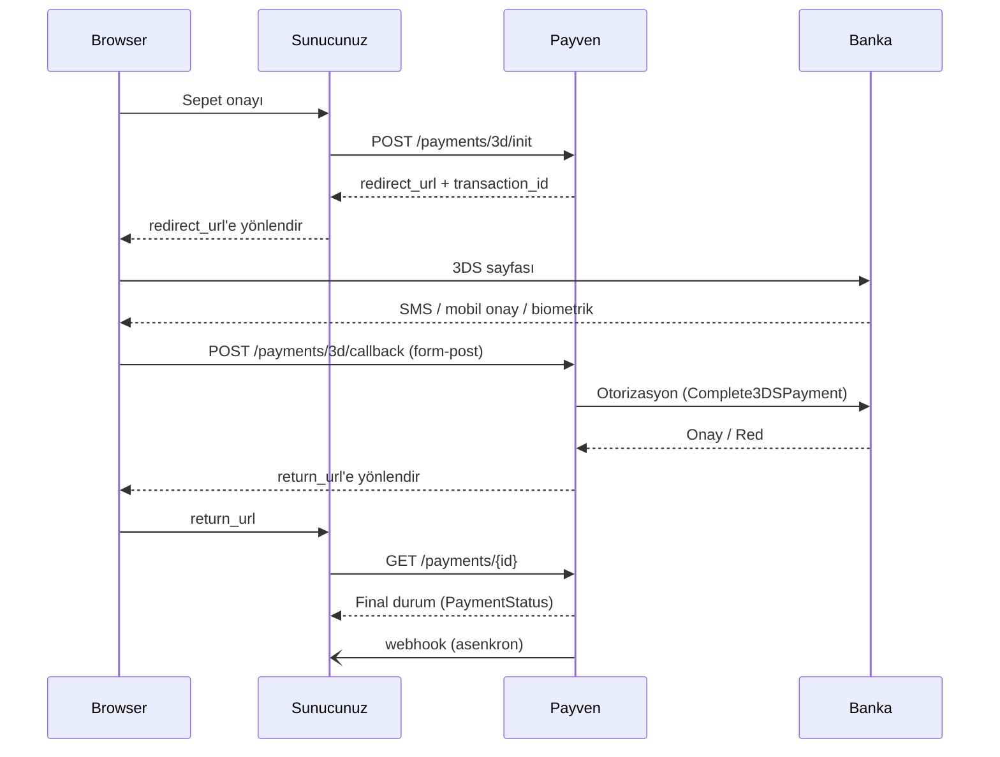

3D Secure, kart sahibinin işlemi onaylamasını isteyen ek bir güvenlik katmanıdır. Başarılı 3DS doğrulaması durumunda **chargeback sorumluluğu bankaya geçer**. Tüketici e-ticaret işlemlerinde **şiddetle önerilir**.

## Akış (özet)



## 1. Adım — 3DS Init

```http
POST /api/v1/payments/3d/init
```

```bash
curl -X POST https://vpos.payven.com.tr/api/v1/payments/3d/init \
  -H "Authorization: Bearer $PAYVEN_TOKEN" \
  -H "Idempotency-Key: order-1001-payment" \
  -H "Content-Type: application/json" \
  -d '{
    "external_id":    "ORDER-1001",
    "amount":         { "amount": 15000, "currency": "TRY" },
    "installment":    1,
    "operation_type": "sale",
    "card": {
      "holder_name":  "Test Kullanici",
      "number":       "4546711234567894",
      "expire_month": "12",
      "expire_year":  "2030",
      "cvv":          "000"
    },
    "callback_url": "https://api.example.com/webhooks/3d-callback",
    "return_url":   "https://example.com/odeme/sonuc",
    "buyer": {
      "id":         "cust-001",
      "email":      "musteri@example.com",
      "ip_address": "85.105.10.10"
    }
  }'
```

| Alan | Tip | Zorunluluk | Açıklama |
|---|---|---|---|
| `external_id`, `amount`, `installment`, `card`, `buyer`, `billing_address`, `shipping_address`, `basket_items` | Opsiyonel | — | [Non-3D](/sanal-pos/payments/non-3d) ile aynı |
| `operation_type` | enum | Opsiyonel | `sale` (varsayılan) veya `pre_auth` |
| `callback_url` | url | Zorunlu | Bankanın 3DS sonrası form-post yapacağı endpoint. **Sunucu tarafında** Payven'in `/3d/callback` endpoint'ini kullanmanız önerilir; bu alanı yalnızca özel akışlarda kendi endpoint'inizle override edin. |
| `return_url` | url | Zorunlu | Müşterinin son olarak yönlendirileceği URL. Genellikle frontend sayfası. |
| `cancel_url` | url | Opsiyonel | Müşteri 3DS sayfasını iptal ederse yönlendirileceği URL |

### Yanıt

```http
HTTP/1.1 200 OK
Content-Type: application/json
```

```json
{
  "transaction_id": "8e3f5c12-9a7b-4c8d-bc4e-2c963f66afa6",
  "status":         "pending_3ds",
  "extra_properties": {
    "redirect_url":    "https://3ds.example-bank.com/auth?token=abc123",
    "redirect_method": "GET",
    "external_id":     "ORDER-1001"
  }
}
```

`extra_properties.redirect_url` adresine müşteriyi **HTTP 302** ile yönlendirin (veya tarayıcıda `window.location.href`).

## 2. Adım — 3DS sayfasında doğrulama

Müşteri bankanın 3DS sayfasında SMS, mobil uygulama veya biometrik onay sağlar. **Payven kapsamı dışındadır** — banka kendi sürecini yürütür.

## 3. Adım — Callback (Banka → Payven)

Banka, 3DS sonucunu Payven'e form-post ile iletir (`POST /payments/3d/callback`). Bu kısım otomatik gerçekleşir, müdahale gerektirmez. Payven, callback'i alır → bankaya `Complete3DSPayment` (otorizasyon) gönderir → işlem son durumuna gelir.

## 4. Adım — Return URL (Payven → tarayıcı)

Payven, müşteriyi `return_url` adresine yönlendirir. URL'ye query parametresi olarak `transaction_id` ve `status` eklenir:

```
https://example.com/odeme/sonuc?transaction_id=8e3f5c12-...&status=completed
```

<Warning>
`return_url`'deki query parametreleri **güvenilmez** — kullanıcı tarafından manipüle edilebilir. Final durumu mutlaka sunucu tarafında [GET /payments/{id}](/sanal-pos/inquiries/payment-detail) ile doğrulayın.
</Warning>

## 5. Adım — Sunucu tarafında final durum sorgusu

```http
GET /api/v1/payments/{transaction_id}
```

```bash
curl https://vpos.payven.com.tr/api/v1/payments/8e3f5c12-9a7b-4c8d-bc4e-2c963f66afa6 \
  -H "Authorization: Bearer $PAYVEN_TOKEN"
```

Yanıt [`PaymentStatus`](/sanal-pos/payment-object#paymentstatus) yapısındadır:

```json
{
  "transaction_id":      "8e3f5c12-...",
  "status":              "completed",
  "amount":              15000,
  "currency":            "TRY",
  "is_3d_secure":        true,
  "created":             "2026-05-03T12:34:56.789+00:00",
  "basket_id":           "BASKET-2026-001",
  "error_code":          null,
  "provider_error_code": null,
  "extra_properties": {
    "processed_at":            "2026-05-03T12:34:58.123+00:00",
    "auth_code":               "654321",
    "host_reference":          "PAYVEN-REF-790",
    "provider_transaction_id": "9f3d2b8e-..."
  }
}
```

Final durumu `status` alanından okuyun:

| `status` | Anlam |
|---|---|
| `completed` | Sale akışı — ödeme başarıyla tamamlandı |
| `authorized` | PreAuth akışı — ön provizyon alındı, `/capture` çağrılması bekleniyor |
| `failed` | 3DS başarısız veya banka reddetti — `error_code` ve `provider_error_code` inceleyin |
| `pending_3ds` | Hâlâ tamamlanmadı (callback gelmemiş, müşteri 3DS sayfasını kapatmış olabilir) |

## Frictionless vs Challenge

3D Secure 2.x'te banka iki moddan birine karar verir:

| Mod | Anlam |
|---|---|
| **Frictionless** | Banka kart sahibini doğrulamak için müşteriye soru sormaz; risk skoruna güvenir. Akış 1-2 saniyedir, kullanıcı redirect'i fark etmeyebilir. |
| **Challenge** | Banka SMS, mobil uygulama veya biometrik doğrulama ister. Kullanıcı 30sn-2dk arası ek adım yapar. |

Hangisinin uygulanacağını **banka belirler** — istemci olarak etkileyemezsiniz. ECI / CAVV / 3DS protokol versiyonu gibi alanlar şu an `extra_properties` içinde döner; ileride üst seviye `three_ds.*` alanı olarak yapısal olarak verilecektir (bkz. [Payment Objesi → Yol Haritası](/sanal-pos/payment-object#yol-haritasi)).

## Hata senaryoları

| Senaryo | `status` | `error_code` |
|---|---|---|
| Müşteri 3DS sayfasını iptal etti / kapattı | `failed` | `three_ds_user_cancelled` |
| 3DS doğrulaması başarısız (yanlış SMS, vb.) | `failed` | `three_ds_authentication_failed` |
| 3DS timeout (banka yanıt vermedi) | `failed` | `three_ds_timeout` |
| 3DS başarılı ama banka otorizasyonu reddetti | `failed` | `bank_declined` (+ `provider_error_code`) |
| Callback gelmediyse — return_url'e ulaşılamadı | `pending_3ds` | — (sonradan webhook ile temizlenir) |

## Webhook ile asenkron yakalama

`return_url`'e yönlendirme **müşteri tarayıcısı** üzerinden çalışır — müşteri tarayıcıyı kapatırsa sonucu kaçırırsınız. Webhook entegre edin:

```bash
curl -X POST https://vpos.payven.com.tr/api/v1/webhooks \
  -H "Authorization: Bearer $PAYVEN_TOKEN" \
  -H "Content-Type: application/json" \
  -d '{
    "url":    "https://api.example.com/webhooks/payven",
    "events": ["payment.completed", "payment.failed", "3ds.completed", "3ds.failed"]
  }'
```

Detay: [Webhook Genel Bakış](/sanal-pos/webhooks/overview).

## Test ortamı

Sandbox 3DS sayfasında banka simülasyonu çalışır. Test kart numaralarına, şifrelere ve frictionless/challenge tetikleyen senaryolara [Test Kartları](/sanal-pos/test/test-cards) sayfasından bakın.

## Sonraki adımlar

<CardGroup cols={2}>
  <Card title="Pre-Auth → Capture" icon="lock-keyhole" href="/sanal-pos/payments/pre-auth-capture">
    3DS başarılı sonrası iki aşamalı çekim.
  </Card>
  <Card title="Hosted Checkout" icon="window-maximize" href="/sanal-pos/payments/hosted-checkout">
    PCI-DSS yükünü minimize eden Payven barındırmalı sayfa.
  </Card>
  <Card title="Webhook İmza Doğrulama" icon="shield-check" href="/sanal-pos/webhooks/signature">
    Asenkron olayları güvenle işleyin.
  </Card>
  <Card title="İade İşlemi" icon="rotate-left" href="/sanal-pos/payments/refund">
    Tam veya kısmi iade.
  </Card>
</CardGroup>
