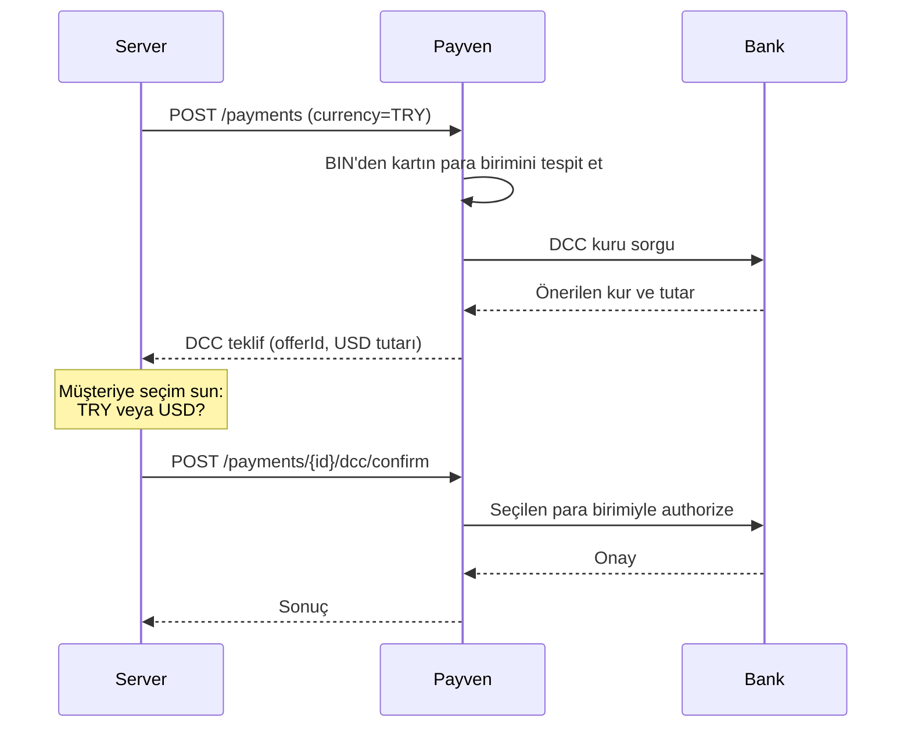

DCC, yabancı kart sahibine **kendi kart para biriminde** işlem tutarını gösteren akıştır. Müşteri TRY veya kendi para birimi (USD, EUR, GBP) arasında seçim yapar.

<Note>
DCC özelliği kuruluşunuzun banka anlaşmasında etkin olmalıdır. Detay için [destek ekibinize](/resources/support) danışın.
</Note>

## Akış



## 1. İlk istek (TRY tutarıyla)

Normal `POST /payments` veya `POST /payments/3d/init` isteği yapın. Yanıtta DCC teklifi gelirse:

```json
{
  "isSuccess": true,
  "data": {
    "id": "8e3f5c12-...",
    "status": "DccPending",
    "amount": 15000,
    "currency": "TRY",
    "dcc": {
      "offerId": "dcc_8e3f5c12",
      "alternativeCurrency": "USD",
      "alternativeAmount": 480,
      "exchangeRate": 31.25,
      "markup": 3.5,
      "expiresAt": "2026-05-03T12:40:00Z"
    }
  }
}
```

## 2. Müşteriye seçim sun

UI'da iki seçenek gösterin:

```
☐ Türk Lirası ile öde:    150,00 ₺
☑ Kendi para biriminizle: 4,80 USD  (kur: 31.25)
```

## 3. Seçimi onayla

```
POST /api/v1/payments/{paymentId}/dcc/confirm
```

```bash
curl -X POST https://vpos.payven.com.tr/api/v1/payments/8e3f5c12-.../dcc/confirm \
  -H "X-API-Key: $KEY" -H "X-API-Secret: $SECRET" -H "X-Merchant-Id: $MERCHANT" \
  -H "Content-Type: application/json" \
  -d '{
    "offerId": "dcc_8e3f5c12",
    "useAlternativeCurrency": true
  }'
```

| Alan | Açıklama |
|---|---|
| `offerId` | İlk yanıttaki teklif kimliği |
| `useAlternativeCurrency` | `true` = USD ile öde, `false` = TRY ile öde |

## Yanıt

```json
{
  "isSuccess": true,
  "data": {
    "id": "8e3f5c12-...",
    "status": "Success",
    "amount": 480,
    "currency": "USD",
    "dcc": {
      "offerId": "dcc_8e3f5c12",
      "originalAmount": 15000,
      "originalCurrency": "TRY",
      "exchangeRate": 31.25
    }
  }
}
```

## Önemli kurallar

<Check>**Kullanıcı kararı zorunludur.** PCI-DSS DCC kuralı: müşteriye iki seçenek sunulmalı, varsayılan **TRY** olmalı.</Check>
<Check>**Kuru ve markup'ı net göster.** Müşteriye uygulanan kur açık şekilde gösterilmeli.</Check>
<Check>**Teklif süresi kısadır.** Genellikle 5 dakika. Süresi dolmuş teklifle confirm `DCC_OFFER_EXPIRED` döner.</Check>
<Check>**Yerel kart için DCC önerilmez.** Türk bankası kartında DCC otomatik kapalıdır — `dcc` alanı dönmez.</Check>

## Hata yanıtları

| `code` | Anlam |
|---|---|
| `DCC_NOT_AVAILABLE` | Kuruluşunuz için DCC etkin değil |
| `DCC_OFFER_EXPIRED` | Teklif süresi doldu |
| `DCC_INVALID_OFFER` | Teklif kimliği yanlış veya başka bir ödemeye ait |
