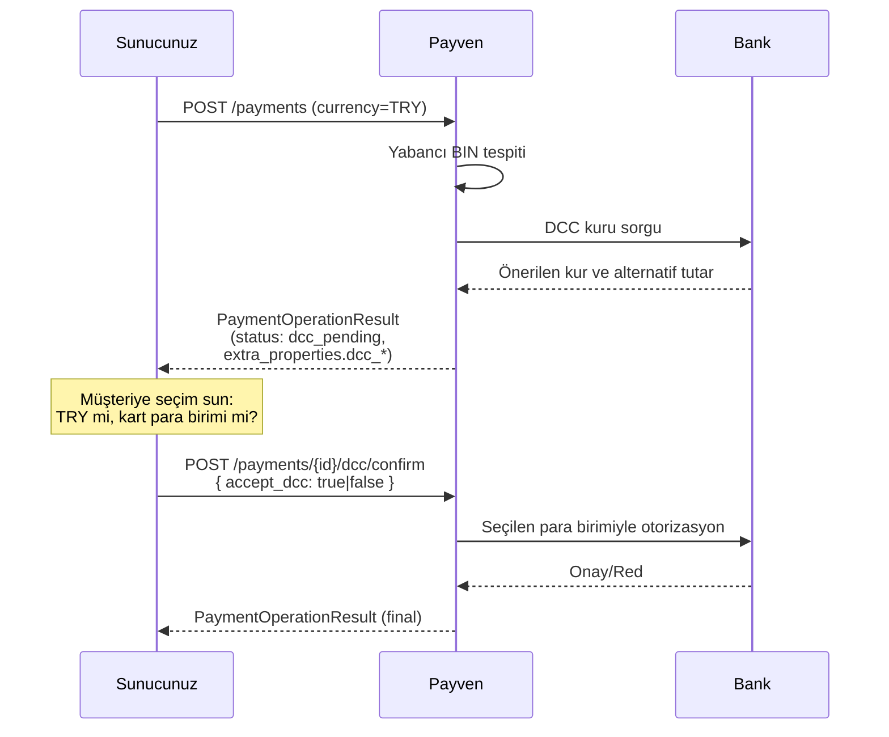

DCC (Dynamic Currency Conversion), yabancı kart sahibine **kendi kart para biriminde** işlem tutarını gösteren akıştır. Müşteri TRY veya kart para birimi (USD, EUR, GBP) arasında seçim yapar.

<Note>
DCC özelliği organizasyonunuzun banka anlaşmasında etkin olmalıdır ve **DCC'yi destekleyen
konnektör** üzerinden işlem geçmelidir. Etkinlik durumu için [destek ekibinize](/resources/support)
danışın.
</Note>

## Akış



## 1. İlk istek (TRY tutarıyla)

Standart `POST /payments` veya `POST /payments/3d/init` isteği yapın. Payven yabancı BIN tespit eder ve DCC teklifi varsa yanıtta `extra_properties` içinde döner:

```json
{
  "transaction_id": "8e3f5c12-9a7b-4c8d-bc4e-2c963f66afa6",
  "status":         "dcc_pending",
  "extra_properties": {
    "dcc_alternative_currency": "USD",
    "dcc_alternative_amount":   "480",
    "dcc_exchange_rate":        "31.25",
    "dcc_markup_percent":       "3.5",
    "dcc_offer_expires_at":     "2026-05-03T12:40:00.000+00:00",
    "processed_at":             "2026-05-03T12:35:00.123+00:00"
  }
}
```

| Alan | Açıklama |
|---|---|
| `dcc_alternative_currency` | Kart para birimi (USD, EUR, GBP) |
| `dcc_alternative_amount` | Bu para biriminde gösterilecek tutar (kart cinsi alt birimi: cent / penny) |
| `dcc_exchange_rate` | Uygulanacak çapraz kur |
| `dcc_markup_percent` | Banka tarafından eklenen marj (% olarak) |
| `dcc_offer_expires_at` | Teklifin geçerlilik süresi (genellikle 5 dakika) |

## 2. Müşteriye seçim sun

Müşteriye iki seçeneği şeffaf şekilde gösterin (PCI-DSS DCC kuralı zorunluluğu):

```
☐ Türk Lirası ile öde:    150,00 ₺
☐ Kart para biriminizle:    4,80 USD  (kur: 31,25 — %3,5 marj dahil)
```

<Warning>
**PCI-DSS DCC kuralı:** Müşteriye **iki seçenek** sunulmalı, **varsayılan TRY** olmalı, kur ve markup açıkça belirtilmelidir. Aksi durumda kart şeması cezai yaptırım uygulayabilir.
</Warning>

## 3. Seçimi onayla

```http
POST /api/v1/payments/{transaction_id}/dcc/confirm
```

```bash
curl -X POST https://vpos.payven.com.tr/api/v1/payments/8e3f5c12-9a7b-4c8d-bc4e-2c963f66afa6/dcc/confirm \
  -H "Authorization: Bearer $PAYVEN_TOKEN" \
  -H "Idempotency-Key: order-1001-dcc-confirm" \
  -H "Content-Type: application/json" \
  -d '{
    "accept_dcc": true
  }'
```

| Alan | Tip | Açıklama |
|---|---|---|
| `accept_dcc` | bool | `true` → kart para birimi ile öde; `false` → orijinal TRY ile öde |

## Final yanıt

```json
{
  "transaction_id": "8e3f5c12-...",
  "status":         "completed",
  "extra_properties": {
    "processed_at":          "2026-05-03T12:38:01.234+00:00",
    "auth_code":             "123456",
    "host_reference":        "PAYVEN-REF-789",
    "dcc_charged_currency":  "USD",
    "dcc_charged_amount":    "480",
    "dcc_original_amount":   "15000",
    "dcc_original_currency": "TRY",
    "dcc_exchange_rate":     "31.25"
  }
}
```

## Kurallar

<Check>**Müşteri kararı zorunludur.** Default seçenek **TRY** olmalı; müşteri açıkça kart para birimini seçmeli.</Check>
<Check>**Kuru ve markup'ı net göster.** Müşteriye uygulanan kur ve marj kartlı işlemde mutlaka görünür olmalı.</Check>
<Check>**Teklif süresi kısadır.** Genellikle 5 dakika. Süresi dolmuş teklifle confirm `422 dcc_offer_expired` döner.</Check>
<Check>**Yerel kart için DCC önerilmez.** Türk bankası kartında DCC otomatik kapalıdır — `extra_properties` içinde DCC alanları gelmez.</Check>

## Hata yanıtları

| HTTP | `code` | Anlam |
|---|---|---|
| `404` | `payment_not_found` | İşlem bulunamadı |
| `422` | `dcc_not_available` | Organizasyonunuz veya kart için DCC etkin değil |
| `422` | `dcc_offer_expired` | Teklif süresi doldu — yeni `POST /payments` ile baştan başlayın |
| `422` | `dcc_invalid_state` | İşlem `dcc_pending` durumunda değil |

Hata zarfı RFC 9457 problem+json formatındadır.

## Konnektör desteği

DCC, banka konnektörüne özgü bir özelliktir — her banka desteklemez. Aktif olduğu konnektörler için konsoldan **Konnektörler** ekranına bakın veya [destek ekibimize](/resources/support) ulaşın.
