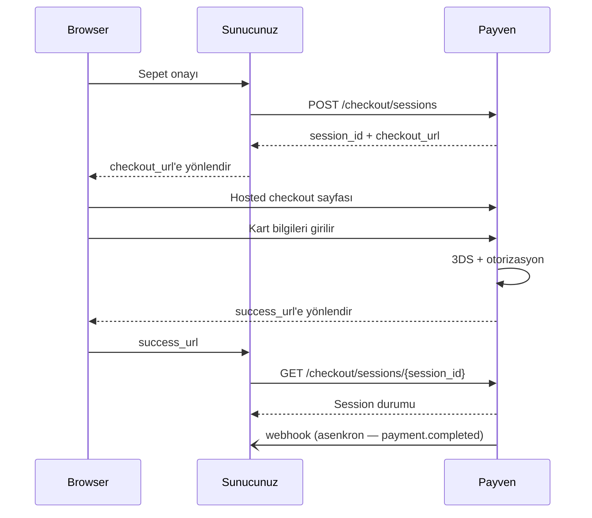

Hosted Checkout, müşterinin kart bilgilerini **Payven'in barındırdığı sayfada** girdiği akıştır. Sizin sunucularınız kart numarasına **hiç dokunmaz**, bu da PCI-DSS denetim kapsamınızı en alt seviyeye (SAQ-A) indirir.

## Ne zaman tercih etmeliyim?

<Check>**Hızlı entegrasyon** — kart formu, BIN lookup, taksit seçenekleri, Luhn kontrolü, 3DS yönlendirme, sonuç sayfası — hepsi Payven'de</Check>
<Check>**Düşük PCI yükü** — kart verisi sunucularınıza dokunmaz</Check>
<Check>**Mobil uyumlu** — Payven sayfası hazır responsive</Check>
<Check>**Tenant-default 3DS modu** — `ThreeDSecure`, `ThreeDPay`, `ThreeDPayHosting` modlarından platform politikasına uygun olanı otomatik seçer</Check>

Aksi durumda [Direct API (Non-3D)](/sanal-pos/payments/non-3d) veya [Pay-by-Link](/sanal-pos/payments/pay-by-link) kullanın.

## Akış



## 1. Oturum oluşturun

```http
POST /api/v1/checkout/sessions
```

```bash
curl -X POST https://vpos.payven.com.tr/api/v1/checkout/sessions \
  -H "Authorization: Bearer $PAYVEN_TOKEN" \
  -H "Idempotency-Key: order-1001-checkout" \
  -H "Content-Type: application/json" \
  -d '{
    "merchant_name":         "Acme Mağaza",
    "amount":                { "amount": 15000, "currency": "TRY" },
    "allowed_installments":  [1, 2, 3, 6, 9],
    "description":           "Sipariş ödemesi",
    "external_id":           "ORDER-1001",
    "basket_id":             "BASKET-2026-001",
    "customer_email":        "musteri@example.com",
    "customer_phone":        "+905551234567",
    "payment_mode":          "three_d_secure",
    "allow_pre_auth":        false,
    "is_test_session":       false,
    "success_url":           "https://example.com/odeme/sonuc",
    "cancel_url":            "https://example.com/odeme/iptal",
    "metadata": {
      "campaign_id": "summer-2026"
    }
  }'
```

| Alan | Tip | Zorunlu | Açıklama |
|---|---|---|---|
| `amount.amount` | long (kuruş) | ✅ | Toplam tutar |
| `amount.currency` | enum | ✅ | Şu an yalnız `"TRY"` kabul edilir |
| `merchant_name` | string | ❌ | Sayfa başlığında gösterilen isim |
| `allowed_installments` | int[] | ❌ | İzin verilen taksit seçenekleri. Boş → `[1, 2, 3, 6, 9, 12]` varsayılanı |
| `external_id`, `basket_id`, `description` | string | ❌ | Sipariş referansları |
| `customer_email`, `customer_phone` | string | ❌ | Müşteri bilgileri (önerilir — fraud için) |
| `payment_mode` | enum | ❌ | `non_3d` / `three_d_secure` / `three_d_pay` / `three_d_pay_hosting`. Boş → tenant'ın `preferred_three_d_flow` ayarından türetilir. |
| `allow_pre_auth` | bool | ❌ | Checkout sayfasında "Ön provizyon" seçeneği gösterilsin mi (default `false`) |
| `is_test_session` | bool | ❌ | Test araçları (Void/Refund/Capture butonları) gösterilsin mi |
| `success_url` | url | ❌ | Başarılı ödeme sonrası yönlendirme |
| `cancel_url` | url | ❌ | Başarısız / iptal sonrası yönlendirme |
| `metadata` | object | ❌ | Anahtar-değer çiftleri (raporlama) |

<Note>
**Tenant policy uyumu:** `payment_mode: "non_3d"` istenirse ancak tenant policy'sinde
`allow_non_3d` kapalıysa istek `400 Bad Request` ile reddedilir. Production tenant'larda
non-3D varsayılan olarak kapalıdır — fraud riski nedeniyle.
</Note>

### Yanıt

```json
{
  "session_id":   "8e3f5c129a7b4c8dbc4e2c963f66afa6",
  "checkout_url": "https://vpos.payven.com.tr/checkout.html?session=8e3f5c129a7b4c8dbc4e2c963f66afa6",
  "expires_at":   "2026-05-03T13:30:00.000+00:00"
}
```

| Alan | Açıklama |
|---|---|
| `session_id` | 128-bit random session kimliği. URL parametresi olarak Payven sayfasına gider. |
| `checkout_url` | Müşteriyi yönlendireceğiniz URL |
| `expires_at` | Session geçerlilik süresi (oluşturulduktan **30 dakika** sonra) |

## 2. Müşteriyi yönlendirin

```javascript
res.redirect(302, response.checkout_url);
```

veya client-side:

```javascript
window.location.href = response.checkout_url;
```

## 3. Müşteri Payven sayfasında ödeme yapar

Bu adım Payven sayfasında yürür:

- Kart numarası, son kullanma, CVV, isim girilir
- Otomatik BIN lookup → banka logosu, taksit seçenekleri
- Kart birliği validasyonu, Luhn checksum kontrolü
- Seçilen `payment_mode` üzerinden 3DS akışı
- Maksimum **3 başarısız deneme** sonrasında session `status: "failed"` olur

## 4. `success_url` veya `cancel_url` üzerinden geri dönüş

Ödeme tamamlandığında Payven, müşteriyi config'lediğiniz URL'e yönlendirir. Query parametresi olarak `session_id` ve `status` eklenir:

```
https://example.com/odeme/sonuc?session_id=8e3f5c12...&status=completed
```

<Warning>
URL parametreleri **güvenilmez** — kullanıcı tarafından manipüle edilebilir.
Final durumu mutlaka sunucu tarafında doğrulayın.
</Warning>

## 5. Session durumunu sorgulayın

```http
GET /api/v1/checkout/sessions/{session_id}
```

```bash
curl https://vpos.payven.com.tr/api/v1/checkout/sessions/8e3f5c129a7b4c8dbc4e2c963f66afa6 \
  -H "Authorization: Bearer $PAYVEN_TOKEN"
```

```json
{
  "session_id":     "8e3f5c129a7b4c8dbc4e2c963f66afa6",
  "status":         "completed",
  "amount":         15000,
  "currency":       "TRY",
  "transaction_id": "8e3f5c12-9a7b-4c8d-bc4e-2c963f66afa6",
  "attempt_count":  1,
  "created_at":     "2026-05-03T13:00:00.000+00:00",
  "expires_at":     "2026-05-03T13:30:00.000+00:00"
}
```

| Session `status` | Anlam |
|---|---|
| `open` | Müşteri henüz ödemedi |
| `processing` | Ödeme işleniyor (3DS callback bekleniyor) |
| `completed` | Ödeme başarıyla tamamlandı — `transaction_id` ile [Payment objesini](/sanal-pos/payment-object) sorgulayın |
| `failed` | Tüm denemeler başarısız (`max_attempts` aşıldı) |
| `expired` | 30 dakikalık geçerlilik süresi doldu |
| `cancelled` | Müşteri iptal etti |

## İşlem sonu durumu

`session.status: "completed"` olduğunda detay için:

```bash
curl https://vpos.payven.com.tr/api/v1/payments/$transaction_id \
  -H "Authorization: Bearer $PAYVEN_TOKEN"
```

Yanıt yapısı: [Payment Objesi](/sanal-pos/payment-object).

## Görünüm özelleştirme

Şu anda Payven hosted checkout sayfası **payven markasıyla** yayınlanır. White-label domain, custom CSS, logo + ana renk gibi gelişmiş özelleştirme için:
- Konsoldan tenant ayarlarını kullanın (logo, ana renk)
- White-label domain talebi için [satış ekibinize](/resources/support) ulaşın

## Webhook olayları

Hosted Checkout için yayınlanan olaylar:

| Olay | Açıklama |
|---|---|
| `payment.completed` | Müşteri başarıyla ödeme tamamladı |
| `payment.failed` | Müşteri ödeme yapmaya çalıştı, başarısız |
| `3ds.completed` / `3ds.failed` | 3DS akışlı modlarda ek olarak yayınlanır |

Hosted Checkout'a özgü `checkout.session.*` olayları yol haritasındadır — şu an session durumunu `GET /api/v1/checkout/sessions/{id}` ile sorgulayarak takip edin. Bkz. [Webhook Olayları](/sanal-pos/webhooks/events).

## Yaygın hatalar

| HTTP | `code` | Anlam |
|---|---|---|
| `400` | `non_3d_not_allowed` | Tenant policy'sinde Non-3D kapalı |
| `400` | `merchant_id_required` | Aktif merchant kimliği bulunamadı |
| `404` | `session_not_found` | `session_id` geçersiz |
| `410` | `session_expired` | Session süresi dolmuş |

Hata yanıtı RFC 9457 problem+json formatındadır.

## Sonraki adımlar

<CardGroup cols={2}>
  <Card title="Pay-by-Link" icon="link" href="/sanal-pos/payments/pay-by-link">
    Bankaya ait barındırma sayfası ile link tabanlı ödeme.
  </Card>
  <Card title="Webhook entegrasyonu" icon="bell" href="/sanal-pos/webhooks/overview">
    Asenkron sonuçları gerçek zamanlı yakalayın.
  </Card>
</CardGroup>
