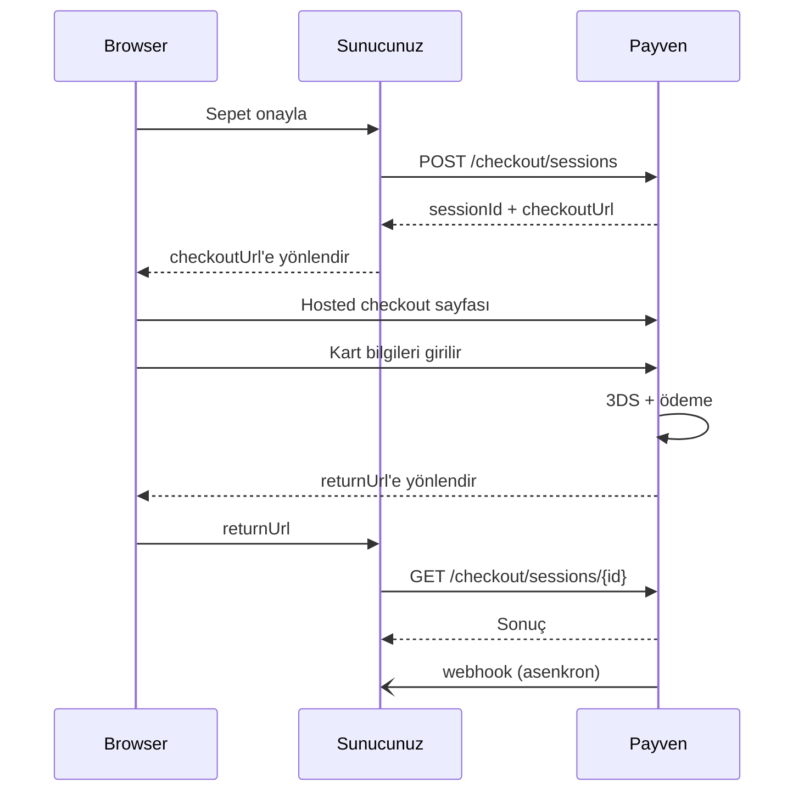

Hosted Checkout, müşterinin kart bilgilerini **Payven'in barındırdığı sayfada** girdiği akıştır. Sizin sunucularınız kart numarasına **hiç dokunmaz**, bu da PCI-DSS denetim kapsamınızı en alt seviyeye (SAQ-A) indirir.

## Ne zaman tercih etmeliyim?

<Check>**Hızlı entegrasyon** — kart formu, validasyon, 3DS yönlendirme hepsi Payven'de</Check>
<Check>**Düşük PCI yükü** — kart verisi sunucularınıza dokunmaz</Check>
<Check>**Mobil uyumlu** — Payven sayfası hazır responsive</Check>
<Check>**Çoklu para birimi ve DCC desteği**</Check>

Aksi durumda [Direct API](/sanal-pos/payments/non-3d) veya [Pay-by-Link](/sanal-pos/payments/pay-by-link) kullanın.

## Akış



## 1. Oturum oluştur

```
POST /api/v1/checkout/sessions
```

```bash
curl -X POST https://vpos.payven.com.tr/api/v1/checkout/sessions \
  -H "X-API-Key: $KEY" -H "X-API-Secret: $SECRET" -H "X-Merchant-Id: $MERCHANT" \
  -H "Idempotency-Key: order-1001-checkout" \
  -H "Content-Type: application/json" \
  -d '{
    "externalId": "ORDER-1001",
    "amount": 15000,
    "currency": "TRY",
    "allowedInstallments": [1, 2, 3, 6, 9],
    "buyer": {
      "id": "cust-001",
      "email": "musteri@example.com",
      "name": "Müşteri Adı",
      "phone": "+905551234567"
    },
    "items": [
      {
        "id": "sku-1",
        "name": "Ürün adı",
        "quantity": 1,
        "unitPrice": 15000
      }
    ],
    "returnUrl": "https://example.com/odeme/sonuc",
    "callbackUrl": "https://api.example.com/webhooks/payven",
    "expiresAt": "2026-05-03T13:30:00Z",
    "appearance": {
      "logoUrl": "https://example.com/logo.svg",
      "primaryColor": "#1A56DB",
      "merchantName": "Acme Mağaza"
    }
  }'
```

| Alan | Tip | Zorunlu | Açıklama |
|---|---|---|---|
| `externalId` | string | ✅ | Sipariş kimliğiniz |
| `amount` | int | ✅ | Toplam tutar (kuruş) |
| `currency` | enum | ✅ | `TRY`, `USD`, `EUR`, `GBP` |
| `allowedInstallments` | int[] | ❌ | İzin verilen taksit seçenekleri. Boş bırakılırsa kart için izin verilen tüm seçenekler gösterilir. |
| `buyer.*` | object | ⚠️ | Müşteri bilgileri (önerilir — fraud için) |
| `items[]` | object[] | ❌ | Sepet kalemleri (sayfa görüntüsünde listelenir) |
| `returnUrl` | string | ✅ | Müşterinin son yönlendirileceği URL |
| `callbackUrl` | string | ❌ | Sunucu-sunucu callback URL'i |
| `expiresAt` | string | ❌ | Oturumun geçerlilik süresi (max 30 dk önerilir) |
| `appearance.*` | object | ❌ | Sayfa görünümü özelleştirme |

### Yanıt

```json
{
  "isSuccess": true,
  "code": "201",
  "data": {
    "sessionId": "ses_8e3f5c12",
    "checkoutUrl": "https://checkout.payven.com.tr/ses_8e3f5c12",
    "expiresAt": "2026-05-03T13:30:00Z",
    "status": "Open"
  }
}
```

## 2. Müşteriyi yönlendir

`checkoutUrl`'e tarayıcıyı yönlendirin:

```javascript
res.redirect(302, data.checkoutUrl);
```

veya client-side:

```javascript
window.location.href = data.checkoutUrl;
```

## 3. Müşteri ödemeyi yapar

Bu adım Payven sayfasında yürür:

- Kart numarası, son kullanma, CVV, kart sahibi adı girilir
- Otomatik BIN lookup → banka logosu, taksit seçenekleri
- Kart birliği validasyonu, Luhn kontrolü
- 3D Secure gerekiyorsa banka sayfasına yönlendirme
- Sonuç döner

## 4. returnUrl üzerinden geri dönüş

Müşteri tarayıcısı `returnUrl?sessionId=ses_8e3f5c12&status=Success` adresine yönlendirilir.

<Warning>
URL parametreleri **güvenilmez** — sunucu tarafında durumu doğrulayın.
</Warning>

## 5. Durumu doğrula

```
GET /api/v1/checkout/sessions/{sessionId}
```

```bash
curl https://vpos.payven.com.tr/api/v1/checkout/sessions/ses_8e3f5c12 \
  -H "X-API-Key: $KEY" -H "X-API-Secret: $SECRET" -H "X-Merchant-Id: $MERCHANT"
```

```json
{
  "isSuccess": true,
  "data": {
    "sessionId": "ses_8e3f5c12",
    "status": "Completed",
    "payment": {
      "id": "8e3f5c12-...",
      "status": "Success",
      "amount": 15000,
      "installment": 3,
      "card": { "binNumber": "454671", "lastFourDigits": "7894" },
      "connector": { "responseCode": "00", "authCode": "123456" }
    }
  }
}
```

| Session `status` | Anlam |
|---|---|
| `Open` | Müşteri henüz ödemedi |
| `Completed` | Ödeme başarıyla tamamlandı |
| `Failed` | Ödeme başarısız |
| `Expired` | Geçerlilik süresi doldu |
| `Cancelled` | Müşteri iptal etti |

## Görünüm özelleştirme

`appearance` alanıyla checkout sayfasını markanıza uyarlayabilirsiniz:

| Alan | Açıklama |
|---|---|
| `logoUrl` | Sayfanın üstünde gösterilecek logo (max 200px yükseklik) |
| `primaryColor` | Buton ve vurgu rengi (hex format) |
| `merchantName` | Sayfa başlığında gösterilecek isim |
| `locale` | `tr-TR` (varsayılan), `en-US` |

Daha gelişmiş özelleştirme için (custom CSS, white-label domain) destek ekibinize yazın.

## Webhook olayları

Hosted Checkout için yayınlanan ek olaylar:

- `checkout.session.completed` — Ödeme başarıyla tamamlandı
- `checkout.session.expired` — Süre doldu
- `checkout.session.failed` — Müşteri ödeme yapamadı

Tam liste: [Webhook Olayları](/sanal-pos/webhooks/events).
