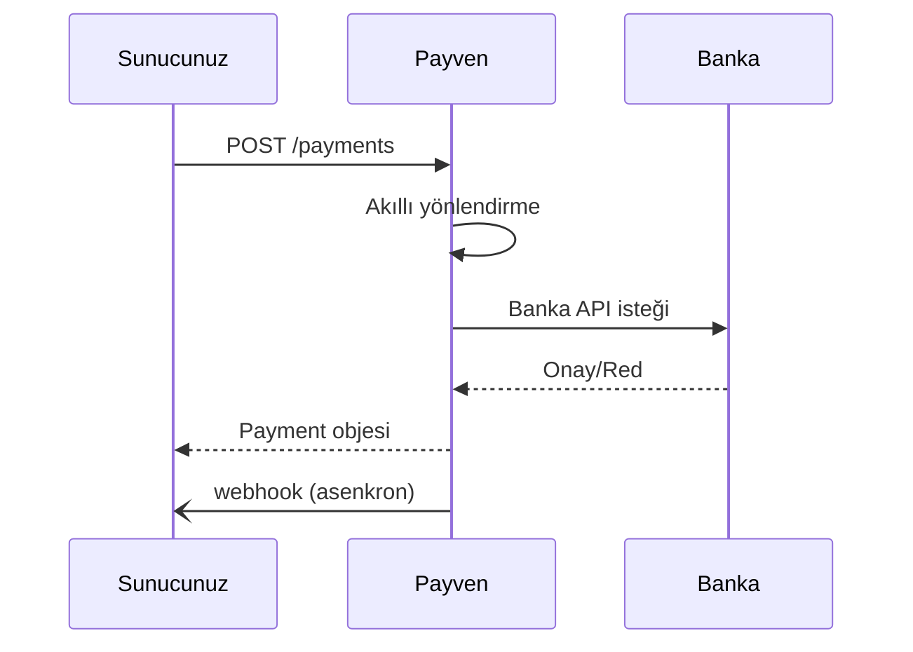

Non-3D ödeme, en basit ödeme akışıdır. Tek bir API isteğiyle ödeme tamamlanır — kart bilgileri Payven'e iletilir, Payven banka onayını alır ve sonucu döner.

<Warning>
**Risk:** Non-3D işlemlerde kart sahibi doğrulaması yapılmadığı için **chargeback (ters ibraz) sorumluluğu** sizdedir. Tüketici ödemelerinde [3D Secure](/sanal-pos/payments/3d-secure) önerilir. Non-3D, kapalı devre B2B ortamları veya düşük risk segmentleri için uygundur.
</Warning>

## Endpoint

```
POST /api/v1/payments
```

## Akış



## İstek

<CodeGroup>
```bash cURL
curl -X POST https://vpos.payven.com.tr/api/v1/payments \
  -H "X-API-Key: $PAYVEN_KEY" \
  -H "X-API-Secret: $PAYVEN_SECRET" \
  -H "X-Merchant-Id: $PAYVEN_MERCHANT" \
  -H "Idempotency-Key: order-1001-payment" \
  -H "Content-Type: application/json" \
  -d '{
    "externalId": "ORDER-1001",
    "amount": 15000,
    "currency": "TRY",
    "installment": 1,
    "use3D": false,
    "card": {
      "holderName": "Test Kullanici",
      "number": "4546711234567894",
      "expireMonth": "12",
      "expireYear": "2030",
      "cvv": "000"
    },
    "buyer": {
      "id": "cust-001",
      "email": "musteri@example.com",
      "ip": "85.105.10.10"
    },
    "metadata": {
      "campaignId": "summer-2026"
    }
  }'
```

```csharp C#
var payload = new
{
    externalId = "ORDER-1001",
    amount = 15000L,
    currency = "TRY",
    installment = 1,
    use3D = false,
    card = new
    {
        holderName = "Test Kullanici",
        number = "4546711234567894",
        expireMonth = "12",
        expireYear = "2030",
        cvv = "000"
    },
    buyer = new { id = "cust-001", email = "musteri@example.com", ip = "85.105.10.10" }
};

var request = new HttpRequestMessage(HttpMethod.Post, "/api/v1/payments")
{
    Content = JsonContent.Create(payload)
};
request.Headers.Add("Idempotency-Key", $"order-1001-payment");

var response = await client.SendAsync(request);
var payment = await response.Content.ReadFromJsonAsync<ApiResponse<Payment>>();
```

```javascript Node.js
const response = await fetch("https://vpos.payven.com.tr/api/v1/payments", {
  method: "POST",
  headers: {
    "X-API-Key": process.env.PAYVEN_KEY,
    "X-API-Secret": process.env.PAYVEN_SECRET,
    "X-Merchant-Id": process.env.PAYVEN_MERCHANT,
    "Idempotency-Key": "order-1001-payment",
    "Content-Type": "application/json",
  },
  body: JSON.stringify({
    externalId: "ORDER-1001",
    amount: 15000,
    currency: "TRY",
    installment: 1,
    use3D: false,
    card: {
      holderName: "Test Kullanici",
      number: "4546711234567894",
      expireMonth: "12",
      expireYear: "2030",
      cvv: "000",
    },
    buyer: { id: "cust-001", email: "musteri@example.com", ip: "85.105.10.10" },
  }),
});
```

```go Go
type Card struct {
	HolderName  string `json:"holderName"`
	Number      string `json:"number"`
	ExpireMonth string `json:"expireMonth"`
	ExpireYear  string `json:"expireYear"`
	Cvv         string `json:"cvv"`
}

payload := map[string]any{
	"externalId":  "ORDER-1001",
	"amount":      15000,
	"currency":    "TRY",
	"installment": 1,
	"use3D":       false,
	"card": Card{
		HolderName: "Test Kullanici", Number: "4546711234567894",
		ExpireMonth: "12", ExpireYear: "2030", Cvv: "000",
	},
}

body, _ := json.Marshal(payload)
req, _ := http.NewRequest("POST", baseURL+"/api/v1/payments", bytes.NewReader(body))
req.Header.Set("X-API-Key", apiKey)
req.Header.Set("X-API-Secret", apiSecret)
req.Header.Set("X-Merchant-Id", merchantID)
req.Header.Set("Idempotency-Key", "order-1001-payment")
req.Header.Set("Content-Type", "application/json")
resp, _ := http.DefaultClient.Do(req)
```

```php PHP
$payload = [
    "externalId"  => "ORDER-1001",
    "amount"      => 15000,
    "currency"    => "TRY",
    "installment" => 1,
    "use3D"       => false,
    "card" => [
        "holderName"  => "Test Kullanici",
        "number"      => "4546711234567894",
        "expireMonth" => "12",
        "expireYear"  => "2030",
        "cvv"         => "000",
    ],
    "buyer" => [
        "id" => "cust-001", "email" => "musteri@example.com", "ip" => "85.105.10.10",
    ],
];

$ch = curl_init("https://vpos.payven.com.tr/api/v1/payments");
curl_setopt_array($ch, [
    CURLOPT_RETURNTRANSFER => true,
    CURLOPT_POST => true,
    CURLOPT_HTTPHEADER => [
        "X-API-Key: $key",
        "X-API-Secret: $secret",
        "X-Merchant-Id: $merchant",
        "Idempotency-Key: order-1001-payment",
        "Content-Type: application/json",
    ],
    CURLOPT_POSTFIELDS => json_encode($payload),
]);
$response = json_decode(curl_exec($ch), true);
```

```python Python
import requests

response = requests.post(
    "https://vpos.payven.com.tr/api/v1/payments",
    headers={
        "X-API-Key": os.environ["PAYVEN_KEY"],
        "X-API-Secret": os.environ["PAYVEN_SECRET"],
        "X-Merchant-Id": os.environ["PAYVEN_MERCHANT"],
        "Idempotency-Key": "order-1001-payment",
    },
    json={
        "externalId": "ORDER-1001",
        "amount": 15000,
        "currency": "TRY",
        "installment": 1,
        "use3D": False,
        "card": {
            "holderName": "Test Kullanici",
            "number": "4546711234567894",
            "expireMonth": "12",
            "expireYear": "2030",
            "cvv": "000",
        },
        "buyer": {
            "id": "cust-001",
            "email": "musteri@example.com",
            "ip": "85.105.10.10",
        },
    },
)
print(response.json())
```
</CodeGroup>

## İstek alanları

| Alan | Tip | Zorunlu | Açıklama |
|---|---|---|---|
| `externalId` | string | ✅ | Sipariş kimliğiniz |
| `amount` | int | ✅ | Tutar (kuruş) |
| `currency` | enum | ✅ | `TRY`, `USD`, `EUR`, `GBP` |
| `installment` | int | ✅ | Taksit sayısı (1 = peşin) |
| `use3D` | bool | ✅ | `false` |
| `card.holderName` | string | ✅ | Kart üzerindeki isim |
| `card.number` | string | ✅ | Kart numarası (boşluksuz) |
| `card.expireMonth` | string | ✅ | İki hane (`01`–`12`) |
| `card.expireYear` | string | ✅ | Dört hane |
| `card.cvv` | string | ✅ | 3-4 hane |
| `buyer.id` | string | ⚠️ | Müşteri kimliğiniz (fraud için faydalı) |
| `buyer.email` | string | ⚠️ | Müşteri e-postası |
| `buyer.ip` | string | ⚠️ | Müşterinin IP adresi |
| `metadata` | object | ❌ | Sizin tanımladığınız anahtar-değer çiftleri |

## Başarılı yanıt

```json
{
  "isSuccess": true,
  "code": "200",
  "message": "Başarılı.",
  "data": {
    "id": "8e3f5c12-...",
    "externalId": "ORDER-1001",
    "status": "Success",
    "amount": 15000,
    "currency": "TRY",
    "installment": 1,
    "use3D": false,
    "card": {
      "binNumber": "454671",
      "lastFourDigits": "7894",
      "scheme": "Visa",
      "type": "Credit",
      "program": "Bonus",
      "bankCode": "GARANTI",
      "bankName": "Garanti BBVA"
    },
    "connector": {
      "code": "GarantiVPOS",
      "responseCode": "00",
      "responseMessage": "Onaylandı",
      "hostReference": "PAYVEN-REF-789",
      "authCode": "123456"
    },
    "createdAt": "2026-05-03T12:34:56Z",
    "completedAt": "2026-05-03T12:34:58Z"
  }
}
```

`status: "Success"` → ödeme başarıyla tamamlandı.

## Başarısız yanıt

Banka tarafından reddedilen bir ödeme:

```json
{
  "isSuccess": false,
  "code": "BANK_DECLINED",
  "message": "Banka işlemi reddetti.",
  "data": {
    "id": "8e3f5c12-...",
    "externalId": "ORDER-1001",
    "status": "Failed",
    "connector": {
      "code": "GarantiVPOS",
      "responseCode": "51",
      "responseMessage": "Yetersiz bakiye"
    }
  }
}
```

`connector.responseCode` ve `responseMessage` alanları banka tarafından dönen orijinal yanıttır. Tam liste için: [Banka Yanıt Kodları](/sanal-pos/errors/bank-codes).

## Sonraki adımlar

<CardGroup cols={2}>
  <Card title="3D Secure'a geçin" icon="shield-check" href="/sanal-pos/payments/3d-secure">
    Tüketici işlemlerinde chargeback riskini azaltın.
  </Card>
  <Card title="İade işlemi" icon="rotate-left" href="/sanal-pos/payments/refund">
    Tam veya kısmi iade nasıl yapılır?
  </Card>
  <Card title="Webhook entegre edin" icon="bell" href="/sanal-pos/webhooks/overview">
    Asenkron sonuçları gerçek zamanlı alın.
  </Card>
  <Card title="Akıllı yönlendirme" icon="route" href="/sanal-pos/routing/overview">
    Birden fazla bankaya nasıl yönlendirilir?
  </Card>
</CardGroup>
