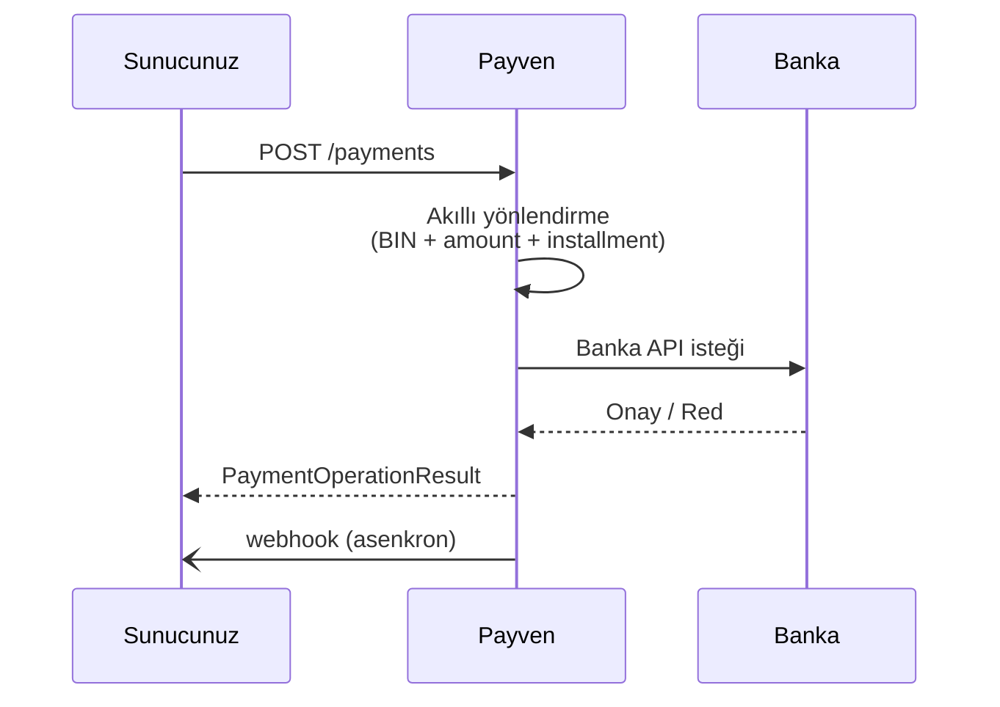

Non-3D ödeme en basit ödeme akışıdır. Tek bir API isteğiyle ödeme tamamlanır — kart bilgileri Payven'e iletilir, akıllı yönlendirme motoru uygun bankayı seçer, banka onayı alınır ve sonuç dönülür.

<Warning>
**Risk:** Non-3D işlemlerde kart sahibi doğrulaması yapılmadığı için **chargeback (ters ibraz) sorumluluğu** sizdedir. Tüketici ödemelerinde [3D Secure](/sanal-pos/payments/3d-secure) önerilir. Non-3D, kapalı devre B2B akışları, abonelik yenilemeleri (CIT/MIT) veya düşük risk segmentleri için uygundur.
</Warning>

## Endpoint

```http
POST /api/v1/payments
```

## Akış



## İstek

```bash
curl -X POST https://vpos.payven.com.tr/api/v1/payments \
  -H "Authorization: Bearer $PAYVEN_TOKEN" \
  -H "Idempotency-Key: order-1001-payment" \
  -H "Content-Type: application/json" \
  -d '{
    "external_id":    "ORDER-1001",
    "basket_id":      "BASKET-2026-001",
    "amount":         { "amount": 15000, "currency": "TRY" },
    "installment":    1,
    "operation_type": "sale",
    "card": {
      "holder_name":  "Test Kullanici",
      "number":       "4546711234567894",
      "expire_month": "12",
      "expire_year":  "2030",
      "cvv":          "000"
    },
    "buyer": {
      "id":         "cust-001",
      "name":       "Test",
      "surname":    "Kullanici",
      "email":      "musteri@example.com",
      "phone":      "+905551112233",
      "ip_address": "85.105.10.10"
    },
    "billing_address": {
      "contact_name": "Test Kullanici",
      "city":         "Istanbul",
      "country":      "TR",
      "address":      "Maslak Mh. ...",
      "postal_code":  "34485"
    },
    "description": "Sipariş ödemesi"
  }'
```

<CodeGroup>
```javascript Node.js
const response = await fetch("https://vpos.payven.com.tr/api/v1/payments", {
  method: "POST",
  headers: {
    Authorization: `Bearer ${accessToken}`,
    "Idempotency-Key": `order-${order.id}-payment`,
    "Content-Type": "application/json",
  },
  body: JSON.stringify({
    external_id: order.id,
    amount: { amount: 15000, currency: "TRY" },
    installment: 1,
    operation_type: "sale",
    card: {
      holder_name:  "Test Kullanici",
      number:       "4546711234567894",
      expire_month: "12",
      expire_year:  "2030",
      cvv:          "000",
    },
    buyer: {
      id:         order.customerId,
      email:      order.email,
      ip_address: req.ip,
    },
  }),
});
const result = await response.json();
```

```python Python
import httpx, os

response = httpx.post(
    "https://vpos.payven.com.tr/api/v1/payments",
    headers={
        "Authorization":   f"Bearer {access_token}",
        "Idempotency-Key": f"order-{order.id}-payment",
    },
    json={
        "external_id":    order.id,
        "amount":         {"amount": 15000, "currency": "TRY"},
        "installment":    1,
        "operation_type": "sale",
        "card": {
            "holder_name":  "Test Kullanici",
            "number":       "4546711234567894",
            "expire_month": "12",
            "expire_year":  "2030",
            "cvv":          "000",
        },
        "buyer": {
            "id":         order.customer_id,
            "email":      order.email,
            "ip_address": request.client.host,
        },
    },
)
result = response.json()
```

```csharp C#
var payload = new
{
    external_id    = order.Id,
    amount         = new { amount = 15000L, currency = "TRY" },
    installment    = 1,
    operation_type = "sale",
    card = new
    {
        holder_name  = "Test Kullanici",
        number       = "4546711234567894",
        expire_month = "12",
        expire_year  = "2030",
        cvv          = "000"
    },
    buyer = new
    {
        id         = order.CustomerId,
        email      = order.Email,
        ip_address = httpContext.Connection.RemoteIpAddress?.ToString()
    }
};

var request = new HttpRequestMessage(HttpMethod.Post, "/api/v1/payments")
{
    Content = JsonContent.Create(payload)
};
request.Headers.Authorization = new AuthenticationHeaderValue("Bearer", accessToken);
request.Headers.Add("Idempotency-Key", $"order-{order.Id}-payment");

var response = await client.SendAsync(request);
var result = await response.Content.ReadFromJsonAsync<PaymentOperationResult>();
```

```go Go
payload := map[string]any{
    "external_id":    order.ID,
    "amount":         map[string]any{"amount": 15000, "currency": "TRY"},
    "installment":    1,
    "operation_type": "sale",
    "card": map[string]string{
        "holder_name":  "Test Kullanici",
        "number":       "4546711234567894",
        "expire_month": "12",
        "expire_year":  "2030",
        "cvv":          "000",
    },
    "buyer": map[string]any{
        "id":         order.CustomerID,
        "email":      order.Email,
        "ip_address": clientIP,
    },
}

body, _ := json.Marshal(payload)
req, _ := http.NewRequest("POST", baseURL+"/api/v1/payments", bytes.NewReader(body))
req.Header.Set("Authorization", "Bearer "+accessToken)
req.Header.Set("Idempotency-Key", fmt.Sprintf("order-%s-payment", order.ID))
req.Header.Set("Content-Type", "application/json")
resp, _ := http.DefaultClient.Do(req)
```

```php PHP
$payload = [
    "external_id"    => $order->id,
    "amount"         => ["amount" => 15000, "currency" => "TRY"],
    "installment"    => 1,
    "operation_type" => "sale",
    "card" => [
        "holder_name"  => "Test Kullanici",
        "number"       => "4546711234567894",
        "expire_month" => "12",
        "expire_year"  => "2030",
        "cvv"          => "000",
    ],
    "buyer" => [
        "id"         => $order->customer_id,
        "email"      => $order->email,
        "ip_address" => $_SERVER["REMOTE_ADDR"],
    ],
];

$ch = curl_init("https://vpos.payven.com.tr/api/v1/payments");
curl_setopt_array($ch, [
    CURLOPT_RETURNTRANSFER => true,
    CURLOPT_POST           => true,
    CURLOPT_HTTPHEADER => [
        "Authorization: Bearer $accessToken",
        "Idempotency-Key: order-{$order->id}-payment",
        "Content-Type: application/json",
    ],
    CURLOPT_POSTFIELDS => json_encode($payload),
]);
$response = json_decode(curl_exec($ch), true);
```
</CodeGroup>

## İstek alanları

| Alan | Tip | Zorunlu | Açıklama |
|---|---|---|---|
| `external_id` | string | önerilir | Sizin sisteminizdeki sipariş kimliği. İdeal olarak `Idempotency-Key` ile aynı seed'den üretin. |
| `basket_id` | string | ❌ | Sepet kimliği (raporlama için) |
| `amount.amount` | int (kuruş) | ✅ | Tutar — kuruş cinsinden tam sayı |
| `amount.currency` | enum | ✅ | `TRY` (varsayılan), `USD`, `EUR`, `GBP` |
| `installment` | int | ✅ | Taksit sayısı (`1` = peşin). Banka & BIN desteği gerekir. |
| `operation_type` | enum | ❌ | `sale` (varsayılan, anında çekim) veya `pre_auth` (ön provizyon — sonradan `/capture` gerekir) |
| `card.holder_name` | string | ✅ | Kart üzerindeki isim |
| `card.number` | string | ✅ | 13-19 haneli kart numarası (boşluksuz, Luhn checksum geçerli) |
| `card.expire_month` | string | ✅ | İki hane (`01`–`12`) |
| `card.expire_year` | string | ✅ | Dört hane (`2030`) |
| `card.cvv` | string | ✅ | 3 hane (Amex için 4) |
| `buyer.id` | string | önerilir | Müşteri kimliğiniz (fraud sinyalleri için) |
| `buyer.name`, `surname`, `email`, `phone` | string | önerilir | Müşteri bilgileri (banka risk skoru için) |
| `buyer.ip_address` | string | önerilir | Müşterinin IP adresi (fraud için kritik) |
| `buyer.identity_number` | string | ❌ | TC kimlik no (yüksek tutarlı işlemlerde bazı bankalar zorunlu kılar) |
| `billing_address`, `shipping_address` | object | ❌ | Adres alanları — bazı bankalar/3DS senaryoları için risk skoruna girer |
| `basket_items[]` | array | ❌ | Sepet kalemleri (`name`, `price`, `quantity`) |
| `description` | string | ❌ | İşlem açıklaması (banka ekstresi açıklamasına yansıyabilir) |
| `extra_properties` | object | ❌ | Konnektör-spesifik özel alanlar (advanced) |

<Note>
İlgili headers — bu istek için zorunlu olanlar:
- `Authorization: Bearer <token>` (Identity'den alınan JWT)
- `Idempotency-Key` (önerilir — yeniden gönderim koruması için bkz. [Idempotency](/documentation/concepts/idempotency))
- `Content-Type: application/json`
</Note>

## Başarılı yanıt

```http
HTTP/1.1 200 OK
Content-Type: application/json
X-Correlation-Id: 9f1c8e76-2a3b-4f12-9c8d-12cb24a8a8a8
```

```json
{
  "transaction_id":      "8e3f5c12-9a7b-4c8d-bc4e-2c963f66afa6",
  "status":              "completed",
  "is_success":          true,
  "message":             "Onaylandı",
  "error_code":          null,
  "provider_error_code": null,
  "extra_properties": {
    "processed_at":            "2026-05-03T12:34:58.123+00:00",
    "receipt_id":              "RCPT-20260503-0001",
    "external_id":             "ORDER-1001",
    "provider_transaction_id": "9f3d2b8e-...",
    "auth_code":               "123456",
    "host_reference":          "PAYVEN-REF-789"
  }
}
```

`status: "completed"` ve `is_success: true` → ödeme başarıyla tamamlandı. Detaylı alan referansı: [Payment Objesi](/sanal-pos/payment-object).

## Banka tarafından red

Banka işlemi reddederse HTTP `200` döner ama gövdede `is_success: false` olur:

```json
{
  "transaction_id":      "8e3f5c12-...",
  "status":              "failed",
  "is_success":          false,
  "message":             "Yetersiz bakiye",
  "error_code":          "bank_declined",
  "provider_error_code": "51",
  "extra_properties": {
    "processed_at": "2026-05-03T12:34:58.123+00:00",
    "external_id":  "ORDER-1001"
  }
}
```

| Alan | Anlam |
|---|---|
| `error_code` | Payven kategorik hata kodu (`bank_declined`, `fraud_blocked`, vb.) |
| `provider_error_code` | Bankanın orijinal yanıt kodu (`51` = yetersiz bakiye, `54` = expired card) |

Tam liste: [Banka Yanıt Kodları](/sanal-pos/errors/bank-codes).

## Validasyon hatası

Eksik veya geçersiz alanlar `422 Unprocessable Entity` ile RFC 9457 problem+json döner:

```http
HTTP/1.1 422 Unprocessable Entity
Content-Type: application/problem+json
```

```json
{
  "type":   "https://docs.payven.com.tr/errors/validation_failed",
  "title":  "Validasyon hatası",
  "status": 422,
  "code":   "validation_failed",
  "detail": "1 alan geçersiz",
  "errors": [
    { "field": "card.number", "code": "invalid_card", "message": "Kart numarası Luhn checksum'ı geçmiyor." }
  ]
}
```

Detay: [Hata Yönetimi](/documentation/concepts/errors).

## Sonraki adımlar

<CardGroup cols={2}>
  <Card title="3D Secure'a geçin" icon="shield-check" href="/sanal-pos/payments/3d-secure">
    Tüketici işlemlerinde chargeback riskini azaltın.
  </Card>
  <Card title="İade işlemi" icon="rotate-left" href="/sanal-pos/payments/refund">
    Tam veya kısmi iade nasıl yapılır?
  </Card>
  <Card title="Webhook entegre edin" icon="bell" href="/sanal-pos/webhooks/overview">
    Asenkron sonuçları gerçek zamanlı alın.
  </Card>
  <Card title="Akıllı yönlendirme" icon="route" href="/sanal-pos/routing/overview">
    Birden fazla bankaya nasıl yönlendirilir?
  </Card>
</CardGroup>
