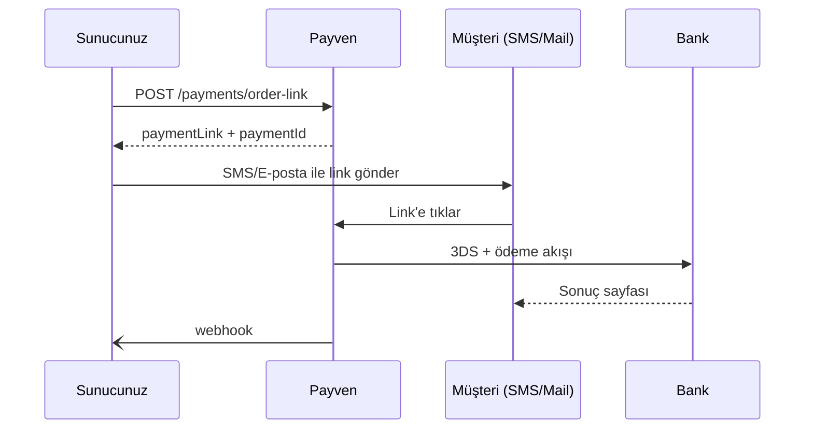

Pay-by-Link, müşteriye gönderebileceğiniz **tek kullanımlık ödeme linki** üretir. Müşteri linke tıklayıp banka/hosted checkout sayfasında ödemeyi yapar. Çağrı merkezi, abonelik yenileme, ofis dışı satış senaryoları için idealdir.

## Akış



## Endpoint

```
POST /api/v1/payments/order-link
```

## İstek

```bash
curl -X POST https://vpos.payven.com.tr/api/v1/payments/order-link \
  -H "X-API-Key: $KEY" -H "X-API-Secret: $SECRET" -H "X-Merchant-Id: $MERCHANT" \
  -H "Idempotency-Key: order-1001-link" \
  -H "Content-Type: application/json" \
  -d '{
    "externalId": "ORDER-1001",
    "amount": 15000,
    "currency": "TRY",
    "installment": 1,
    "description": "Sipariş #1001 ödemesi",
    "customerEmail": "musteri@example.com",
    "customerPhone": "+905551234567",
    "expiresAt": "2026-05-04T12:00:00Z",
    "returnUrl": "https://example.com/odeme/sonuc",
    "callbackUrl": "https://api.example.com/webhooks/payven"
  }'
```

| Alan | Tip | Zorunlu | Açıklama |
|---|---|---|---|
| `externalId` | string | ✅ | Sipariş kimliğiniz |
| `amount` | int | ✅ | Tutar (kuruş) |
| `currency` | enum | ✅ | `TRY`, `USD`, `EUR`, `GBP` |
| `installment` | int | ❌ | Sabit taksit. Boş bırakılırsa müşteri seçer. |
| `description` | string | ⚠️ | Ödeme sayfasında müşteriye gösterilecek açıklama |
| `customerEmail` | string | ⚠️ | Otomatik e-posta gönderimi için (opsiyonel) |
| `customerPhone` | string | ⚠️ | Otomatik SMS için (opsiyonel) |
| `expiresAt` | string | ❌ | Linkin geçerlilik süresi (varsayılan 24 saat) |
| `returnUrl` | string | ✅ | Müşterinin son yönlendirileceği URL |
| `callbackUrl` | string | ❌ | Sunucu-sunucu callback |

## Yanıt

```json
{
  "isSuccess": true,
  "code": "201",
  "data": {
    "id": "8e3f5c12-...",
    "externalId": "ORDER-1001",
    "status": "AwaitingPayment",
    "paymentLink": "https://link.payven.com.tr/pay/abc123def456",
    "shortLink": "https://pyv.tr/abc123",
    "qrCodeUrl": "https://link.payven.com.tr/pay/abc123def456/qr",
    "expiresAt": "2026-05-04T12:00:00Z"
  }
}
```

| Alan | Açıklama |
|---|---|
| `paymentLink` | Tam URL — kendi mesajınızda paylaşabilirsiniz |
| `shortLink` | Karakter sınırı düşük olan SMS için kısa versiyon |
| `qrCodeUrl` | QR kod görseli — fiziksel ortamda kullanım için |

## Müşteriye iletme

Linki kendi tercih ettiğiniz kanaldan iletebilirsiniz:

| Kanal | Önerilen alan |
|---|---|
| SMS | `shortLink` (160 karakter sınırı) |
| E-posta | `paymentLink` |
| WhatsApp / Telegram | `paymentLink` |
| QR kod (mağaza, fiş) | `qrCodeUrl` |

`customerEmail` veya `customerPhone` doldurursanız Payven **otomatik gönderim** yapar (panelde aktivasyon gerektirir). Aksi durumda gönderim sizdedir.

## Tek tek tıklama vs çoklu deneme

Bir link **birden fazla deneme** için kullanılabilir:

| Senaryo | Davranış |
|---|---|
| Müşteri ilk denemede başarılı | Link kapanır (`status: Completed`) |
| Müşteri kart reddedildi, başka kart denemek istiyor | Link aktif kalır, müşteri tekrar deneyebilir |
| Süre doldu | Link `Expired` durumuna geçer |
| Manuel iptal | `DELETE /payments/order-link/{id}` ile kapatılabilir |

## Linki iptal etme

```
DELETE /api/v1/payments/order-link/{id}
```

```bash
curl -X DELETE https://vpos.payven.com.tr/api/v1/payments/order-link/8e3f5c12-... \
  -H "X-API-Key: $KEY" -H "X-API-Secret: $SECRET" -H "X-Merchant-Id: $MERCHANT"
```

İptal edilen linke tıklayan müşteri "ödeme süresi dolmuş" mesajı görür.

## Webhook olayları

| Olay | Açıklama |
|---|---|
| `payment.link.created` | Link oluşturuldu |
| `payment.link.viewed` | Müşteri linke tıkladı |
| `payment.succeeded` | Ödeme başarılı |
| `payment.failed` | Müşteri ödeme yapmaya çalıştı, başarısız |
| `payment.link.expired` | Süre doldu |

## Tipik kullanım kalıpları

<AccordionGroup>
  <Accordion title="Çağrı merkezi">
    Operatör müşteriyle telefonda görüşür, sipariş alır. Sonra:
    1. CRM'den `POST /payments/order-link` çağrısı.
    2. Müşteriye SMS gönderilir.
    3. Operatör müşteriden sonucu beklemeden çağrıyı kapatır.
    4. Webhook ile ödeme bildirildiğinde sipariş onaylanır.
  </Accordion>
  <Accordion title="Abonelik yenileme">
    Otomatik yenileme yerine:
    1. Vadeden 3 gün önce `customerEmail` doldurularak link üretilir.
    2. Payven otomatik mail gönderir.
    3. Müşteri ödemeyi yaptığında abonelik uzatılır.
  </Accordion>
  <Accordion title="QR kodla mağaza ödemesi">
    1. Kasa ekranında `qrCodeUrl` gösterilir.
    2. Müşteri telefonuyla okutur.
    3. Hosted checkout sayfasında ödemeyi yapar.
    4. Kasiyer webhook bildirimini bekler.
  </Accordion>
</AccordionGroup>
