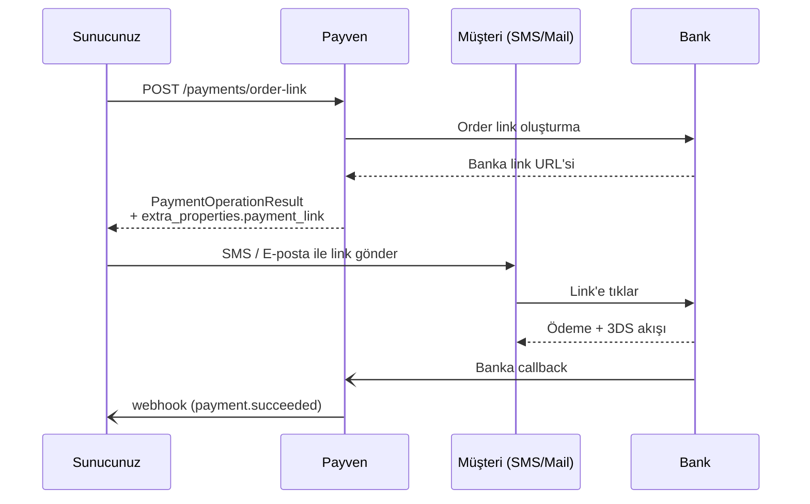

Pay-by-Link, müşteriye gönderebileceğiniz **banka barındırmalı ödeme linki** üretir. Müşteri linke tıklayıp bankanın güvenli sayfasında ödemeyi yapar. Çağrı merkezi, abonelik yenileme, ofis dışı satış senaryoları için idealdir.

<Note>
**Hosted Checkout vs Pay-by-Link** — İkisi de barındırmalı sayfa kullanır. Aralarındaki fark:
- **Hosted Checkout** → sayfayı **Payven** barındırır, multi-banka taksit seçimi gösterir.
- **Pay-by-Link** → sayfayı **banka** barındırır (örn. HalkBank Order Link). Tek-banka, tek-link.
</Note>

## Akış



## Endpoint

```http
POST /api/v1/payments/order-link
```

## İstek

```bash
curl -X POST https://vpos.payven.com.tr/api/v1/payments/order-link \
  -H "Authorization: Bearer $PAYVEN_TOKEN" \
  -H "Idempotency-Key: order-1001-link" \
  -H "Content-Type: application/json" \
  -d '{
    "external_id":    "ORDER-1001",
    "amount":         15000,
    "currency":       "TRY",
    "installment":    1,
    "description":    "Sipariş #1001 ödemesi",
    "customer_email": "musteri@example.com",
    "customer_phone": "+905551234567",
    "return_url":     "https://example.com/odeme/sonuc",
    "callback_url":   "https://api.example.com/webhooks/3d-callback"
  }'
```

| Alan | Tip | Zorunlu | Açıklama |
|---|---|---|---|
| `amount` | int (kuruş) | ✅ | Tutar |
| `currency` | string | ❌ | `TRY` (varsayılan), `USD`, `EUR`, `GBP` |
| `installment` | int | ❌ | Sabit taksit (varsayılan `1`). Banka linkinde müşteriye sunulur. |
| `external_id` | string | önerilir | Sipariş kimliğiniz |
| `description` | string | ❌ | Müşteriye gösterilecek ödeme açıklaması |
| `customer_email` | string | ❌ | Müşteri e-posta (raporlama için) |
| `customer_phone` | string | ❌ | Müşteri telefon (raporlama için) |
| `return_url` | url | ✅ | Ödeme sonrası müşterinin dönmesi gereken URL |
| `callback_url` | url | ❌ | Bankanın callback gönderdiği endpoint (sunucu-sunucu) |
| `extra_properties` | object | ❌ | Konnektör-spesifik özel alanlar |

## Yanıt

```json
{
  "transaction_id":      "8e3f5c12-9a7b-4c8d-bc4e-2c963f66afa6",
  "status":              "processing",
  "is_success":          true,
  "message":             "Sipariş linki oluşturuldu",
  "error_code":          null,
  "provider_error_code": null,
  "extra_properties": {
    "payment_link":      "https://hosted.bank.example.com/pay/abc123def456",
    "provider_order_id": "BANK-ORDER-789",
    "processed_at":      "2026-05-03T13:00:00.123+00:00",
    "expires_at":        "2026-05-04T13:00:00.000+00:00"
  }
}
```

| `extra_properties` alanı | Açıklama |
|---|---|
| `payment_link` | Müşteriye gönderilecek tam URL |
| `provider_order_id` | Bankadaki sipariş referans kimliği |
| `processed_at` | Linkin oluşturulduğu zaman |
| `expires_at` | Linkin geçerlilik süresi (banka politikasına göre belirlenir, genelde 24 saat) |

`status: "processing"` → işlem oluşturuldu, müşteri ödeme yapana kadar bu durumda kalır.

## Müşteriye iletme

`payment_link` URL'sini istediğiniz kanaldan iletin. Payven otomatik mail/SMS göndermez — bu sizin sorumluluğunuzdadır.

| Kanal | Pratik öneriler |
|---|---|
| SMS | URL kısaltıcı (örn. `pyv.tr`) ile 160 karakter sınırını aşmayın. URL kısaltmayı sizin sisteminizde yapabilirsiniz. |
| E-posta | Tam URL'yi `<a href="...">` etiketinde verin. |
| WhatsApp / Telegram | Tam URL veya QR olarak gönderin. |
| QR kod | URL'yi 3rd party kütüphane ile QR kod görseline dönüştürüp fiş/ekranda gösterin. |

## Tek tıklama vs çoklu deneme

Banka linkinin davranışı **konnektöre özgüdür**. Tipik patternler:

| Senaryo | Banka davranışı |
|---|---|
| Müşteri ilk denemede başarılı | Link tek kullanımlık — ikinci kez çalışmaz |
| Müşterinin ilk denemesi reddedildi | Çoğu banka müşteriye yeniden deneme şansı verir |
| Süre doldu | Link artık çalışmaz — yeni link üretmek gerekir |

Final durumu görmek için: [GET /api/v1/payments/{transaction_id}](/sanal-pos/inquiries/payment-detail).

## Linki "iptal etme"

Mevcut implementasyonda explicit bir DELETE endpoint'i yoktur — banka tarafında link süresini önceden kapatmak için ya:
- Linkin doğal süresinin dolmasını bekleyin (banka politikası), veya
- Sipariş tarafında ödemeyi geçersiz işaretleyip yeni süreç başlatın.

Operasyonel iptal süreci için [destek ekibimize](/resources/support) ulaşın.

## Webhook olayları

| Olay | Açıklama |
|---|---|
| `payment.completed` | Müşteri linkten ödemeyi başarıyla yaptı |
| `payment.failed` | Müşteri ödeme yaptı ama banka reddetti |
| `3ds.completed` / `3ds.failed` | 3DS akışı tetiklendiğinde |

Detay: [Webhook Olayları](/sanal-pos/webhooks/events).

## Tipik kullanım kalıpları

<AccordionGroup>
  <Accordion title="Çağrı merkezi">
    Operatör müşteriyle telefonda görüşür, sipariş alır:
    1. CRM'den `POST /payments/order-link` çağrısı.
    2. `payment_link`'i alır, kendi SMS / e-posta sisteminden gönderir.
    3. Operatör müşterinin ödeme yapmasını beklemeden çağrıyı kapatabilir.
    4. Webhook ile `payment.succeeded` geldiğinde sipariş onaylanır.
  </Accordion>
  <Accordion title="Abonelik yenileme">
    Otomatik recurring kullanmıyorsanız:
    1. Vade tarihinden 3 gün önce link üret.
    2. Müşteriye e-posta ile gönder.
    3. Müşteri ödediğinde aboneliği uzat.
  </Accordion>
  <Accordion title="QR kodla mağaza ödemesi">
    1. Kasa ekranında `payment_link`'in QR kodunu göster (3rd party QR kütüphanesi ile).
    2. Müşteri telefonuyla okur.
    3. Banka sayfasında ödemeyi yapar.
    4. Kasiyer webhook bildirimini bekler.
  </Accordion>
</AccordionGroup>

## Konnektör desteği

Pay-by-Link tüm konnektörlerde değil, **`order_link` operasyonunu destekleyen** konnektörlerde çalışır. Şu an aktif: HalkBank VPOS. Diğer konnektörler için destek genişlemektedir — güncel liste için konsoldan **Ayarlar → Konnektörler** ekranını kontrol edin.
