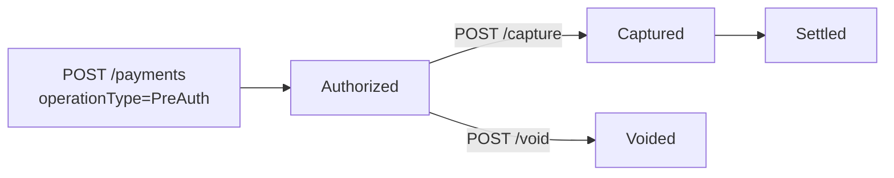

Ön provizyon (Pre-Authorization), kart üzerindeki tutarı **rezerve eder** ama henüz çekmez. Daha sonra **capture** ile rezervasyonu tutara çevirirsiniz veya **void** ile iptal edersiniz.

## Tipik kullanım senaryoları

- **Otel rezervasyonu:** Konuk geldiğinde net tutar belli olur — önce blokaj, check-out'ta capture.
- **Araç kiralama:** Hasar/yakıt değerlendirmesi sonrası net tutar çekilir.
- **E-ticaret kargo:** Kargo tutarı sonradan eklenebilir; net tutarda capture.
- **Marketplace:** Stok onayı sonrası capture; stok yoksa void.

## Akış



## 1. Ön provizyon (PreAuth)

```bash
curl -X POST https://vpos.payven.com.tr/api/v1/payments \
  -H "X-API-Key: $KEY" -H "X-API-Secret: $SECRET" -H "X-Merchant-Id: $MERCHANT" \
  -H "Idempotency-Key: hotel-1001-preauth" \
  -H "Content-Type: application/json" \
  -d '{
    "externalId": "HOTEL-1001",
    "amount": 50000,
    "currency": "TRY",
    "installment": 1,
    "use3D": true,
    "operationType": "PreAuth",
    "card": { ... },
    "callbackUrl": "...",
    "returnUrl": "..."
  }'
```

`operationType: "PreAuth"` parametresi, akışı sale değil ön provizyon yapar. 3DS akışı [3D Secure ödemesi](/sanal-pos/payments/3d-secure) ile aynıdır.

### Başarılı yanıt

```json
{
  "isSuccess": true,
  "data": {
    "id": "8e3f5c12-...",
    "status": "Authorized",
    "operationType": "PreAuth",
    "amount": 50000,
    "capturedAmount": 0,
    "connector": {
      "responseCode": "00",
      "responseMessage": "Onaylandı",
      "authCode": "123456"
    }
  }
}
```

`status: Authorized` ve `capturedAmount: 0` → tutar bloke edildi ama çekilmedi.

## 2. Çekim (Capture)

```
POST /api/v1/payments/{paymentId}/capture
```

```bash
curl -X POST https://vpos.payven.com.tr/api/v1/payments/8e3f5c12-.../capture \
  -H "X-API-Key: $KEY" -H "X-API-Secret: $SECRET" -H "X-Merchant-Id: $MERCHANT" \
  -H "Idempotency-Key: hotel-1001-capture" \
  -H "Content-Type: application/json" \
  -d '{
    "amount": 47500
  }'
```

| Alan | Açıklama |
|---|---|
| `amount` | Çekilecek tutar (kuruş). Boş gönderilirse tüm rezerve tutar çekilir. |

### Yanıt

```json
{
  "isSuccess": true,
  "data": {
    "id": "8e3f5c12-...",
    "status": "Captured",
    "amount": 50000,
    "capturedAmount": 47500,
    "connector": {
      "responseCode": "00",
      "responseMessage": "Çekim onaylandı"
    }
  }
}
```

`amount` (50000) > `capturedAmount` (47500): bloke edilen tutarın bir kısmı çekildi, kalan **otomatik olarak serbest bırakılır**.

### Kısmi çekim kuralları

<Check>`amount` ≤ orijinal `amount` olmalıdır. Aşan değer `CAPTURE_AMOUNT_EXCEEDS_AUTH` ile reddedilir.</Check>
<Check>Bir Pre-Auth için **tek bir capture** yapılabilir. Aşamalı çekim için her bir bölüm ayrı bir Pre-Auth olmalıdır.</Check>
<Check>Capture **24 saat içinde** yapılmalıdır. Bu süreyi aştıktan sonra rezervasyon banka tarafından otomatik düşer; capture endpoint'i `PRE_AUTH_EXPIRED` döner.</Check>

## 3. İptal (Void)

Çekim yapılmadan rezervasyonu serbest bırakmak için:

```bash
curl -X POST https://vpos.payven.com.tr/api/v1/payments/8e3f5c12-.../void \
  -H "X-API-Key: $KEY" -H "X-API-Secret: $SECRET" -H "X-Merchant-Id: $MERCHANT" \
  -H "Idempotency-Key: hotel-1001-void"
```

Detay: [İptal (Void)](/sanal-pos/payments/void).

## Hata yanıtları

| HTTP | `code` | Anlam |
|---|---|---|
| `404` | `PAYMENT_NOT_FOUND` | Ödeme bulunamadı |
| `422` | `PAYMENT_NOT_PRE_AUTH` | Bu ödeme bir Pre-Auth değil |
| `422` | `CAPTURE_AMOUNT_EXCEEDS_AUTH` | Çekim tutarı rezerve tutarı aşıyor |
| `422` | `PRE_AUTH_EXPIRED` | 24 saatlik capture süresi aşıldı |
| `422` | `PAYMENT_ALREADY_CAPTURED` | Zaten çekim yapılmış |

## Mutabakat etkisi

Pre-Auth ve Capture'ın mutabakat hareketleri farklıdır:

- **Pre-Auth:** Mutabakata **dahil değil** — sadece blokaj.
- **Capture:** Capture günü mutabakatına dahil edilir.
- **Void:** Mutabakatta hareket görünmez.

Detay: [Mutabakat Yaşam Döngüsü](/sanal-pos/reconciliation/lifecycle).
