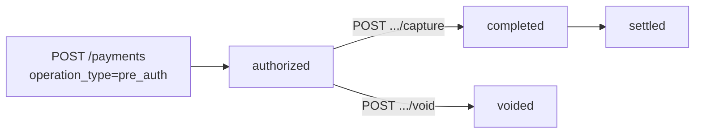

Ön provizyon (Pre-Authorization), kart üzerindeki tutarı **rezerve eder** ama henüz çekmez. Daha sonra `capture` ile rezervasyonu tutara çevirirsiniz veya `void` ile iptal edersiniz.

## Tipik senaryolar

- **Otel rezervasyonu** — Konuk geldiğinde net tutar belli olur, blokaj alıp check-out'ta capture.
- **Araç kiralama** — Hasar / yakıt değerlendirmesi sonrası net tutar çekilir.
- **E-ticaret kargo** — Kargo tutarı sonradan eklenebilir; net tutarda capture.
- **Marketplace** — Stok onayı sonrası capture; stok yoksa void.

## Akış



## 1. Ön provizyon (Pre-Auth)

Non-3D veya 3D Secure akışı ile başlatılır — tek farkı body'de `operation_type: "pre_auth"` parametresi.

```bash
curl -X POST https://vpos.payven.com.tr/api/v1/payments/3d/init \
  -H "Authorization: Bearer $PAYVEN_TOKEN" \
  -H "Idempotency-Key: hotel-1001-preauth" \
  -H "Content-Type: application/json" \
  -d '{
    "external_id":    "HOTEL-1001",
    "amount":         { "amount": 50000, "currency": "TRY" },
    "installment":    1,
    "operation_type": "pre_auth",
    "card": {
      "holder_name":  "Test Kullanici",
      "number":       "4546711234567894",
      "expire_month": "12",
      "expire_year":  "2030",
      "cvv":          "000"
    },
    "callback_url": "https://api.example.com/webhooks/3d-callback",
    "return_url":   "https://example.com/odeme/sonuc"
  }'
```

3DS akışı [3D Secure](/sanal-pos/payments/3d-secure) ile aynıdır; sale yerine pre-auth ile sonuçlanır.

### Başarılı sonuç

3DS tamamlandıktan sonra `GET /api/v1/payments/{transaction_id}` çağırınca:

```json
{
  "transaction_id": "8e3f5c12-9a7b-4c8d-bc4e-2c963f66afa6",
  "status":         "authorized",
  "amount":         50000,
  "currency":       "TRY",
  "is_3d_secure":   true,
  "extra_properties": {
    "processed_at":   "2026-05-03T12:34:58.123+00:00",
    "auth_code":      "123456",
    "host_reference": "PAYVEN-PA-789"
  }
}
```

`status: "authorized"` → tutar bloke edildi ama henüz çekilmedi.

## 2. Çekim (Capture)

```http
POST /api/v1/payments/{transaction_id}/capture
```

```bash
curl -X POST https://vpos.payven.com.tr/api/v1/payments/8e3f5c12-9a7b-4c8d-bc4e-2c963f66afa6/capture \
  -H "Authorization: Bearer $PAYVEN_TOKEN" \
  -H "Idempotency-Key: hotel-1001-capture" \
  -H "Content-Type: application/json" \
  -d '{
    "amount": { "amount": 47500, "currency": "TRY" },
    "reason": "Check-out tutarı"
  }'
```

| Alan | Tip | Zorunlu | Açıklama |
|---|---|---|---|
| `amount.amount` | int (kuruş) | ❌ | Çekilecek tutar. Boş veya `0` gönderilirse **kalan tüm rezerve tutar** çekilir. |
| `amount.currency` | string | ❌ | Para birimi (boşsa orijinal işlemin para birimi) |
| `reason` | string | ❌ | Capture sebebi (raporlama için) |
| `extra_properties` | object | ❌ | Konnektör-spesifik özel alanlar |

### Başarılı yanıt

```json
{
  "transaction_id": "8e3f5c12-9a7b-4c8d-bc4e-2c963f66afa6",
  "status":         "completed",
  "extra_properties": {
    "processed_at":    "2026-05-03T18:00:01.234+00:00",
    "auth_code":       "789012",
    "host_reference":  "PAYVEN-CAP-790",
    "captured_amount": "47500",
    "released_amount": "2500"
  }
}
```

`captured_amount` (47500) < orijinal `amount` (50000) → **kısmi çekim** yapıldı, kalan **2500 kuruş otomatik olarak rezervasyondan serbest bırakıldı**.

### Kısmi çekim kuralları

<Check>`amount` ≤ orijinal `amount` olmalıdır. Aşan değer `capture_amount_exceeds_authorization` ile reddedilir.</Check>
<Check>Bir Pre-Auth için **tek capture** yapılabilir. Aşamalı çekim için her bölümü ayrı bir Pre-Auth olarak başlatın.</Check>
<Check>Capture **24 saat içinde** yapılmalıdır. Süreyi aştıktan sonra rezervasyon banka tarafında otomatik düşer; capture endpoint'i `pre_auth_expired` döner.</Check>

## 3. İptal (Void)

Çekim yapılmadan rezervasyonu serbest bırakmak için:

```bash
curl -X POST https://vpos.payven.com.tr/api/v1/payments/8e3f5c12-.../void \
  -H "Authorization: Bearer $PAYVEN_TOKEN" \
  -H "Idempotency-Key: hotel-1001-void"
```

Detay: [İptal (Void)](/sanal-pos/payments/void).

## Hata yanıtları

| HTTP | `code` | Anlam |
|---|---|---|
| `404` | `payment_not_found` | İşlem bulunamadı |
| `422` | `payment_not_pre_auth` | Bu işlem bir Pre-Auth değil (zaten Sale) |
| `422` | `capture_amount_exceeds_authorization` | Çekim tutarı rezerve tutarı aşıyor |
| `422` | `pre_auth_expired` | 24 saatlik capture süresi aşıldı |
| `422` | `payment_already_captured` | Zaten çekim yapılmış |
| `422` | `bank_declined` | Banka çekim isteğini reddetti |

Hata zarfı RFC 9457 problem+json formatındadır. Detay: [Hata Yönetimi](/documentation/concepts/errors).

## Mutabakat etkisi

| Aşama | Mutabakat hareketi |
|---|---|
| Pre-Auth | Mutabakata **dahil değil** — yalnızca blokaj |
| Capture | Capture günü mutabakatına dahil edilir |
| Void (capture'dan önce) | Mutabakatta hareket görünmez |

Detay: [Mutabakat Yaşam Döngüsü](/sanal-pos/reconciliation/lifecycle).

## Webhook olayları

| Olay | Açıklama |
|---|---|
| `payment.authorized` | Pre-Auth başarıyla alındı |
| `capture.completed` | Capture başarıyla tamamlandı |
| `void.completed` | Pre-Auth iptal edildi (capture'dan önce) |

Detay: [Webhook Olayları](/sanal-pos/webhooks/events).
