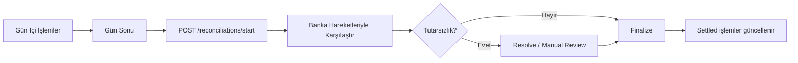

Mutabakat (reconciliation), bir gün boyunca yapılan tüm ödeme/iade hareketlerinin **banka gün sonu kayıtlarıyla eşleştirilmesi** sürecidir. Tutarsızlıkları tespit eder, gelir muhasebesini netleştirir.

## Süreç



## Endpoint'ler

| İşlem | Endpoint |
|---|---|
| Mutabakat başlat | `POST /api/v1/reconciliations/start` |
| Liste | `GET /api/v1/reconciliations` |
| Detay | `GET /api/v1/reconciliations/{id}` |
| Hareket detayı | `GET /api/v1/reconciliations/{id}/details` |
| Tek tutarsızlığı çöz | `POST /api/v1/reconciliations/{id}/details/{detailId}/resolve` |
| Toplu çöz | `POST /api/v1/reconciliations/{id}/details/bulk-resolve` |
| Finalize | `POST /api/v1/reconciliations/{id}/finalize` |
| İptal | `POST /api/v1/reconciliations/{id}/cancel` |

## Mutabakat başlatma

```bash
curl -X POST https://vpos.payven.com.tr/api/v1/reconciliations/start \
  -H "X-API-Key: $KEY" -H "X-API-Secret: $SECRET" -H "X-Merchant-Id: $MERCHANT" \
  -H "Content-Type: application/json" \
  -d '{
    "date": "2026-05-03",
    "connectorConfigurationIds": ["cfg_garanti_001", "cfg_akbank_001"]
  }'
```

| Alan | Açıklama |
|---|---|
| `date` | Mutabakat günü (UTC) |
| `connectorConfigurationIds` | Hangi konnektörler dahil — boş bırakılırsa hepsi |

## Yanıt

```json
{
  "isSuccess": true,
  "data": {
    "id": "rec_8e3f5c12",
    "date": "2026-05-03",
    "status": "InProgress",
    "totalTransactions": 1247,
    "matchedCount": 0,
    "discrepancyCount": 0,
    "createdAt": "2026-05-04T03:00:00Z"
  }
}
```

## Statüler

| Status | Anlam |
|---|---|
| `InProgress` | Karşılaştırma sürüyor |
| `WaitingForReview` | Tutarsızlıklar var, kullanıcı incelemesi bekleniyor |
| `Finalized` | Tamamlandı |
| `Cancelled` | İptal edildi |

## Tutarsızlık tipleri

| Tip | Açıklama |
|---|---|
| `OnlyInPayven` | Payven kaydı var, banka kaydı yok |
| `OnlyInBank` | Banka kaydı var, Payven kaydı yok |
| `AmountMismatch` | İki tarafta da var ama tutarlar uyuşmuyor |
| `StatusMismatch` | Statü farklı (örn. Payven'de Success, banka'da iptal) |
| `DuplicateInBank` | Bankada aynı işlem birden fazla kez |

## Detaylar ve çözüm

Detay: [Mutabakat Yaşam Döngüsü](/sanal-pos/reconciliation/lifecycle).
