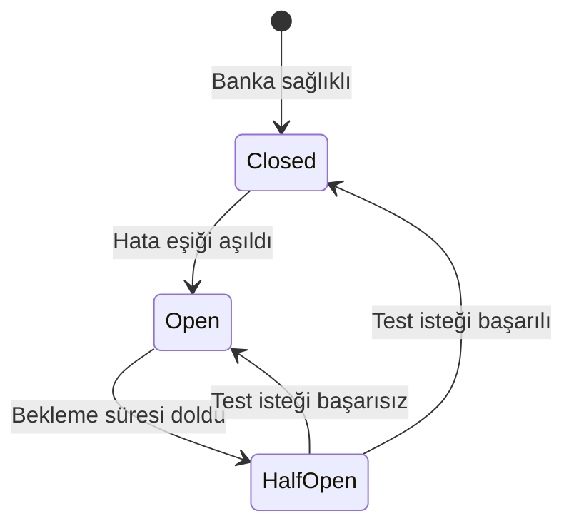

Circuit Breaker, bir bankanın **istikrarsız** olduğunu tespit ettiğinde o bankayı **geçici olarak** yönlendirme havuzundan çıkarır. Banka düzelene kadar işlemler diğer konnektörlere yönlendirilir.

## Neden gerekli?

Akıllı Yönlendirme her isteği gerçek zamanlı değerlendirir. Ama bir banka **sürekli** hata veriyorsa her seferinde yeniden denemek:

- Müşteri için gecikme yaratır (5 sn timeout sonrası fallback)
- Toplam başarı oranını düşürür
- Hatalı bankayı meşgul eder

Circuit Breaker bu döngüyü kırar — hatalı banka belirli bir süre **devre dışı bırakılır**.

## Üç hal



| Hal | Davranış |
|---|---|
| **Closed** | Banka sağlıklı, normal yönlendirme |
| **Open** | Banka devre dışı, hiçbir istek atılmaz |
| **HalfOpen** | Bekleme süresi sonunda küçük bir test trafiği gönderilir |

## Konfigürasyon

Circuit Breaker parametreleri konnektör konfigürasyonunda saklanır ve konsoldan yönetilir. Tipik varsayılanlar:

| Parametre | Varsayılan | Açıklama |
|---|---|---|
| Hata oranı eşiği | %50 | Bu oranın aşılması Open'a yol açar |
| Minimum istek hacmi | 20 | Eşiğin değerlendirilmesi için minimum istek sayısı |
| Rolling pencere | 60 sn | Hata oranı hesaplama penceresi |
| Open kalma süresi | 300 sn (5 dk) | Half-Open'a geçmeden önce bekleme |

Konnektör başına özelleştirme için: **Konsol → Konnektörler → [Konfigürasyon]** ekranı veya `PUT /api/v1/connector-configurations/{id}` endpoint'i.

## Açılma kriteri

Bir banka aşağıdaki **tüm** koşullar sağlandığında "Open" haline geçer:

1. Son `rollingWindowSeconds` saniyede minimum `minimumRequestVolume` istek atılmış olmalı.
2. Bunların hata oranı `errorThresholdPercentage` değerini aşmış olmalı.

Örneğin: son 60 saniyede 20+ istek atılmış ve %50'den fazlası 5xx/timeout dönmüşse banka 5 dakika kapanır.

## Yarı-açık hal (HalfOpen)

Bekleme süresi dolunca breaker "HalfOpen" haline geçer. Sonraki birkaç istek **test trafiği** olarak banka ile yeniden denenir:

- Test başarılı → Closed haline döner, normal çalışmaya devam eder.
- Test başarısız → tekrar Open haline döner.

## İstek üzerindeki etkisi

Banka Open haldeyken o bankaya yönlendirilecek istekler:

- Routing kuralında **`fallback_connector_config_id`** tanımlanmışsa → doğrudan fallback konnektöre gider, birinci konnektör hiç denenmez (timeout süresi kaybedilmez)
- Fallback yoksa → işlem `connector_unavailable` koduyla reddedilir
- Karşılayan başka kural varsa engine onu değerlendirmeye devam eder

## Sağlık endpoint'i

Konnektörün anlık sağlık durumunu API üzerinden kontrol edebilirsiniz:

```bash
curl https://vpos.payven.com.tr/api/v1/connector-configurations/{id}/health \
  -H "Authorization: Bearer $PAYVEN_TOKEN"
```

Yanıt; mevcut hali (`closed`/`open`/`half_open`), son rolling penceredeki başarı/hata oranını, ortalama yanıt süresini ve son durum değişiklik zamanını döner.

## İzleme

Breaker durumunu konsoldaki **Konnektör Sağlık Paneli** ekranından takip edebilirsiniz:

- Mevcut hali (Closed / Open / HalfOpen)
- Son rolling window'daki başarı/hata oranı
- Ortalama yanıt süresi
- Hangi tarihte Open'a düştüğü
- Spark-line trend grafikleri

## Yol haritası

- **Connector health webhook event'leri** (`connector.circuit.opened` / `closed`) — şu an public webhook event listesinde yok, planlamada
- **Konnektör başına özel circuit breaker konfig UI'ı** (varsayılan ayarlar yerine merchant-spesifik)
- **Manuel devreden çıkarma** — bakım pencereleri için konnektörü manuel Open'a alma
- **Bağlantı testleri** — konfigürasyon sırasında **Test Et** ile sağlık doğrulama
