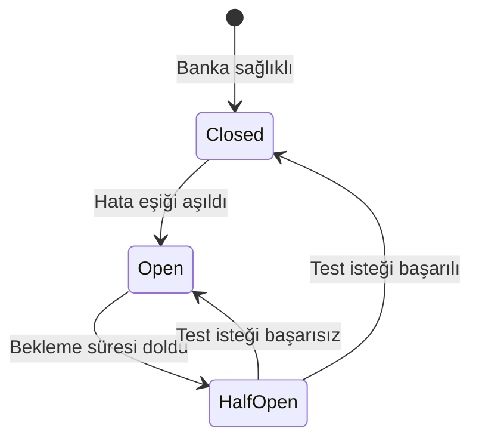

Circuit Breaker, bir bankanın **istikrarsız** olduğunu tespit ettiğinde o bankayı **geçici olarak** yönlendirme havuzundan çıkarır. Banka düzelene kadar işlemler diğer konnektörlere yönlendirilir.

## Neden gerekli?

Akıllı Yönlendirme her isteği gerçek zamanlı değerlendirir. Ama bir banka **sürekli** hata veriyorsa her seferinde yeniden denemek:

- Müşteri için gecikme yaratır (5 sn timeout sonrası fallback)
- Toplam başarı oranını düşürür
- Hatalı bankayı meşgul eder

Circuit Breaker bu döngüyü kırar — hatalı banka belirli bir süre **devre dışı bırakılır**.

## Üç hal



| Hal | Davranış |
|---|---|
| **Closed** | Banka sağlıklı, normal yönlendirme |
| **Open** | Banka devre dışı, hiçbir istek atılmaz |
| **HalfOpen** | Bekleme süresi sonunda küçük bir test trafiği gönderilir |

## Konfigürasyon

Her banka konfigürasyonu için ayarlanabilir:

```json
{
  "configurationId": "cfg_garanti_001",
  "circuitBreaker": {
    "enabled": true,
    "errorThresholdPercentage": 50,
    "minimumRequestVolume": 20,
    "rollingWindowSeconds": 60,
    "openStateDurationSeconds": 300
  }
}
```

| Alan | Açıklama |
|---|---|
| `errorThresholdPercentage` | Hata oranı eşiği (varsayılan: 50%) |
| `minimumRequestVolume` | Eşiğin değerlendirilmesi için minimum istek sayısı (varsayılan: 20) |
| `rollingWindowSeconds` | Hata oranı hesaplama penceresi (varsayılan: 60 sn) |
| `openStateDurationSeconds` | Open halde kalma süresi (varsayılan: 300 sn) |

## Açılma kriteri

Bir banka aşağıdaki **tüm** koşullar sağlandığında "Open" haline geçer:

1. Son `rollingWindowSeconds` saniyede minimum `minimumRequestVolume` istek atılmış olmalı.
2. Bunların hata oranı `errorThresholdPercentage` değerini aşmış olmalı.

Örneğin: son 60 saniyede 20+ istek atılmış ve %50'den fazlası 5xx/timeout dönmüşse banka 5 dakika kapanır.

## Yarı-açık hal (HalfOpen)

Bekleme süresi dolunca breaker "HalfOpen" haline geçer. Sonraki birkaç istek **test trafiği** olarak banka ile yeniden denenir:

- Test başarılı → Closed haline döner, normal çalışmaya devam eder.
- Test başarısız → tekrar Open haline döner.

## Müşteri etkisi

Banka Open haldeyken o bankaya yönlendirilecek istekler:

- Eğer kuralda **fallback** tanımlanmışsa → fallback konnektöre yönlendirilir.
- Fallback yoksa → işlem `ROUTING_NO_HEALTHY_CONNECTOR` ile reddedilir.

## İzleme

Breaker durumunu konsoldaki **Konnektör Sağlık Paneli** ekranından takip edebilirsiniz. Her bankanın:

- Mevcut hali (Closed/Open/HalfOpen)
- Son rolling window'daki başarı/hata oranı
- Ortalama yanıt süresi
- Hangi tarihte Open'a düştüğü

bilgileri görüntülenir.

## Olay bildirimi

Breaker hal değişiklikleri webhook ile de iletilebilir:

| Olay | Tetiklenme |
|---|---|
| `connector.circuit.opened` | Banka Open haline geçti |
| `connector.circuit.closed` | Banka Closed haline döndü |

Bu olaylar **opsiyonel** abonelikteler — varsayılan olarak gönderilmez. Aboneliğinizde `events: ["connector.circuit.*"]` tanımlayarak alın.
