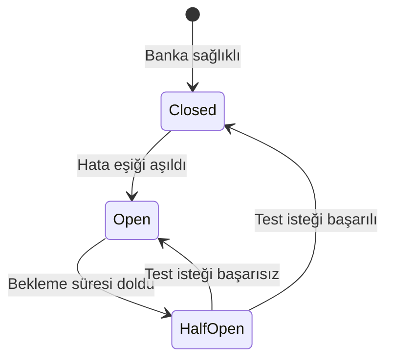

Circuit Breaker, bir bankanın **istikrarsız** olduğunu tespit ettiğinde o bankayı **geçici olarak** yönlendirme havuzundan çıkarır. Banka düzelene kadar işlemler diğer konnektörlere yönlendirilir.

## Neden gerekli?

Akıllı Yönlendirme her isteği gerçek zamanlı değerlendirir. Ama bir banka **sürekli** hata veriyorsa her seferinde yeniden denemek:

- Müşteri için gecikme yaratır (5 sn timeout sonrası fallback)
- Toplam başarı oranını düşürür
- Hatalı bankayı meşgul eder

Circuit Breaker bu döngüyü kırar — hatalı banka belirli bir süre **devre dışı bırakılır**.

## Üç hal


```mermaid
stateDiagram-v2
    [*] --> Closed: Banka sağlıklı
    Closed --> Open: Hata eşiği aşıldı
    Open --> HalfOpen: Bekleme süresi doldu
    HalfOpen --> Closed: Test isteği başarılı
    HalfOpen --> Open: Test isteği başarısız
```

| Hal | Davranış |
|---|---|
| **Closed** | Banka sağlıklı, normal yönlendirme |
| **Open** | Banka devre dışı, hiçbir istek atılmaz |
| **HalfOpen** | Bekleme süresi sonunda küçük bir test trafiği gönderilir |

## Konfigürasyon

Circuit Breaker, konnektör HTTP istemcisi üzerinde **Polly** kütüphanesi ile uygulanmıştır (`Infrastructure/Http/PollyPolicies.cs`). Mevcut varsayılanlar (`AdvancedCircuitBreakerAsync`, sampling window tabanlı):

| Parametre | Varsayılan | Açıklama |
|---|---|---|
| `failureThreshold` | 0.5 | Sampling window içindeki hata oranı eşiği (%50) |
| `minimumThroughput` | 10 | Bu sayıdan az çağrıda CB değerlendirme yapılmaz |
| `samplingDuration` | 30 sn | Rolling pencere uzunluğu |
| `durationOfBreak` | 15 sn | Open kalma süresi (sonra HalfOpen'a geçer) |
| HalfOpen test trafiği | 1 istek | Tek başarılı istek → Closed; başarısız → Open |
| Retry policy (ayrı, INNER) | 3 deneme | Exponential backoff (`2^attempt` saniye) |
| Timeout | 30 sn | İstek başına |

<Note>
Pipeline sırası **CB OUTER, Retry INNER**. Aksi sıralamada bir kullanıcı çağrısının 3 retry denemesi CB'ye 3 ayrı hata yazar ve birkaç geçici hatada CB açılır. Şu anki sırada **1 kullanıcı çağrısı = CB için 1 sample**.
</Note>

Konnektör başına özelleştirme için: **Konsol → Konnektörler → [Konfigürasyon]** ekranı veya `PUT /api/v1/connector-configurations/{id}` endpoint'i.

## Açılma kriteri

Bir konnektör HTTP istemcisi son **30 sn**'deki en az **10 çağrıdan** **%50'si** geçici hata (5xx, timeout, network) verdiğinde Open'a geçer. **15 saniye** boyunca o konnektöre çağrı yapılmaz; süre sonunda HalfOpen'a geçilir ve tek bir test isteği denenir.

## Yarı-açık hal (HalfOpen)

Bekleme süresi dolunca breaker "HalfOpen" haline geçer. Sonraki birkaç istek **test trafiği** olarak banka ile yeniden denenir:

- Test başarılı → Closed haline döner, normal çalışmaya devam eder.
- Test başarısız → tekrar Open haline döner.

## İstek üzerindeki etkisi

Banka Open haldeyken o bankaya yönlendirilecek istekler:

- Routing kuralında **`fallback_connector_config_id`** tanımlanmışsa → doğrudan fallback konnektöre gider, birinci konnektör hiç denenmez (timeout süresi kaybedilmez)
- Fallback yoksa → işlem `connector_unavailable` koduyla reddedilir
- Karşılayan başka kural varsa engine onu değerlendirmeye devam eder

## Sağlık endpoint'i

Konnektörün anlık sağlık durumunu API üzerinden kontrol edebilirsiniz:

```bash
curl https://vpos.payven.com.tr/api/v1/connector-configurations/{id}/health \
  -H "Authorization: Bearer $PAYVEN_TOKEN"
```

Yanıt; mevcut hali (`closed`/`open`/`half_open`), son rolling penceredeki başarı/hata oranını, ortalama yanıt süresini ve son durum değişiklik zamanını döner.

## İzleme

Breaker durumunu konsoldaki **Konnektör Sağlık Paneli** ekranından takip edebilirsiniz:

- Mevcut hali (Closed / Open / HalfOpen)
- Son rolling window'daki başarı/hata oranı
- Ortalama yanıt süresi
- Hangi tarihte Open'a düştüğü
- Spark-line trend grafikleri

## Yol haritası

- **Connector health webhook olayları** (devre açıldı / kapandı) — şu an webhook olay kataloğunda yok, planlamada
- **Konnektör başına özel circuit breaker konfig UI'ı** (varsayılan ayarlar yerine merchant-spesifik)
- **Manuel devreden çıkarma** — bakım pencereleri için konnektörü manuel Open'a alma
- **Bağlantı testleri** — konfigürasyon sırasında **Test Et** ile sağlık doğrulama
