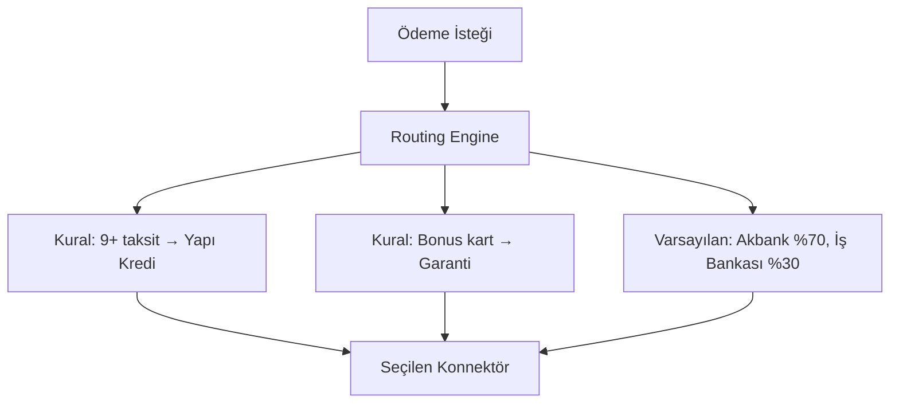

Akıllı Yönlendirme, her ödeme isteğini **gerçek zamanlı koşullara** göre en uygun konnektöre (bankaya) yönlendiren motordur. Hangi bankaya gideceği:

- BIN aralığı
- Tutar
- Taksit sayısı
- Kart birliği (Visa/MC/Troy)
- Kart tipi (kredi/banka)
- 3DS durumu
- Banka sağlık durumu (latency, hata oranı)
- Komisyon oranları
- Trafik dağıtım hedefi

gibi parametrelerin **kompozit skoruna** göre belirlenir.

## Neden akıllı yönlendirme?

| Sorun | Çözüm |
|---|---|
| "Bonus kartlarını Garanti'ye yönlendirmek daha düşük komisyonlu" | BIN bazlı kural |
| "Akbank tarafında 5xx oranı yükseldi, geçici olarak başka bankaya yönlendir" | Circuit breaker |
| "Yüksek tutar işlemleri büyük bankaya gitsin" | Tutar bazlı kural |
| "9-12 taksitte sadece anlaşmamızın olduğu banka çalışsın" | Taksit bazlı filtre |
| "Trafiği iki banka arasında %70-%30 dağıt" | Ağırlık bazlı dağıtım |

## Yapı



Engine kuralları **sırayla** değerlendirir. Bir kural eşleşirse o konnektör seçilir; eşleşmeyen kural bir sonraki kurala düşer. Hiçbir kural eşleşmezse varsayılan kural devreye girer.

## Yönlendirme adımları

1. **Kuralları sırayla değerlendir** — istek koşullara karşı kontrol edilir.
2. **Skor hesapla** — eşleşen her kural için bir kompozit skor üretilir (banka sağlığı, komisyon, ağırlık).
3. **En yüksek skorlu konnektörü seç**.
4. **Smart Retry hazır olsun** — birinci konnektör başarısız olursa fallback için sıralanmış alternatifler.

## Kural yapısı

Bir kural şu bileşenlerden oluşur:

| Alan | Açıklama |
|---|---|
| `name` | Açıklayıcı isim |
| `priority` | Değerlendirme sırası (düşük sayı = önce) |
| `conditions[]` | Koşullar (AND/OR) |
| `connectors[]` | Eşleşince hedeflenecek konnektörler (ağırlıklı) |
| `enabled` | Aktif mi? |

Detay: [Yönlendirme Kuralları](/sanal-pos/routing/rules).

## Banka sağlığı

Engine, gerçek zamanlı banka sağlığını izler:

- Son 5 dakikadaki başarı oranı
- Ortalama yanıt süresi
- 5xx hata yoğunluğu

Bir bankanın hata oranı eşiği (örn. %10) aşarsa **circuit breaker** devreye girer ve o banka geçici olarak yönlendirme havuzundan çıkarılır. Detay: [Circuit Breaker](/sanal-pos/routing/circuit-breaker).

## Smart Retry

Yönlendirilen banka geçici hata verirse istek **otomatik olarak** alternatif konnektöre yönlendirilir — kullanıcı yeniden ödeme yapmaz. Detay: [Smart Retry](/sanal-pos/routing/smart-retry).

## Kuralları yönetme

Kurallar konsoldan veya API üzerinden yönetilir:

```bash
GET    /api/v1/routing-rules           # Liste
POST   /api/v1/routing-rules           # Yeni kural
PUT    /api/v1/routing-rules/{id}      # Güncelleme
DELETE /api/v1/routing-rules/{id}      # Silme
PATCH  /api/v1/routing-rules/{id}/activate
PATCH  /api/v1/routing-rules/{id}/deactivate
POST   /api/v1/routing-rules/resolve   # Bir koşula hangi kural uygulanır?
```

## Simülasyon

Production'a uygulamadan önce kuralları test ortamında simüle edin:

```bash
POST /api/v1/routing-rules/resolve
{
  "amount": 60000,
  "installment": 9,
  "card": { "binNumber": "454671", "scheme": "Visa" }
}
```

Yanıt, bu işlemin **hangi kurala düşeceği** ve **hangi konnektörün seçileceği** bilgisini döner.
