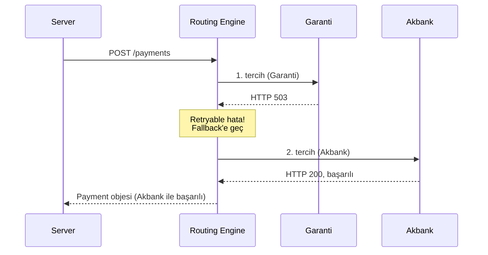

Smart Retry, **birinci tercih banka geçici hata** verdiğinde, müşteriden yeniden bilgi almaksızın işlemi alternatif konnektöre yönlendiren mekanizmadır.

## Hangi durumlarda devreye girer?

| Banka yanıtı | Smart Retry uygulanır mı? |
|---|---|
| Başarılı (`responseCode: 00`) | ❌ İhtiyaç yok |
| Yetersiz bakiye, şüpheli işlem | ❌ Müşteri kaynaklı, retry sonuç değiştirmez |
| Limit aşımı, kart blokajı | ❌ Müşteri kaynaklı |
| Geçici banka hatası (5xx, timeout) | ✅ Alternatif konnektöre yönlendirilir |
| Banka sistem bakımı | ✅ Yönlendirilir |
| Bağlantı hatası | ✅ Yönlendirilir |

Genel kural: **kart sahibi kaynaklı reddetmeler retry edilmez**, **banka altyapısı kaynaklı geçici sorunlar retry edilir**.

## Akış



## Kural konfigürasyonu

[Routing kuralında](/sanal-pos/routing/rules) `fallbacks` belirleyerek hangi alternatif konnektörlerin denemesini tanımlayın:

```json
{
  "name": "Bonus kartlar — Garanti, fallback Akbank",
  "connectors": [
    { "configurationId": "cfg_garanti_001", "weight": 100 }
  ],
  "fallbacks": [
    { "configurationId": "cfg_akbank_001", "priority": 1 },
    { "configurationId": "cfg_isbank_001", "priority": 2 }
  ],
  "smartRetry": {
    "enabled": true,
    "maxAttempts": 3
  }
}
```

| Alan | Açıklama |
|---|---|
| `smartRetry.enabled` | Smart Retry açık mı? |
| `smartRetry.maxAttempts` | Toplam deneme sayısı (varsayılan 3) |

## Yanıtta retry geçmişi

Smart Retry uygulandığında payment objesinde bir retry geçmişi alanı döner:

```json
{
  "data": {
    "id": "8e3f5c12-...",
    "status": "Success",
    "connector": {
      "code": "AkbankNestpay",
      "configurationId": "cfg_akbank_001"
    },
    "retryHistory": [
      {
        "attempt": 1,
        "configurationId": "cfg_garanti_001",
        "responseCode": "503",
        "errorType": "BankUnreachable",
        "duration": 5012
      },
      {
        "attempt": 2,
        "configurationId": "cfg_akbank_001",
        "responseCode": "00",
        "duration": 821
      }
    ]
  }
}
```

## Performans etkisi

Toplam istek süresi, denenen konnektörlerin toplamıdır. Pratik etki:

- Tek deneme: ~1-2 sn
- 1 retry: ~3-5 sn (ilkinde 5 sn timeout + 2 sn ikinci deneme)
- 2 retry: ~7-10 sn

İstemcinizin timeout'unu yeterince yüksek ayarlayın (önerilen: 30 sn).

## Idempotency korunur

Smart Retry sırasında aynı `Idempotency-Key` ile birden fazla deneme yapılır — Payven tarafında bu garanti edilir. Sizin tarafınızda bir şey yapmanız gerekmez.

## Banka komisyon farkı

Birinci ve ikinci konnektörün komisyon oranları farklı olabilir. Smart Retry'a düşmüş işlemleri raporlarken bu farkı dikkate alın. `retryHistory` alanından hangi konnektörün başarılı olduğunu görebilirsiniz.
