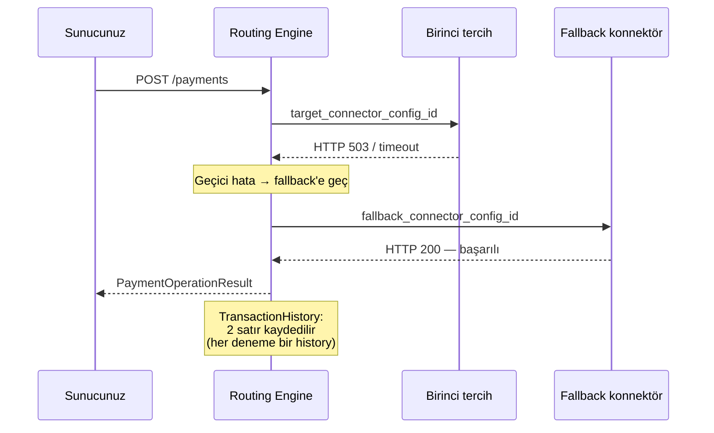

Smart Retry, **birinci tercih konnektör geçici hata** verdiğinde işlemi alternatif konnektöre yönlendiren mekanizmadır. Müşteriden yeniden bilgi almaz; routing kuralında tanımlı `fallback_connector_config_id` üzerinden ikinci denemeyi yapar.

## Hangi durumlarda devreye girer?

| Banka yanıtı | Smart Retry uygulanır mı? |
|---|---|
| Başarılı (`provider_error_code: "00"`) | İhtiyaç yok |
| Yetersiz bakiye, expired card, fraud | Müşteri/kart kaynaklı — retry sonuç değiştirmez |
| Limit aşımı, kart blokajı | Müşteri kaynaklı |
| Banka HTTP 5xx | Alternatif konnektöre yönlendirilir |
| Banka timeout | Yönlendirilir |
| Bağlantı / TLS hatası | Yönlendirilir |
| Connector circuit breaker açık | Yönlendirilir |

Genel kural: **kart sahibi kaynaklı reddetmeler retry edilmez**, **banka altyapısı kaynaklı geçici sorunlar retry edilir**.

## Akış



## Kural konfigürasyonu

[Routing kuralında](/sanal-pos/routing/rules) `fallback_connector_config_id` alanını doldurun:

```bash
curl -X POST https://vpos.payven.com.tr/api/v1/routing-rules \
  -H "Authorization: Bearer $PAYVEN_TOKEN" \
  -H "Content-Type: application/json" \
  -d '{
    "name":                          "Bonus → Garanti, fallback Akbank",
    "priority":                      10,
    "is_active":                     true,
    "card_brand_filter":             "bonus",
    "min_amount":                    100,
    "max_amount":                    20000000,
    "target_connector_config_id":    "cfg_garanti_prod-001",
    "fallback_connector_config_id":  "cfg_akbank_prod-001",
    "weight":                        70,
    "success_rate":                  99.2,
    "average_response_time_ms":      850,
    "cost_score":                    80
  }'
```

`fallback_connector_config_id` boş bırakılırsa o kural için Smart Retry devreye girmez — birinci tercih başarısız olursa işlem `failed` olur.

## Yanıt davranışı

Müşteri tarafından bakıldığında Smart Retry **görünmez** — tek bir başarılı `PaymentOperationResult` döner:

```json
{
  "transaction_id": "8e3f5c12-...",
  "status":         "completed",
  "extra_properties": {
    "processed_at":            "2026-05-03T12:34:58.123+00:00",
    "auth_code":               "789012",
    "host_reference":          "AKBANK-REF-456",
    "provider_transaction_id": "..."
  }
}
```

Hangi konnektörün başarılı olduğunu işlem detayında (`GET /transactions/{id}`) → `connector_code` ve `connector_configuration_id` alanlarından görebilirsiniz. Tüm denemelerin geçmişi [İşlem Geçmişi (Timeline)](/sanal-pos/inquiries/payment-history) üzerinden çekilir — her başarısız+başarılı deneme ayrı bir `TransactionHistory` kaydı olur.

## Banka sağlığı + Smart Retry

Smart Retry tek başına çalışmaz; **Circuit Breaker** ile birlikte hareket eder:

- Banka hata oranı eşiği aşarsa Circuit Breaker açılır → o konnektör yönlendirme havuzundan **çıkar**
- Yeni gelen istekler **doğrudan** fallback konnektöre gider (birinci denemeden sırasında değil, kuralda)
- Sağlık geri gelince Circuit Breaker yarı-açık → kapalı → konnektör yine ana havuzda

Detay: [Circuit Breaker](/sanal-pos/routing/circuit-breaker).

## Performans etkisi

Toplam istek süresi, denenen konnektörlerin toplamı + transition overhead'idir:

- Tek başarılı deneme: ~1-2 sn
- 1 retry sonrası başarı: ~3-7 sn (birinci timeout + ikinci başarılı)
- Timeout sonrası fallback: ~5-10 sn

İstemcinizin HTTP timeout'unu yeterince yüksek ayarlayın — **30 saniye** önerilir.

## Idempotency korunur

Smart Retry sırasında aynı `Idempotency-Key` Payven tarafında korunur. Birinci konnektöre giderken Payven tarafı, fallback'e giderken yine korunur — `Idempotency-Key` zaten Payven cache + DB'sinde tutulur. Sizin tarafınızda bir şey yapmanız gerekmez.

<Note>
**Banka komisyon farkı:** birinci ve fallback konnektörün komisyon oranları farklı olabilir. Smart Retry'a düşmüş işlemleri raporlarken `connector_code` üzerinden hangi konnektörün başarılı olduğunu görüp komisyon hesaplamanızı buna göre yapın.
</Note>

## Yapılandırma sınırları

| Parametre | Varsayılan |
|---|---|
| Retry sayısı | 1 (birinci tercih + fallback) |
| Birinci tercih timeout | 30 sn |
| Fallback timeout | 30 sn |

İleri seviye senaryolar (çoklu fallback, exponential backoff arasında) için yol haritası:
- Çoklu `fallback_chain` desteği
- İstek başına timeout konfigürasyonu
- Retry kararı için ML tabanlı sinyaller (banka sağlığı + geçmiş başarı)

Güncellemeler için: [Changelog](/resources/changelog).
